# Informe TB2

<h3> Universidad Peruana de Ciencias Aplicadas </h3>

<h5> Ingeniería de Software </h5>

<h5> Aplicaciones para Dispositivos Móviles - 1ACC0238 </h5>

<h5> Docente: Mayta Guillermo, Jorge Luis </h5>

<h5> Startup:AgroTracer  </h5>

<h5> Producto: GanLink  </h5>

## Team members:

| Nombre | Código |
|:-----------------------------------:|:----------:|
| Guerrero Tomas, Nelson Fabrizio     | U202222745 |
| Rodas Sotomayor, Ernesto            | U202312443 |
| Huaman Hinostroza, Milenio          | U20211c245 |
| Mora Blas, Diego Alonzo             | U20231c069 |
| León Vivas, Fabrizio Amir           | U20211B994 |

<h5 style="text-align: center"> Ciclo 2025-020 </h5>

## Registro de versiones del informe

| Versión |    Fecha   |              Autor              | Descripción de modificación                                                                                                   |
| :-----: | :--------: | :-----------------------------: | ----------------------------------------------------------------------------------------------------------------------------- |
|   1.0   | 17/09/2025 |     Mora Blas, Diego Alonzo     | Creación del documento de trabajo en formato markdown                                                                         |
|   1.1   | 18/09/2025 |     Rodas Sotomayor, Ernesto    | Desarrollo del capítulo 1 del documento en formato markdown                                                                   |
|   1.2   | 18/09/2025 | Guerrero Tomas, Nelson Fabrizio | Desarrollo del capítulo 2 del documento en formato markdown                                                                   |
|   1.3   | 18/09/2025 |    Huaman Hinostroza, Milenio   | Desarrollo del capítulo 2.5 del documento en formato markdown                                                                 |
|   1.4   | 09/10/2025 |       León Vivas, Fabrizio      | Desarrollo del capítulo 2.6 del documento en formato markdown                                                                 |
|   1.5   | 09/10/2025 |     Rodas Sotomayor, Ernesto    | Desarrollo del capítulo 3.1 del documento en formato markdown                                                                 |
|   1.6   | 09/10/2025 | Guerrero Tomas, Nelson Fabrizio | Desarrollo del capítulo 4.1 del documento en formato markdown                                                                 |
|   1.7   | 09/10/2025 |     Mora Blas, Diego Alonzo     | Desarrollo del capítulo 4.2 del documento en formato markdown                                                                 |
|   1.8   | 28/10/2025 | Guerrero Tomas, Nelson Fabrizio | Incorporación inicial del Capítulo IV: Product Implementation & Validation con despliegue del backend y documentación técnica |
|   1.9   | 05/11/2025 |     Rodas Sotomayor, Ernesto    | Actualización del Sprint 2, adición de resultados de validación, Conclusiones, Bibliografía y Anexos para la entrega TB2      |

## Project Report Collaboration Insights

URL del repositorio para el reporte del proyecto:

**TB1**

Para el desarrollo del informe perteneciente a la entrega TB1, se dividió la implementación de secciones de la siguiente forma para cada integrante del equipo:

|Integrante      |Tareas Asignadas|
|-|-|
|Nelson Guerrero |Competidores (2.1) y Needfinding (2.3)|
|Ernesto Rodas   |Capítulo I completo (Startup Profile, Solution Profile y Segmento Objetivo)|
|Milenio Huamán  |Empathy Mapping (2.3.4), Ubiquitous Language (2.3.5) y Requirements Specification (2.4)|
|Diego Mora      |Strategic-Level Domain-Driven Design (2.5) y Tactical-Level Domain-Driven Design (2.6)|

El proceso de colaboración en el informe se realizó mediante commits constantes al repositorio de la organización GanLink.

## Project Report Collaboration Insights

URL del repositorio para el reporte del proyecto:

**TB1**

**Github Collaboration Insights**

Github también presenta un timeline de las ramas principales y los procesos de merge a los que se han sometido. Todas las ramas se crearon tomando en cuenta el diseño de GitFlow para una buena organización cuando se usa un software de control de versiones.

Los integrantes son:

* Nelson Guerrero (Nelsoondev)
* Ernesto Rodas (ernesto1718)
* Milenio Huaman (Milenioupc)
* Diego Mora (diegoalonzomora)

Se explican las ramas más prominentes:

- **main**: Se trata de la rama principal del proyecto y se actualiza para cada entregable.

- **develop**: Se trata de la rama principal para el proceso del desarrollo del proyecto.

Los siguientes gráficos representan analíticos de commits en el repositorio del informe. En los gráficos se incluye la cantidad de lineas de texto añadidas por cada integrante del equipo.

**TP**

Para el desarrollo del informe perteneciente a la entrega TB1, se dividió la implementación de secciones de la siguiente forma para cada integrante del equipo:

| Integrante      | Tareas Asignadas                                                                                                                                                                                                     |
| --------------- | -------------------------------------------------------------------------------------------------------------------------------------------------------------------------------------------------------------------- |
| Ernesto Rodas   | Actualizar **Registro de Versiones del Informe**, **Project Report Collaboration Insights** y **Student Outcome**; revisión y corrección de artefactos previos.                                                      |
| Nelson Guerrero | **Capítulo III – 3.1 Product design**: Style Guidelines, Arquitectura de Información, Landing Page (implementación + evidencia de despliegue).                                                                       |
| Milenio Huamán  | **Capítulo III – 3.2–3.4**: Wireframes, Wireflows, Mockups, User Flows y Prototyping; demostración de **pantallas core** de la app.                                                                                  |
| Diego Mora      | **Capítulo IV – 4.1 Software Configuration Management**: repos, convenciones (branching), CI/CD; evidencia de **backend al 70%** desplegado.                                                                         |
| Fabrizio León   | **Capítulo IV – 4.2 Product Implementation & Validation (Sprint 1)**: plan y evidencias del Sprint 1 (backlog, burndown/velocity, increment), validación y testing; **Conclusiones**, **Bibliografía** y **Anexos**. |

**TB1**

**Github Collaboration Insights**

Github también presenta un timeline de las ramas principales y los procesos de merge a los que se han sometido. Todas las ramas se crearon tomando en cuenta el diseño de GitFlow para una buena organización cuando se usa un software de control de versiones.

Los integrantes son:

* Nelson Guerrero (Nelsoondev)
* Ernesto Rodas (ernesto1718)
* Milenio Huaman (Milenioupc)
* Diego Mora (diegoalonzomora)
* Fabrizio León (codylionvivo)

Se explican las ramas más prominentes:

- **main**: Se trata de la rama principal del proyecto y se actualiza para cada entregable.

- **develop**: Se trata de la rama principal para el proceso del desarrollo del proyecto.

Los siguientes gráficos representan analíticos de commits en el repositorio del informe. En los gráficos se incluye la cantidad de lineas de texto añadidas por cada integrante del equipo.

## Student Outcomes

En el siguiente cuadro se describe las acciones realizadas y enunciados de conclusiones por parte del grupo, que permiten sustentar el haber alcanzado el logro del ABET –EAC - Student Outcome 7.

| Criterio específico                                                                                                                    | Acciones realizadas                                                                                                                                                                                                                                                                                                                                                                                                                                                                                                                                                                                                                                                                                                                                                                                                                                                                                                                                                                                                                                                                                                                                                                                                                                                                                                                                                                                                                                                                                                                                                                                                                                                                                                                                                                                                                                                                     | Conclusiones                                                                                                                                                                                                                           |
| -------------------------------------------------------------------------------------------------------------------------------------- | :-------------------------------------------------------------------------------------------------------------------------------------------------------------------------------------------------------------------------------------------------------------------------------------------------------------------------------------------------------------------------------------------------------------------------------------------------------------------------------------------------------------------------------------------------------------------------------------------------------------------------------------------------------------------------------------------------------------------------------------------------------------------------------------------------------------------------------------------------------------------------------------------------------------------------------------------------------------------------------------------------------------------------------------------------------------------------------------------------------------------------------------------------------------------------------------------------------------------------------------------------------------------------------------------------------------------------------------------------------------------------------------------------------------------------------------------------------------------------------------------------------------------------------------------------------------------------------------------------------------------------------------------------------------------------------------------------------------------------------------------------------------------------------------------------------------------------------------------------------------------------------------- | -------------------------------------------------------------------------------------------------------------------------------------------------------------------------------------------------------------------------------------- |
| Actualiza conceptos y conocimientos necesarios para su desarrollo profesional y en especial para su proyecto en soluciones de software | **Ernesto Rodas**   TB1: Responsable del **Capítulo I** (Startup Profile, Solution Profile, Lean UX, Segmentos objetivo).  TP1: Responsable de colaborar en todas las areas que pudiera, tanto el UX design, landing page, etc.  **Nelson Guerrero**   TB1: Responsable de **Competidores (2.1)** y **Needfinding (2.3)**.  TP1: Se encargo de mockup, wireframes, flujos de trajo y colaboro en programacion.  **Milenio Huamán**   TB1: Responsable de **Entrevistas (2.2)** y **Requirements Specification (2.4)**.  TP1 : Responsable del bounded context bovinue donde aplico principios SOLID para generar endpoints estables.  **Diego Mora**   TB1: Responsable de **Strategic-Level DDD (2.5)** y **Tactical-Level DDD (2.6)**.    TP1 : Se encargo de liderar al equipo generando una comunicacion clara con objetivos definidos, ademas de trabajar tanto en el frontend como el backend.                                                   **Fabrizio Leon**         TP1: Complemento sus concocimientos de cursos anteriores para la integracion del backend en .NET en especial el bounded context IAM                                                                                                                                                                                                                                                                                                                                                                                                                                                                                                                                                                                                                                                                                                                                               | Cada integrante desarrolló secciones específicas del documento, aplicando conceptos técnicos actualizados y orientados al desarrollo de soluciones de software en el marco del proyecto.                                               |
| Reconoce la necesidad del aprendizaje permanente para el desempeño profesional y el desarrollo de proyectos en soluciones de software  | **Ernesto Rodas**   TB1: En su sección incorporó fundamentos actualizados sobre la startup y la solución digital. TP1: Demostró una mejora constante en el uso de herramientas de diseño mobile, aplicando principios de usabilidad y accesibilidad para la creación de interfaces intuitivas en la landing page. Se capacitó de forma autónoma en Figma para optimizar la experiencia del usuario en dispositivos móviles.  **Nelson Guerrero**   TB1: Investigó y contrastó información de competidores, aplicando metodologías de Needfinding. TP1: Fortaleció sus conocimientos en el diseño de interfaces responsivas, implementando wireframes y prototipos adaptables a distintos tamaños de pantalla. Investigó sobre patrones de navegación mobile y los aplicó en el flujo de usuario.  **Milenio Huamán**   TB1: Realizó entrevistas, recopiló evidencia y redactó la especificación de requerimientos. TP1: Continuó su aprendizaje en arquitecturas limpias aplicadas a entornos móviles, asegurando la integración eficiente entre backend y frontend. Buscó información sobre buenas prácticas de desarrollo modular en Kotlin y las aplicó en el bounded context de Bovinue.  **Diego Mora**   TB1: Desarrolló el modelado estratégico y táctico de DDD, aplicando buenas prácticas arquitectónicas.TP1: Reforzó sus conocimientos sobre la comunicación entre capas de la aplicación móvil, liderando la implementación del diseño responsive y la conexión con servicios backend. Promovió la actualización constante del equipo en metodologías ágiles y frameworks modernos.                  **Fabrizio León**   TP1: Consolidó su aprendizaje previo en desarrollo backend aplicando nuevas prácticas de integración con aplicaciones móviles, especialmente en la autenticación y seguridad del usuario mediante el bounded context IAM. | El equipo demostró capacidad de aprendizaje continuo al integrar metodologías y herramientas modernas en el desarrollo del proyecto, reforzando la importancia de la actualización constante para responder a los retos profesionales. |

# Objetivos SMART

| Nombre del integrante | Objetivo SMART                                                                                                                                                                                                                                           |
| --------------------- | :------------------------------------------------------------------------------------------------------------------------------------------------------------------------------------------------------------------------------------------------------- |
| **Nelson Guerrero**   | Desarrollar una aplicación móvil funcional publicada en **Google Play** que implemente buenas prácticas de diseño UX/UI y arquitectura limpia, en un plazo de **12 meses**, fortaleciendo mis habilidades en **desarrollo móvil multiplataforma**.       |
| **Ernesto Rodas**     | Obtener una **certificación internacional en UX/UI Design** (como Google UX Certificate o similar) dentro de los **próximos 10 meses**, aplicando los conocimientos adquiridos en la carrera para mejorar la experiencia de usuario en proyectos reales. |
| **Diego Mora**        | Liderar un **equipo de desarrollo ágil** en una empresa tecnológica en un periodo de **18 meses**, implementando metodologías **Scrum y DevOps** para asegurar la entrega continua y eficiente de soluciones de software.                                |
| **Fabrizio León**     | Dominar el **desarrollo backend con .NET y microservicios** logrando participar en al menos **3 proyectos empresariales** en los próximos **2 años**, priorizando la escalabilidad, seguridad y buenas prácticas de integración.                         |
| **Milenio Huamán**    | Convertirme en **arquitecto de software especializado en Kotlin y arquitecturas limpias** en un plazo de **2 años**, aplicando principios SOLID y patrones de diseño para optimizar el rendimiento y mantenibilidad de sistemas móviles y backend.       |

## Contenido
1. [**Capítulo I: Presentación**](#1)  
   1.1. [Startup Profile](#1.1)  
   1.1.1. [Descripción de la Startup](#1.1.1)  
   1.1.2. [Perfiles de integrantes del equipo](#1.1.2)  
   1.2. [Solution Profile](#1.2)  
   1.2.1. [Antecedentes y problemática](#1.2.1)  
   1.2.2. [Lean UX Process](#1.2.2)  
   1.2.2.1. [Lean UX Problem Statements](#1.2.2.1)  
   1.2.2.2. [Lean UX Assumptions](#1.2.2.2)  
   1.2.2.3. [Lean UX Hypothesis Statements](#1.2.2.3)  
   1.2.2.4. [Lean UX Canvas](#1.2.2.4)  
   1.3. [Segmentos objetivo](#1.3)  

2. [**Capítulo II: Requirements Development and Software Solution Design**](#2)  
   2.1. [Competidores](#2.1)  
   2.1.1. [Análisis competitivo](#2.1.1)  
   2.1.2. [Estrategias y tácticas frente a competidores](#2.1.2)  
   2.2. [Entrevistas](#2.2)  
   2.2.1. [Diseño de entrevistas](#2.2.1)  
   2.2.2. [Registro de entrevistas](#2.2.2)  
   2.2.3. [Análisis de entrevistas](#2.2.3)  
   2.3. [Needfinding](#2.3)  
   2.3.1. [User Personas](#2.3.1)  
   2.3.2. [User Task Matrix](#2.3.2)  
   2.3.3. [User Journey Mapping](#2.3.3)  
   2.3.4. [Empathy Mapping](#2.3.4)  
   2.3.5. [Ubiquitous Language](#2.3.5)  
   2.4. [Requirements Specification](#2.4)  
   2.4.1. [User Stories](#2.4.1)  
   2.4.2. [Impact Mapping](#2.4.2)  
   2.4.3. [Product Backlog](#2.4.3)  
   2.5. [Strategic-Level Domain-Driven Design](#2.5)  
   2.5.1. [EventStorming](#2.5.1)  
   2.5.1.1. [Candidate Context Discovery](#2.5.1.1)  
   2.5.1.2. [Domain Message Flows Modeling](#2.5.1.2)  
   2.5.1.3. [Bounded Context Canvases](#2.5.1.3)  
   2.5.2. [Context Mapping](#2.5.2)  
   2.5.3. [Software Architecture](#2.5.3)  
   2.5.3.1. [Software Architecture Context Level Diagrams](#2.5.3.1)  
   2.5.3.2. [Software Architecture Container Level Diagrams](#2.5.3.2)  
   2.5.3.3. [Software Architecture Deployment Diagrams](#2.5.3.3)  
   2.6. [Tactical-Level Domain-Driven Design](#2.6)  
   2.6.x. [Bounded Context: `<Bounded Context Name>`](#2.6.x)  
   2.6.x.1. [Domain Layer](#2.6.x.1)  
   2.6.x.2. [Interface Layer](#2.6.x.2)  
   2.6.x.3. [Application Layer](#2.6.x.3)  
   2.6.x.4. [Infrastructure Layer](#2.6.x.4)  
   2.6.x.5. [Bounded Context Software Architecture Component Level Diagrams](#2.6.x.5)  
   2.6.x.6. [Bounded Context Software Architecture Code Level Diagrams](#2.6.x.6)  
   2.6.x.6.1. [Bounded Context Domain Layer Class Diagrams](#2.6.x.6.1)  
   2.6.x.6.2. [Bounded Context Database Design Diagram](#2.6.x.6.2)  

3. [**Capítulo III: Solution UI/UX Design**](#3)  
   3.1. [Product Design](#3.1)  
   3.1.1. [Style Guidelines](#3.1.1)  
   3.1.1.1. [General Style Guidelines](#3.1.1.1)  
   3.1.2. [Information Architecture](#3.1.2)  
   3.1.2.1. [Organization Systems](#3.1.2.1)  
   3.1.2.2. [Labelling Systems](#3.1.2.2)  
   3.1.2.3. [SEO Tags and Meta Tags](#3.1.2.3)  
   3.1.2.4. [Searching Systems](#3.1.2.4)  
   3.1.2.5. [Navigation Systems](#3.1.2.5)  
   3.1.3. [Landing Page UI Design](#3.1.3)  
   3.1.3.1. [Landing Page Wireframe](#3.1.3.1)  
   3.1.3.2. [Landing Page Mock-up](#3.1.3.2)  
   3.1.4. [Mobile Applications UX/UI Design](#3.1.4)  
   3.1.4.1. [Mobile Applications Wireframes](#3.1.4.1)  
   3.1.4.2. [Mobile Applications Wireflow Diagrams](#3.1.4.2)  
   3.1.4.3. [Mobile Applications Mock-ups](#3.1.4.3)  
   3.1.4.4. [Mobile Applications User Flow Diagrams](#3.1.4.4)  
   3.1.4.5. [Mobile Applications Prototyping](#3.1.4.5)  

4. [**Capítulo IV: Product Implementation & Validation**](#4)  
   4.1. [Software Configuration Management](#4.1)  
   4.1.1. [Software Development Environment Configuration](#4.1.1)  
   4.1.2. [Source Code Management](#4.1.2)  
   4.1.3. [Source Code Style Guide & Conventions](#4.1.3)  
   4.1.4. [Software Deployment Configuration](#4.1.4)  
   4.2. [Landing Page & Mobile Application Implementation](#4.2)  
   4.2.1. [Sprint n](#4.2.1)  
   4.2.1.1. [Sprint Planning n](#4.2.1.1)  
   4.2.1.2. [Sprint Backlog n](#4.2.1.2)  
   4.2.1.3. [Development Evidence for Sprint Review](#4.2.1.3)  
   4.2.1.4. [Testing Suite Evidence for Sprint Review](#4.2.1.4)  
   4.2.1.5. [Execution Evidence for Sprint Review](#4.2.1.5)  
   4.2.1.6. [Services Documentation Evidence for Sprint Review](#4.2.1.6)  
   4.2.1.7. [Software Deployment Evidence for Sprint Review](#4.2.1.7)  
   4.2.1.8. [Team Collaboration Insights during Sprint](#4.2.1.8)  
   4.3. [Validation Interviews](#4.3)  
   4.3.1. [Diseño de entrevistas](#4.3.1)  
   4.3.2. [Registro de entrevistas](#4.3.2)  
   4.3.3. [Evaluaciones según heurísticas](#4.3.3)  

5. [**Conclusiones**](#5)  
   5.1. [Conclusiones y recomendaciones](#5.1)  

6. [**Videos**](#6)  
   6.1. [Video App Validation](#6.1)  
   6.2. [Video About the product](#6.2)  
   6.3. [Video About the team](#6.3)  

7. [**Glosario**](#7)  
8. [**Bibliografía**](#8)  
9. [**Anexos**](#9)  

<h2>Capítulo I: Introducción</h2>

<h3>1.1 Startup Profile</h3>

En esta sección se presenta la descripción de la startup y los perfiles de los miembros del equipo.

<h4>1.1.1 Descripción de la Startup</h4>

**GanLink** es una startup dedicada a ofrecer soluciones tecnológicas accesibles y efectivas para los **pequeños y medianos ganaderos de Latinoamérica**. Su propuesta se centra en digitalizar la gestión del ganado mediante herramientas móviles simples y asequibles que acompañan al productor en la toma de decisiones estratégicas.

El producto principal de la startup es **AgroTracer**, una **aplicación móvil multiplataforma**, diseñada para que los ganaderos puedan gestionar de manera intuitiva y eficiente sus hatos directamente desde un **teléfono celular**. Adicionalmente, cuenta con una versión web que complementa la experiencia y permite acceder a la información desde cualquier dispositivo.

La aplicación organiza la vida productiva del ganado en **módulos especializados**:
- **Registro individual de animales** (raza, edad, reproducción).
- **Calendario sanitario** con alertas automáticas para vacunas y tratamientos.
- **Control económico** (registro de producción de leche, peso, ingresos y gastos).
- **Historial completo de trazabilidad**, alineado con las normativas vigentes.
- **Academia ganadera**, con contenido educativo práctico para mejorar la gestión.

Gracias a la integración de datos históricos y actualizados en tiempo real, **AgroTracer** permite a los ganaderos **tomar decisiones informadas**, mejorar la productividad, reducir pérdidas por descuidos y fortalecer su competitividad en mercados cada vez más exigentes. De esta forma, GanLink impulsa la transición hacia una **ganadería inteligente, eficiente y sostenible**.

**Misión:**  
Revolucionar la gestión y trazabilidad del ganado en pequeños y medianos hatos ganaderos de Latinoamérica, mediante una aplicación móvil accesible que optimice los procesos productivos y sanitarios.

**Visión:**  
AgroTracer se proyecta como la **aplicación líder** en el registro y control del ganado en Latinoamérica durante los próximos tres años.  
GanLink busca consolidarse como un **modelo de negocio sostenible, confiable y comprometido con la mejora continua de la productividad rural**, a través de tecnología simple, práctica y efectiva.

##### Logotipo de la Startup:
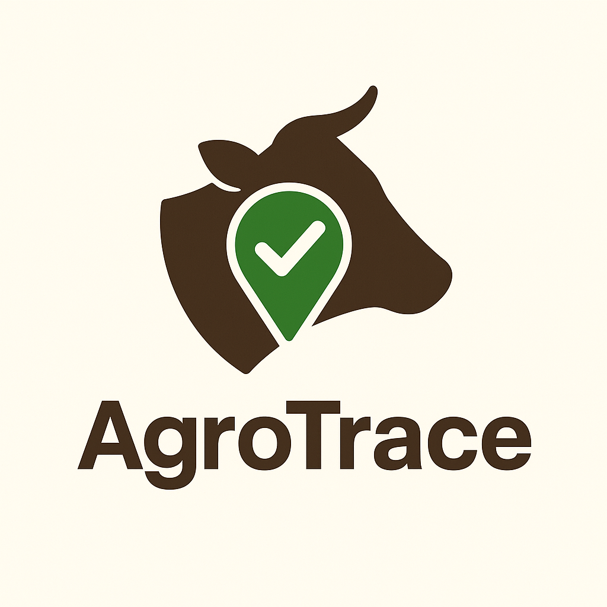
##### Logotipo del servicio
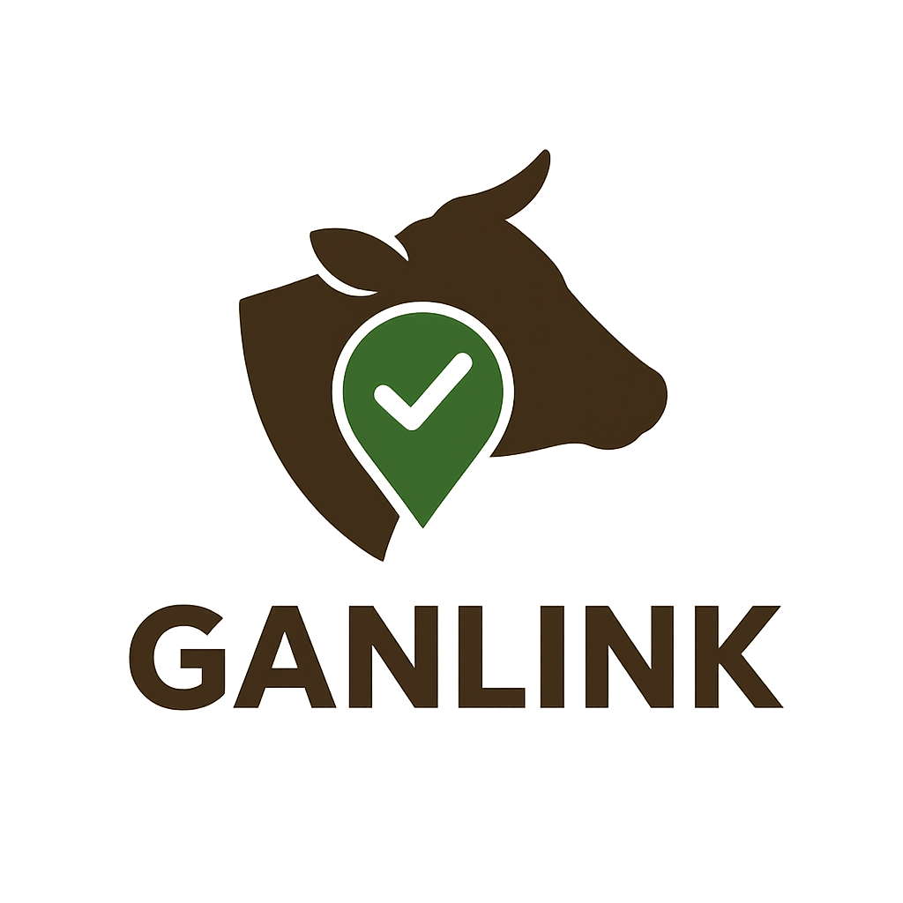

<h4>1.1.2. Perfiles de los integrantes del equipo</h4>

|| Perfiles de los integrantes del equipo |
| :-------------------------------------- | :---------------------------------: |
| Mi nombre es **Nelson Fabrizio Guerrero Tomas**, soy estudiante de Ingeniería de Software con interés en el análisis de usuarios y la investigación de requerimientos. Apoyo al equipo en la recopilación de información y validación de necesidades del sector ganadero. |  |
| Mi nombre es **Ernesto Rodas Sotomayor**, soy estudiante de Ingeniería de Software con experiencia en documentación académica, gestión de proyectos y diseño de soluciones digitales. Aporto al equipo en la redacción técnica, estructuración del informe y liderazgo en la organización de entregables. |  |
| Mi nombre es **Milenio Huamán Hinostroza**, soy estudiante de Ingeniería de Software con afinidad por el modelado de procesos y la especificación de requisitos. Mi aporte se centra en la definición de herramientas de análisis, mapas de empatía y estructuración de historias de usuario. |  |
| Mi nombre es **Diego Alonzo Mora Blas**, soy estudiante de Ingeniería de Software con orientación al diseño técnico y arquitectónico. Contribuyo con la elaboración de diagramas, modelos de dominio y propuestas de arquitectura de software para el desarrollo de la aplicación. |  |
| Mi nombre es **Fabrizio Amir León Vivas**, soy estudiante de Ingeniería de Software con una sólida formación en arquitectura empresarial y desarrollo basado en dominios (DDD). Me especializo en la implementación de microservicios RESTful utilizando Spring Boot y NestJS, aplicando principios de Clean Architecture, buenas prácticas de diseño y pruebas de integración BDD. |  |

<h3>1.2. Solution Profile</h3>

El **Solution Profile** tiene como propósito describir de forma clara la propuesta tecnológica que busca dar respuesta a una problemática específica identificada en el contexto productivo o social. 

<h4>1.2.1. Antecedentes y Problemática</h4>

En el Perú, la ganadería constituye una de las principales actividades económicas rurales; sin embargo, los **pequeños y medianos productores** enfrentan limitaciones estructurales que dificultan su competitividad frente a empresas de mayor escala. La **falta de digitalización**, la escasa trazabilidad del ganado y la **desorganización en el registro de información sanitaria y productiva** son factores que afectan directamente su productividad y acceso a mercados.  
Instituciones como el **SENASA** y el **MIDAGRI** han reconocido estas brechas, señalando que la ausencia de registros confiables impide certificar el origen y las condiciones sanitarias del ganado, restringiendo la inserción de los productores a cadenas formales de valor. A ello se suma la carencia de herramientas tecnológicas adaptadas al contexto rural, lo que perpetúa el uso de métodos manuales, incrementa errores y limita la eficiencia en la toma de decisiones.  
En este contexto, surge la necesidad de desarrollar una **solución tecnológica integral** que permita a los ganaderos registrar, gestionar y consultar de forma sencilla la información de su hato, mejorando la trazabilidad, el control sanitario y la organización productiva. Esta propuesta busca cerrar la brecha digital del sector y fortalecer la sostenibilidad económica de los pequeños productores mediante la adopción de herramientas modernas de gestión y trazabilidad.
###### What (Qué)
**¿Cuál es el problema?**  
Los pequeños y medianos ganaderos de Latinoamérica no gestionan adecuadamente la información de sus hatos y suelen depender de cuadernos o registros incompletos, lo que provoca pérdida de datos, errores y baja eficiencia (SENASA, 2020). Según la WOAH (2024), “Animal identification and animal traceability are tools for addressing animal health (including zoonoses) and food safety issues.”  Además, como sintetiza Cartín-Rojas (2013), “La trazabilidad de los animales y sus productos a lo largo de su proceso productivo permite identificar, verificar y aislar los alimentos potencialmente peligrosos”. 
En mercados internacionales, la trazabilidad es condición de acceso: “Para que sus cadenas productivas puedan acceder al mercado europeo, los países proveedores […] deberán contar con […] sistemas de trazabilidad” (Gautreau, 2024). 

###### When (Cuándo)
**¿Cuándo sucede el problema?**  
El problema aparece a lo largo de **todo el ciclo de vida** del ganado: desde el nacimiento y los controles sanitarios/reproductivos, hasta la venta y el faenado (FAO & ICAR, 2012; SENASA, 2020). Según FAO/ICAR (2012), “One of the key requirements is to demonstrate their origin by having a system of traceability from their point of origin to their final destination.” De acuerdo con la WOAH (2024), la trazabilidad debe “achieve traceability throughout the animal production and food chain”. 

###### Where (Dónde)
**¿Dónde surge el problema?**  
Predomina en **zonas rurales** de América Latina, donde la producción de pequeña y mediana escala enfrenta brechas de **digitalización**, servicios y organización. Como señalan Loukos y Arathoon (2021), “Las herramientas agropecuarias digitales de América Latina no han podido alcanzar la escala […] lo que dificulta su sostenibilidad a largo plazo.” En Perú, sin información de calidad y herramientas adecuadas, la competitividad relativa se reduce frente a productores tecnificados; el Banco Mundial resume que “the gap in productivity has widened over time.” (World Bank, 2017). 

###### Who (Quién)
**¿Quiénes están involucrados?**  
Los principales actores son **pequeños y medianos ganaderos**, sus **asociaciones**, **técnicos agropecuarios** y el **sector público**. El Código Terrestre de la WOAH establece que “Animal identification and animal traceability should be under the responsibility of the Veterinary Authority.” (WOAH, 2024). La literatura sobre acceso a mercados destaca el rol de las organizaciones de productores para mejorar calidad, estandarización y negociación (Riveros, 2008).

###### ¿Quién utilizará la solución?
La solución será utilizada por **ganaderos** que busquen elevar productividad, control sanitario y trazabilidad, y por **técnicos agropecuarios** que acompañan la toma de decisiones en campo mediante registros digitales, alertas sanitarias y tableros simples. En línea con ello, “Las herramientas digitales que permiten que los agricultores accedan a los mercados […] son extremadamente útiles para la generación de conjuntos de datos ricos” (Loukos & Arathoon, 2021). 

###### Why (Por qué)
**¿Cuál es la causa del problema?**  
Confluyen tres causas: (1) **falta de herramientas tecnológicas** adaptadas al contexto rural y de bajo costo; (2) **desconocimiento** de los beneficios de la trazabilidad y la gestión de datos; y (3) **limitado acompañamiento técnico y servicios** (conectividad, extensión, financiamiento). Como evidencia estructural, el Banco Mundial señala que “the gap in productivity has widened over time.” (World Bank, 2017). A la vez, existen oportunidades: “Las intervenciones digitales pueden tener un impacto significativo en la salud y los ingresos de los pequeños agricultores” (Loukos & Arathoon, 2021). 

##### ¿Cuáles son las 2H?

###### How (Cómo)
###### ¿Cómo se utilizará el producto?
**AgroTracer**, desarrollado por **GanLink**, será una **aplicación móvil multiplataforma** complementada con una versión web. Permitirá a los ganaderos registrar información individual de cada animal —raza, edad, peso, estado reproductivo—, recibir alertas sanitarias automáticas para vacunas y tratamientos, controlar ingresos y gastos, generar reportes visuales y descargables, y acceder a contenidos educativos a través de la **Academia Ganadera**. Todo ello mediante una interfaz sencilla, intuitiva y adaptada al contexto rural.

###### ¿Cómo lograremos una gestión eficiente dentro de la aplicación?
La eficiencia se alcanzará mediante un diseño de interfaz **simple, modular y adaptable**, la integración de **alertas automáticas y recordatorios**, la generación de **reportes interactivos y comparativos**, la disponibilidad de **acceso offline** en zonas rurales con baja conectividad y la capacitación de los usuarios a través de la Academia Ganadera para garantizar un uso efectivo de la plataforma.

###### How much (Cuánto)
**¿Cuál es la magnitud del problema?**  
En el Perú, la producción bovina está dominada por pequeños y medianos productores (alrededor del 80% de la carne bovina), pero la base digital y de trazabilidad aún es limitada. Según INEI (2025), “en el cuarto trimestre de 2024, el 58,4 % de los hogares del país disponen del servicio de Internet” y “el mayor crecimiento porcentual… se dio en la población del área rural al pasar de 51,8 % a 56,7 %”.  Además, para el CENAGRO 2012, INEI reportó que “a nivel nacional el 1,8% de hogares de productoras agropecuarias y el 2,0% de los productores… tiene conexión de Internet en el hogar” y que “en promedio, el 3,7% de hogares… cuentan con computadora”.  En paralelo, el hato nacional bordea los 5,6 millones de bovinos: como sintetiza Zúñiga (2022), “En el Perú existen 5.6 millones de cabezas de ganado bovino”.  En identificación oficial, SENASA informó que “identificó oficialmente a 1’275,342 bovinos y 465,024 porcinos”.  Finalmente, a nivel global persiste la brecha de uso: GSMA subraya que “39% of the global population are living within mobile broadband coverage but are not using it – the usage gap”.  Este contexto, sumado a los estándares internacionales —por ejemplo, WOAH recuerda que “Animal identification and animal traceability are tools for addressing animal health… and food safety issues”—, refuerza la necesidad de digitalizar y trazar mejor “del animal al alimento”. 

###### ¿Qué porcentaje del sector se beneficiará?
Con base en la tenencia de smartphones en hogares rurales del Perú y el uso de Internet, estimamos un universo adoptable inmediato cercano al 48% (0,848×0,567). Según Gestión (resumiendo ERESTEL–OSIPTEL), “al cierre de 2024 el 94.8% de los hogares peruanos cuenta con un smartphone” y “en el área rural… se disparó al 84.8%”. A su vez, INEI indicó que “el mayor crecimiento porcentual en el uso de Internet se dio… en el área rural… 56,7 %”. Dado que la brecha de **uso** suele superar a la de **cobertura** —“39%… within mobile broadband coverage but… not using it”—, el rango operativo de adopción directa del 40–60% es razonable si se acompaña con diseño *offline-first* y asistencia técnica. 

<h4>1.2.2. Lean UX Process</h4>

<h5>1.2.2.1. Lean UX Problem Statements</h5>

###### Problem statement

El propósito de AgroTracer es ofrecer a los pequeños y medianos ganaderos una aplicación móvil multiplataforma, simple y accesible, que les permita registrar, organizar y supervisar la información clave de su hato. Con esta herramienta se busca optimizar procesos sanitarios, reproductivos y económicos que hoy se gestionan de forma manual, fragmentada y poco confiable.

En la situación actual, muchos ganaderos mantienen un control limitado o inexistente de su ganado. Los registros suelen hacerse en cuadernos físicos, hojas sueltas o, en ocasiones, con herramientas digitales improvisadas que no se ajustan a sus necesidades. Esta dependencia de métodos tradicionales genera errores en los registros, omisión de vacunas y tratamientos, pérdida de información y baja trazabilidad. Como consecuencia, se afecta la productividad, se dificulta el cumplimiento de normativas sanitarias y se restringen las oportunidades de acceder a mercados más competitivos, donde la trazabilidad es un requisito frecuente.

La ausencia de una solución tecnológica adaptada al contexto rural impide que los productores tomen decisiones informadas, oportunas y sostenibles. Reducir esta brecha mediante un sistema digital sencillo, con registro individual o por lotes, trabajo sin conexión y soporte a la identificación oficial, puede mejorar la trazabilidad, la eficiencia operativa y la competitividad de los pequeños y medianos productores.

Referencias:
- World Organisation for Animal Health. (2024). Terrestrial Animal Health Code, Ch. 4.2: General principles on identification and traceability of live animals. https://www.woah.org/fileadmin/Home/eng/Health_standards/tahc/2024/en_chapitre_ident_traceability.htm  
- SENASA Perú. (2020). Guía de Buenas Prácticas Pecuarias en producción de bovinos. https://www.senasa.gob.pe/senasa/descargasarchivos/2020/07/Guia-BP-BOVINO.pdf  
- Instituto Nacional de Estadística e Informática (INEI). (2025, 26 de marzo). El 58,4% de los hogares del país tiene acceso a Internet (ENAHO, 4.º trim. 2024). https://www.gob.pe/institucion/inei/noticias/1133448-el-58-4-de-los-hogares-del-pais-tiene-acceso-a-internet  
- GSMA. (2024). The State of Mobile Internet Connectivity 2024. https://www.gsma.com/r/wp-content/uploads/2024/10/The-State-of-Mobile-Internet-Connectivity-Report-2024.pdf  
- World Bank. (2017). Gaining Momentum in Peruvian Agriculture: Opportunities to Increase Productivity and Enhance Competitiveness. https://documents1.worldbank.org/curated/en/107451498513689693/pdf/P162084-06-26-2017-1498513685623.pdf  
- MIDAGRI. (2017). Plan Nacional de Desarrollo Ganadero 2017–2027. https://www.midagri.gob.pe/portal/download/pdf/especiales/plan-nacional-ganadero.pdf

**Pregunta orientadora:**  
¿Cómo podríamos digitalizar y automatizar la gestión de la información del ganado de manera que los pequeños y medianos productores puedan optimizar sus procesos sanitarios, reproductivos y económicos, evitando la dependencia de registros manuales y la pérdida de datos relevantes?

<h5>1.2.2.2. Lean UX Assumptions</h5>

###### **Business Assumptions**

1. **Creemos que nuestros usuarios necesitan** una solución más eficiente, confiable y accesible para registrar y monitorear la información relacionada con la salud, la productividad y la trazabilidad del ganado, superando las limitaciones de los métodos manuales.

2. **Estas necesidades se pueden satisfacer** mediante el desarrollo de **AgroTracer**, una aplicación móvil multiplataforma complementada con una versión web, que permita registrar datos clave del hato, emitir alertas automáticas y generar reportes útiles para la toma de decisiones.

3. **Nuestros clientes iniciales serán** pequeños y medianos ganaderos que dispongan de teléfonos móviles inteligentes o computadoras básicas, así como técnicos agropecuarios que brindan asesoría directa en campo.

4. **El valor más importante que un cliente busca en nuestros servicios es** contar con un sistema ordenado y automatizado de gestión ganadera que prevenga pérdidas por descuidos, optimice la productividad y facilite el cumplimiento de normativas de trazabilidad para acceder a mejores mercados.

5. **El cliente también obtendrá** beneficios adicionales como alertas sanitarias programadas, reportes económicos integrados, acceso a historiales completos de cada animal y contenidos educativos dentro de la plataforma.

6. **Vamos a captar la mayoría de clientes mediante** alianzas estratégicas con asociaciones ganaderas, programas de desarrollo rural y campañas de difusión digital dirigidas a zonas con alta actividad pecuaria.

7. **Vamos a generar ingresos mediante** un modelo de suscripción mensual escalable, con planes diferenciados según el tamaño del hato ganadero, además de licencias institucionales para asociaciones y entidades vinculadas al agro.

8. **Nuestra competencia en el mercado está conformada por** aplicaciones genéricas de gestión ganadera, el uso de hojas de cálculo digitales y los métodos tradicionales como cuadernos o registros manuales.

9. **Nuestra ventaja competitiva frente a la competencia será** ofrecer una solución diseñada específicamente para el contexto rural: simple de usar, con funcionalidades adaptadas a pequeños y medianos productores, e integrada con un enfoque educativo a través de la **Academia Ganadera**.

10. **El principal riesgo identificado es** que algunos ganaderos, por factores culturales o falta de experiencia digital, presenten resistencia a adoptar el uso de una aplicación tecnológica para la gestión de su ganado.

11. **Mitigaremos este riesgo mediante** capacitaciones presenciales y virtuales, el diseño de una interfaz altamente intuitiva, la integración de tutoriales interactivos y el fortalecimiento de la **Academia Ganadera** como soporte formativo continuo.

###### **User Assumptions**

###### **¿Quién es el usuario?**
Los usuarios principales de **AgroTracer** son pequeños y medianos ganaderos, así como técnicos agropecuarios que brindan asesoría directa en el campo. En una segunda etapa, la aplicación también podrá ser utilizada por asociaciones ganaderas, cooperativas y entidades públicas vinculadas a programas de formalización, sanidad animal y trazabilidad, ampliando su alcance a un ecosistema más amplio de actores del sector rural.

###### **¿Qué problemas busca resolver nuestro producto?**
El principal problema que **AgroTracer** pretende solucionar es la desorganización en el manejo de la información ganadera y la pérdida de datos clave debido al uso de registros manuales. En la actualidad, muchos productores carecen de un sistema confiable para dar seguimiento a vacunas, partos, tratamientos o controles económicos, lo que afecta negativamente su rentabilidad y limita el cumplimiento de requisitos normativos para acceder a mercados más competitivos.

###### **¿Qué características son importantes para el usuario?**
Las funcionalidades más valoradas incluyen el registro individual de cada animal (edad, raza, estado de salud, productividad), la emisión de alertas automáticas para vacunas y tratamientos, la generación de reportes económicos simplificados, el acceso a historiales completos de cada animal y la disponibilidad de contenidos educativos en formatos prácticos como video o audio. La **facilidad de uso**, incluso en escenarios con conectividad limitada, constituye un factor decisivo para su adopción en zonas rurales.

###### **¿Dónde encaja nuestro producto en su vida y trabajo?**
La aplicación se integra directamente en la rutina diaria del productor ganadero, fortaleciendo su capacidad de planificación, reduciendo pérdidas por descuidos, facilitando el cumplimiento de normativas sanitarias y mejorando la toma de decisiones estratégicas sobre la gestión del hato. Todo ello se traduce en mayor eficiencia operativa, incremento de la rentabilidad y una mejora tangible en la calidad de vida del usuario.

###### **¿Cuándo y cómo se utiliza nuestro producto?**
**AgroTracer** es empleada cada vez que el productor registra un nuevo animal, aplica un tratamiento, registra un parto, controla ingresos o consulta indicadores de productividad. Asimismo, es usada para analizar datos históricos y planificar decisiones estratégicas como ventas, selección de reproductores o gestión de recursos. La aplicación está diseñada para funcionar desde dispositivos móviles y computadoras, en el campo o en el hogar, adaptándose a las condiciones de trabajo del usuario.

###### **¿Cómo debe verse y comportarse nuestro producto?**
La aplicación debe contar con una interfaz **amigable, intuitiva y accesible**, pensada para usuarios con poca experiencia tecnológica. Su comportamiento debe ser estable, rápido y seguro, garantizando la protección de los datos personales del productor y de la información ganadera. El diseño debe transmitir confianza, practicidad y modernidad adaptada al contexto rural, ofreciendo una experiencia clara, sin tecnicismos innecesarios, y con una estética que combine tecnología con cercanía al campo.

###### **Feature Assumptions**

**Creemos que** la aplicación debe contar con una **interfaz intuitiva y responsiva**, accesible desde dispositivos móviles y computadoras, que facilite su uso incluso a ganaderos con poca experiencia tecnológica, garantizando una curva de aprendizaje mínima.

**Creemos que** **AgroTracer** debe incorporar un **sistema de alertas inteligentes y personalizables**, que notifique oportunamente al usuario sobre vacunas, tratamientos sanitarios, partos y fechas clave, reduciendo riesgos de pérdida de productividad por descuidos.

**Creemos que** la aplicación debe permitir un **registro detallado e histórico de cada animal**, incluyendo variables como peso, estado de salud, historial reproductivo, ingresos y egresos asociados, lo que proporcionará información confiable para el análisis productivo y económico.

**Creemos que** **AgroTracer** debe integrar un **módulo de reportes y visualizaciones gráficas interactivas**, que permita a los ganaderos comprender de manera clara la evolución de su hato, tomar decisiones informadas basadas en datos y demostrar trazabilidad ante compradores, asociaciones o autoridades regulatorias.

<h5>1.2.2.3. Lean UX Hypothesis Statements</h5>

* **Hypothesis Statement 01**

  **Creemos que** los pequeños y medianos ganaderos estarán dispuestos a adoptar **AgroTracer** como herramienta principal para registrar digitalmente la información sanitaria, productiva y económica de su hato.

  **Sabremos** que hemos tenido éxito

  **Cuando** al menos el 50% de los usuarios registrados utilicen activamente la aplicación móvil durante el primer trimestre posterior a su lanzamiento.

* **Hypothesis Statement 02**

  **Creemos que** la integración de **alertas automáticas e inteligentes** sobre vacunas, partos y tratamientos sanitarios permitirá a los ganaderos reducir significativamente los descuidos y las pérdidas relacionadas con la salud de su ganado.

  **Sabremos** que hemos tenido éxito

  **Cuando** al menos el 40% de los usuarios reporten haber evitado incidentes sanitarios relevantes gracias a las notificaciones emitidas por la aplicación.

* **Hypothesis Statement 03**

  **Creemos que** el acceso a **reportes visuales interactivos** y al historial individual de los animales permitirá a los usuarios tomar decisiones más acertadas en materia económica y reproductiva.

  **Sabremos** que hemos tenido éxito

  **Cuando** al menos el 60% de los ganaderos indiquen haber tomado decisiones de venta, reproducción o tratamiento basadas directamente en la información proporcionada por **AgroTracer**.

* **Hypothesis Statement 04**

  **Creemos que** el uso de **AgroTracer** reducirá los errores frecuentes asociados a los métodos tradicionales de registro (cuadernos físicos, hojas sueltas o planillas digitales improvisadas) y mejorará la organización de la información ganadera.

  **Sabremos** que hemos tenido éxito

  **Cuando** se evidencie una disminución de al menos el 50% en los errores de registro —como omisiones, datos incompletos o duplicados— tras tres meses de uso continuo de la aplicación móvil.

<h5> 1.2.2.4. Lean UX Canvas.</h5>

El Lean UX Canvas es una herramienta empleada dentro del enfoque de diseño centrado en el usuario (UX) y la metodología Lean, destinada a facilitar la creación y evolución de productos de forma ágil y eficiente. Su finalidad es ofrecer una estructura organizada que promueva la colaboración entre equipos multidisciplinarios. A continuación, se muestra el Lean UX Canvas desarrollado por el equipo mediante el uso de la plataforma digital **Mural**:

Enlace para acceder al [Canvas](https://docs.google.com/document/d/1QeEyI6S3-2wqPz3qXxDNnxgeR3CyS6JbQkdSieTT3ho/edit?tab=t.0#heading=h.vhscor30k2do)

<h3>1.3. Segmento Objetivo</h3>

Según el Ministerio de Desarrollo Agrario y Riego (MIDAGRI, 2023), el Perú cuenta con más de
5 millones de cabezas de ganado vacuno, siendo la ganadería una de las actividades más
relevantes en regiones como Cajamarca, Puno, Cusco y La Libertad. El valor bruto de la
producción ganadera nacional supera los 3 mil millones de soles anuales, y más del 65 % de
las unidades productivas son gestionadas por pequeños y medianos ganaderos.

Este grupo constituye el **único segmento objetivo de GanLink**, dado que aún depende en gran
medida de registros manuales para controlar vacunaciones, nacimientos, alimentación, peso
y reproducción. La falta de digitalización genera errores, pérdida de datos, baja eficiencia en
la gestión y dificultades para cumplir con las exigencias de trazabilidad.

Ante el crecimiento proyectado de la demanda mundial de alimentos en un 70 % hacia el año
2050 (FAO, 2021), la incorporación de herramientas digitales en el sector se vuelve urgente.  
**GanLink**, a través de **AgroTracer**, busca transformar la gestión tradicional en una ganadería
**inteligente, eficiente y rentable**, brindando a los ganaderos una aplicación móvil que centraliza
y automatiza sus procesos de manera accesible y práctica.

<h4>1.3.1. Stakeholders</h4>

* **Stakeholders Internos:**
    - Equipo fundador de GanLink.
    - Equipo de desarrollo y soporte técnico del producto.

* **Stakeholders Externos:**
    - **Ganaderos pequeños y medianos**, usuarios principales y beneficiarios directos de la plataforma.

<!-- capitulo 2 -->

<h2> Capítulo II: Requirements Elicitation & Analysis.</h2>

<h3> 2.1. Competidores.</h3>

Entender el entorno competitivo es crucial para el éxito de cualquier negocio. En esta sección analizaremos detalladamente quiénes son nuestros competidores, tanto directos como indirectos y examinaremos las estrategias que utilizan como también sus fortalezas y debilidades.

<h4> 2.1.1. Análisis competitivo.</h4>

Realizar un análisis competitivo es fundamental para identificar las oportunidades y amenazas en el mercado, así como para posicionar estratégicamente a GanTrace. Este proceso permite entender cómo los competidores satisfacen las necesidades del cliente, qué brechas existen y cómo nuestra solución puede destacar mediante ventajas diferenciadoras. Además, ayuda a diseñar estrategias de marketing, precios y distribución más efectivas, asegurando una propuesta de valor única y sostenible.

<html>

<body>
    <table >
        <tr>
           <td colspan="6" class="sub">  <h1>Competitive Analysis Landscape</h1></td>
        </tr>
        <tr>
            <td colspan="2" rowspan="2" class="sub">¿Por qué llevar acabo este análisis?</td>
            <td colspan="4" class="sub"><h3>¿Quiénes son nuestros principales competidores?</h3></td>
        </tr>
        <tr>
            <td colspan="4">Gracias al análisis de la competencia perteneciente al mercado, se logra comprender el entorno competitivo 
                en el que operará nuestro producto. Ello proporciona una visión detallada de quienes son nuestros competidores 
                directos e indirectos, trazar estrategia a través de información recopilada sobre  su posicionamiento actual en el mercado.</td>
        </tr>
        <tr>
            <td rowspan="3" class="sub">PERFIL</td>
            <td rowspan="2" class="sub">Overview</td>
            <td> Ganlink  </td>
            <td> Livestock Manager  </td>
            <td> AgriTrack  </td>
            <td> FarmLogs  </td> 
        </tr>
        <tr>
            <td>Plataforma web y móvil diseñada para pequeños y medianos ganaderos en Latinoamérica, enfocada en trazabilidad, gestión sanitaria y educación.</td>
            <td>Aplicación móvil y web para gestión de hatos ganaderos, enfocada en registro sanitario y productividad.</td>
            <td>Plataforma multifuncional para gestión agrícola y ganadera, con módulos de cultivo, inventario y finanzas.</td>
            <td>Herramienta global para gestión agrícola, con funcionalidades básicas de ganadería.</td>      
        </tr>
        <tr>
            <td class="sub">Ventaja Competitiva ¿Qué valor ofrece a los clientes?</td>
            <td>Enfocado a la ganadería y la trazabilidad individual el hato a precios accesibles para los ganaderos</td>
            <td>Integración con dispositivos IoT. Reportes automatizados para exportación a autoridades sanitarias.</td>
            <td>Versatilidad: integra cultivos y ganado en una sola plataforma. Análisis predictivo basado en clima y mercado.</td>
            <td>Reconocimiento de marca internacional. Integración con mercados globales de commodities.</td>      
        </tr>
        <tr>
            <td rowspan="2" class="sub">PERFIL DEL MARKETING</td>
            <td class="sub" >Mercado Objetivo</td>
            <td>Pequeños productores (5-100 cabezas de ganado) y técnicos agropecuarios.</td>
            <td>Medianos y grandes ganaderos con acceso a tecnología avanzada.</td>
            <td>Agricultores y ganaderos diversificados en zonas semiurbanas.</td>
            <td>Grandes empresas agroindustriales con enfoque exportador.</td>
        </tr>
        <tr>
            <td class="sub">Estrategias de Marketing</td>
            <td>Alianzas con asociaciones ganaderas y programas gubernamentales. Talleres presenciales en zonas rurales.</td>
            <td>Alianzas con empresas de insumos veterinarios. Publicidad en ferias ganaderas y redes sociales especializadas.</td>
            <td>Contenido educativo en YouTube y webinars. Descuentos por volumen para cooperativas.</td>
            <td>Campañas en medios internacionales (The Economist, Bloomberg).Acuerdos con distribuidores de maquinaria agrícola.</td>
        </tr>
        <tr>
            <td rowspan="3" class="sub">PERFIL DEL PRODUCTO</td>
            <td class="sub">Productos & Servicios</td>
            <td>Plataforma móvil y web para gestión de hatos ganaderos</td>
            <td>Plataforma móvil y web para gestión de hatos ganaderos.</td>
            <td>Plataforma multifuncional para gestión agrícola y ganadera.</td>
            <td>Herramienta global para gestión agrícola y ganadera, con énfasis en mercados formales.</td>
        </tr>
        <tr>
            <td class="sub">Precios & Costos</td>
            <td>Basico: $10/mes Premium: $25/mes y Empresarial: $50/mes</td>
            <td>Básico: $20/mes Premium: $100/mes.</td>
            <td>Solo ganado: $15/mes Full agro: $50/mes.</td>
            <td>Básico: $30/mes Empresarial: $200/mes.</td>
        </tr>
        <tr>
            <td class="sub">Canales de distribución (web/móvil)</td>
            <td>Plataforma web, app móvil y colaboración con ONGs rurales.</td>
            <td>Venta directa en su sitio web y app stores.</td>
            <td>Distribución mediante cooperativas agrícolas.</td>
            <td>Venta directa y partners estratégicos en EE.UU. y Europa.</td>        
        </tr>
        <tr>
            <td rowspan="4" class="sub">ANÁLISIS SWOT</td>
            <td class="sub">Fortalezas</td>
            <td>Diseño accesible para baja conectividad. Costos accesibles y planes de acuerdo al tamaño de la finca.</td>
            <td>Tecnología IoT innovadora. Cumplimiento normativo automático.</td>
            <td>Solución integral para agro. Precios accesibles.</td>
            <td>Enfoque en mercados globales. Datos en tiempo real de mercados.</td>
        </tr>
        <tr>
            <td class="sub">Debilidades</td>
            <td>Dependencia de alianzas para distribución. </td>
            <td>Alto costo para pequeños productores. Interfaz compleja para usuarios rurales.</td>
            <td>Funcionalidades ganaderas menos desarrolladas. Falta de enfoque en trazabilidad sanitaria.</td>
            <td>Precios elevados para Latinoamérica. Poca adaptación a necesidades locales.</td>  
        </tr>
        <tr>
            <td class="sub">Oportunidades</td>
            <td>Demanda creciente de trazabilidad en exportaciones.Subsidios gubernamentales para digitalización rural.</td>
            <td>Expansión a mercados formales (exportación). Alianzas con gobiernos para subsidios.</td>
            <td>Crecimiento de la agricultura de precisión. Demanda de análisis predictivo.</td>
            <td>Expansión a Latinoamérica con socios locales. Demanda de trazabilidad para exportación.</td> 
        </tr>
        <tr>
            <td class="sub">Amenazas</td>
            <td>Competidores globales con más recursos. Resistencia a adoptar tecnología en productores tradicionales.</td>
            <td>Competencia con soluciones low-cost. Resistencia al cambio en ganaderos tradicionales.</td>
            <td>Especialización de competidores como GanTrace. Saturación de plataformas multifuncionales.</td>
            <td>Competencia de startups regionales. Barreras culturales y idiomáticas.</td>          
        </tr>
    </table>
</body>
</html>

<h4>2.1.2. Estrategias y tácticas frente a competidores</h4>

Como parte del plan de posicionamiento y diferenciación de **GanTrace** en el mercado, se han definido las siguientes estrategias y tácticas orientadas a superar a la competencia y asegurar la adopción de **AgroDigital**:

### Estrategias preliminares
- **Penetración en zonas rurales:** establecer convenios con asociaciones ganaderas, cooperativas y programas de desarrollo rural para asegurar la llegada directa a pequeños y medianos productores.
- **Educación digital progresiva:** ofrecer material audiovisual sencillo y adaptado a usuarios con poca experiencia tecnológica, facilitando la curva de aprendizaje.
- **Soporte técnico accesible:** habilitar canales de atención simples y de confianza, como WhatsApp o llamadas telefónicas, que se ajusten al contexto del usuario rural.
- **Generación de valor inmediato:** brindar desde el primer uso alertas automáticas, reportes visuales y herramientas básicas gratuitas que evidencien la utilidad de la aplicación.

### Tácticas específicas
- **Programas de referidos:** implementar promociones y beneficios por recomendación entre productores para acelerar la difusión de la plataforma.
- **Gamificación de registros:** incorporar dinámicas que motiven al ganadero a mantener actualizados sus datos mediante recompensas virtuales o logros.
- **Adaptación regional:** ofrecer versiones personalizadas con lenguaje local y soporte contextualizado según cada región.
- **Presencia en ferias y eventos agropecuarios:** participar activamente en ferias rurales, jornadas técnicas y espacios comunitarios para promover la solución directamente en el entorno del usuario.

<h3>2.2. Entrevistas</h3>

Las entrevistas son una herramienta fundamental para conocer de primera mano la realidad,
necesidades y expectativas de los **ganaderos**, nuestro público objetivo.  
Estas deben seguir una estructura clara y concisa, con preguntas específicas que faciliten
la recolección de información útil para el diseño de la solución digital.

<h4>2.2.1. Diseño de entrevistas</h4>

**Objetivo:**  
Identificar frustraciones, necesidades, nivel de digitalización, dispositivos disponibles
y percepción sobre el uso de herramientas digitales para el registro de información ganadera.

**Segmento entrevistado:**  
Ganaderos (pequeños y medianos).

**Formato:**  
Entrevistas semiestructuradas de 25 a 30 minutos, registradas en audio o video con consentimiento informado.

### Preguntas principales

1. ¿Podría indicarnos su nombre completo, edad y el distrito en el que reside?
2. ¿Cuánto tiempo lleva dedicado a la ganadería y qué tipo de ganado maneja actualmente?
3. ¿Cuál es el tamaño aproximado de su hato y cuántas personas participan en su unidad productiva?
4. ¿Qué herramientas utiliza actualmente para llevar el control de sus animales y actividades?
5. ¿Lleva registros sobre salud, alimentación o reproducción del ganado? ¿De qué manera lo hace?
6. ¿Cuáles son las principales dificultades que enfrenta en la gestión diaria de su ganado?
7. ¿Cómo monitorea actualmente la productividad (peso, leche, reproducción) y salud de su ganado?
8. ¿Qué tan importante considera contar con un historial digital de cada animal (vacunas, partos, tratamientos)?
9. ¿Ha tenido problemas por falta de registros claros (ventas, enfermedades, reproducción)?
10. ¿Ha utilizado alguna aplicación o herramienta digital para la gestión de su ganado? ¿Cómo fue la experiencia?
11. ¿Cuánto tiempo dedica al registro manual de datos, en caso de hacerlo?
12. ¿Qué tipo de información considera más valiosa tener a la mano sobre su ganado?
13. ¿Estaría dispuesto a utilizar una aplicación móvil para registrar y controlar la información de su ganado si fuese sencilla y funcional?
14. ¿Qué funcionalidades le gustaría que tenga la aplicación (alertas de vacunas, historial médico, reportes, etc.)?
15. ¿Qué beneficios espera obtener al adoptar una herramienta digital de gestión ganadera?

### Preguntas complementarias

- ¿Qué expectativas tendría sobre una plataforma digital que centralice toda la información de su ganado?
- ¿Qué dispositivos utiliza con mayor frecuencia en su trabajo (celular, laptop, tablet)?
- ¿Está familiarizado con el uso de aplicaciones móviles o herramientas digitales?
- ¿Qué valoraría más en una aplicación: rapidez, facilidad de uso, seguridad de datos, reportes claros u otro aspecto?
- ¿Le sería útil recibir alertas de vacunación, reproducción o alimentación?
- ¿Qué contenido educativo le gustaría encontrar en una aplicación ganadera (buenas prácticas, alimentación, sanidad)?
- ¿Qué canales digitales utiliza actualmente (WhatsApp, redes sociales, etc.) para su trabajo o comunicación con otros ganaderos?

### Variables demográficas a recolectar

- Edad
- Género
- Nivel educativo
- Distrito de residencia
- Tamaño de la unidad ganadera (número de cabezas de ganado)
- Tipo de ganado manejado
- Frecuencia de registros actuales
- Ocupación principal o alterna
- Herramientas digitales utilizadas
- Tipo de celular y acceso a internet
- Objetivos personales en la actividad ganadera
- Principales frustraciones en la gestión diaria
- Influencia de técnicos, asociaciones o cooperativas en sus decisiones

<h4> 2.2.2. Registro de entrevistas. </h4>

**Entrevista a Ganaderos**

|Entrevistado 2|Angel Berrospi|
|-|-|
|Edad|25|
|Distrito|Lima|
||Angel es una persona que cuenta con 7 años de experiencia en el sector de la ganadería, empezando desde muy joven hasta el día de hoy, en su ganadería cuenta con 60 animales entre 3 personas en la que esas personas se encuentra su padre como principal responsable del sector ganadero. En su experiencia cuenta que un momento complicado en la gestión fue cuando al momento de querer gestionar y saber el registro de vacunas de las vacas, esta no era posible debido a una posible confusión en la selección de los animales que les corresponda la vacuna. Lo que a él le gustaría para su gestión es encontrar un medio digital en el que se le pueda proporcionar la información acerca del historial de salud, comida, vacunas, tratamientos, etc. En su momento, un registro básico. Nunca ha usado una aplicación que le ayude a gestionar y para él sería una gran oportunidad para solucionar estas problemáticas que complican la gestión de su ganado.|
|Timing: 5:30-9:27 |URL: [upc-pre-202520-1acc0238-GanTrace-AgroDigital](https://www.youtube.com/watch?v=VVIPcymbLgw)|

<h4> 2.2.3. Análisis de entrevistas. </h4>

##### Análisis del segmento de Ganaderos

El análisis de las entrevistas realizadas evidencia características comunes y problemáticas recurrentes en los pequeños y medianos ganaderos:

- La **edad promedio** de los entrevistados se encuentra entre los 20 y 30 años, de los cuales el 66 % tiene exactamente 25 años.
- El **100 % de los ganaderos considera tedioso** realizar los registros de manera manual. El uso de cuadernos u hojas sueltas provoca pérdida de información, confusión entre datos y dificultades para mantener un control ordenado.
- Todos los entrevistados cuentan con **más de dos años de experiencia en el sector**, siendo que el 66 % supera los seis años de dedicación a la actividad ganadera.
- El ingreso a la actividad está fuertemente influenciado por los **lazos familiares**, principalmente el apoyo brindado a los padres en la gestión del ganado.
- El **100 % señala que ninguna plataforma digital existente** ha resuelto sus necesidades relacionadas con la organización y traslado de datos, identificando este aspecto como el principal problema que requiere atención.
- Finalmente, todos coinciden en que uno de los **problemas más frecuentes** es el **olvido de datos importantes**, como vacunas, pesos y eventos reproductivos, lo que repercute directamente en la eficiencia de la gestión ganadera.

<h3>2.3. Needfinding</h3>

El proceso de *needfinding* constituye una etapa fundamental dentro del diseño centrado en el usuario,
pues permite identificar necesidades, expectativas y comportamientos de los ganaderos a partir de la
información recolectada en entrevistas y análisis de campo.  
Como resultado de este proceso se construyen diferentes artefactos de investigación, tales como:
**User Personas, User Task Matrix, User Journey Maps, Empathy Mapping y As-is Scenario Mapping**,
los cuales proporcionan una visión clara y estructurada del público objetivo y sus interacciones con la solución digital.

<h4>2.3.1. User Personas</h4>

Los *User Personas* son perfiles ficticios que representan a los segmentos de usuarios entrevistados e identificados.  
Su construcción permite sintetizar las características demográficas, motivaciones, objetivos, desafíos,
hábitos de comportamiento y nivel de adopción tecnológica de los ganaderos.  
Estos perfiles facilitan la comprensión de sus necesidades reales y la forma en que interactúan con
herramientas digitales, convirtiéndose en una guía estratégica para orientar el diseño de la aplicación móvil.

A continuación, se presenta un ejemplo representativo de los ganaderos entrevistados:

###### User Persona: Ganadero

<h4>2.3.2. User Task Matrix</h4>

La **User Task Matrix** permite descomponer y clasificar las tareas que realizan los ganaderos al gestionar su hato.  
Al organizar estas actividades según su **frecuencia** e **importancia**, es posible priorizar el diseño y desarrollo de funcionalidades que maximicen el impacto en la experiencia del usuario.

| **User Task**                                   | **Ganadero (Frecuencia)** | **Ganadero (Importancia)** |
|-------------------------------------------------|---------------------------|----------------------------|
| Registrar un nuevo animal                       | Often                     | High                       |
| Actualizar registro sanitario (vacunas, tratamientos) | Always                | High                       |
| Consultar calendario de vacunación              | Often                     | High                       |
| Recibir alertas automáticas                     | Often                     | High                       |
| Registrar peso y ganancia media diaria          | Sometimes                 | Medium                     |
| Generar y revisar reportes de productividad     | Sometimes                 | Medium                     |
| Compartir registros con asociación o compradores | Rarely                   | Medium                     |
| Acceder a módulos de formación (*Academia ganadera*) | Sometimes             | Medium                     |
| Planificar ciclos de reproducción               | Rarely                    | Medium                     |
| Revisar historial completo de un animal         | Sometimes                 | High                       |

El análisis evidencia que las tareas críticas para los ganaderos se concentran en la **gestión sanitaria del hato**: actualización de vacunas y tratamientos, consulta del calendario y recepción de alertas automáticas.  
Estas acciones, de alta frecuencia e importancia, constituyen la base del **MVP** de AgroDigital.  
En un segundo nivel de prioridad se ubican tareas como la generación de reportes de productividad, el registro de peso y la planificación reproductiva.  
Finalmente, funciones como la academia ganadera o la compartición de registros con terceros pueden ser consideradas como **extensiones en fases posteriores**, al no ser percibidas como críticas en el día a día.

<h4>2.3.3. User Journey Mapping</h4>

El **User Journey Mapping** permite visualizar el ciclo completo de experiencia de los ganaderos con la aplicación **AgroDigital**, desarrollada por GanTrace.  
Este análisis refleja cómo el usuario interactúa con la plataforma desde su primer contacto, pasando por la evaluación de su utilidad, el registro inicial, el uso de funcionalidades principales y la continuidad en el tiempo.

El recorrido se estructura en etapas que abarcan desde la **adquisición del conocimiento sobre la herramienta**, la **consideración de adoptarla**, el **registro y configuración de la cuenta**, la **interacción cotidiana con las funcionalidades clave** (alertas sanitarias, registros de animales, reportes), hasta escenarios de **retención o deserción**.

Este mapeo permite identificar los puntos críticos que influyen en la percepción del valor de la aplicación, así como las oportunidades de mejora en la experiencia del usuario. Con ello, se busca garantizar no solo la adopción inicial, sino también la satisfacción y fidelización del ganadero en el uso continuo de AgroDigital.

###### User Journey del Ganadero

<h4> 2.3.4. As-is Scenario Mapping. </h4>

As-Is Scenario Mapping Ganaderos

<a href="https://miro.com/welcomeonboard/NS9kcmdQVnY4aWhkRVlhaHo0d3grWCszei8vaFA1NmJpYnZnWnE5dWZqVEVYNzN0S3Z5Yi84STM3bjhPOEdqQVM0V2dSNUpybGYzNWkrWlNPU2kvMnFSbWF0eEcrTjhUTHpoYzk0blU3K1ovdmhDUHNZNFNNL1piYWNjbW9oL2tBS2NFMDFkcUNFSnM0d3FEN050ekl3PT0hdjE=?share_link_id=786853897174" target="_blank"> Acceder al Miro </a>

<h4> 2.3.5. Ubiquitous Language - GanLink. </h4>

  

    Glosario de términos del dominio ganadero y de trazabilidad. 
    Los términos están en <strong>inglés</strong> con su equivalente en <em>español</em> entre paréntesis. 
    Las definiciones están en español y buscan eliminar ambigüedades.
  

  <table>
    <thead>
      <tr>
        <th>Term (Spanish)</th>
        <th>Definition</th>
      </tr>
    </thead>
    <tbody>
      <tr>
        <td><strong>Cattle</strong> (Ganado)</td>
        <td>Conjunto de bovinos (vacas y toros) administrados por un propietario con fines productivos.</td>
      </tr>
      <tr>
        <td><strong>Animal ID</strong> (Identificador de animal)</td>
        <td>Código único asignado a un animal para su identificación a lo largo de toda su vida.</td>
      </tr>
      <tr>
        <td><strong>Ear Tag</strong> (Arete)</td>
        <td>Dispositivo físico con código visible que se coloca en la oreja para identificar al animal.</td>
      </tr>
      <tr>
        <td><strong>RFID Tag</strong> (Arete RFID / Chip)</td>
        <td>Dispositivo electrónico que permite lectura automática del ID del animal mediante radiofrecuencia.</td>
      </tr>
      <tr>
        <td><strong>Premises</strong> (Predio)</td>
        <td>Ubicación georreferenciada donde se alberga el ganado (finca, establo, corral, feedlot).</td>
      </tr>
      <tr>
        <td><strong>Herd</strong> (Hato)</td>
        <td>Subconjunto de animales que comparten manejo, ubicación y responsable dentro de un predio.</td>
      </tr>
      <tr>
        <td><strong>Breeder</strong> (Criador)</td>
        <td>Persona o empresa responsable del nacimiento y la crianza temprana de los animales.</td>
      </tr>
      <tr>
        <td><strong>Owner</strong> (Propietario)</td>
        <td>Titular legal actual del animal, registrado para fines sanitarios y comerciales.</td>
      </tr>
      <tr>
        <td><strong>Birth Record</strong> (Registro de nacimiento)</td>
        <td>Evento que crea la traza inicial: fecha, lugar, madre, padre y peso al nacer.</td>
      </tr>
      <tr>
        <td><strong>Weaning</strong> (Destete)</td>
        <td>Evento que registra la separación del ternero de la madre y su peso al destete.</td>
      </tr>
      <tr>
        <td><strong>Breed</strong> (Raza)</td>
        <td>Clasificación genética del animal (p. ej., Brown Swiss, Holstein, Brahman).</td>
      </tr>
      <tr>
        <td><strong>Crossbreed</strong> (Cruzado)</td>
        <td>Animal con mezcla de razas; se registra porcentaje o descripción del cruce.</td>
      </tr>
      <tr>
        <td><strong>Sex</strong> (Sexo)</td>
        <td>Clasificación biológica: hembra o macho.</td>
      </tr>
      <tr>
        <td><strong>Health Record</strong> (Historial sanitario)</td>
        <td>Conjunto de eventos de salud del animal: vacunas, desparasitaciones, tratamientos y diagnósticos.</td>
      </tr>
      <tr>
        <td><strong>Vaccination</strong> (Vacunación)</td>
        <td>Aplicación de biológicos registrados con fecha, vacuna, lote y profesional responsable.</td>
      </tr>
      <tr>
        <td><strong>Deworming</strong> (Desparasitación)</td>
        <td>Tratamiento antiparasitario interno o externo con producto y dosis especificados.</td>
      </tr>
      <tr>
        <td><strong>Treatment</strong> (Tratamiento)</td>
        <td>Intervención veterinaria (medicación, procedimiento) asociada a un diagnóstico.</td>
      </tr>
      <tr>
        <td><strong>Disease Outbreak</strong> (Brote de enfermedad)</td>
        <td>Registro de casos confirmados o sospechosos que afectan a un grupo de animales en un periodo.</td>
      </tr>
      <tr>
        <td><strong>Diagnostic Test</strong> (Prueba diagnóstica)</td>
        <td>Examen (p. ej., brucelosis, tuberculosis) con resultado y laboratorio certificador.</td>
      </tr>
      <tr>
        <td><strong>Movement</strong> (Movimiento)</td>
        <td>Traslado de un animal entre predios o establecimientos, con fecha, origen, destino y guía de transporte.</td>
      </tr>
      <tr>
        <td><strong>Ownership Transfer</strong> (Transferencia de propiedad)</td>
        <td>Cambio de propietario con documentación de compraventa y aceptación del receptor.</td>
      </tr>
      <tr>
        <td><strong>Transport Permit</strong> (Guía de transporte)</td>
        <td>Documento oficial que autoriza un movimiento e identifica ruta, animales y responsable.</td>
      </tr>
      <tr>
        <td><strong>Slaughterhouse</strong> (Matadero / Planta de beneficio)</td>
        <td>Instalación autorizada donde se sacrifica el animal y se registra el número de canal/lote.</td>
      </tr>
      <tr>
        <td><strong>Carcass Lot</strong> (Lote de canal)</td>
        <td>Conjunto de canales con trazabilidad asociada a un proceso y fecha de faena.</td>
      </tr>
      <tr>
        <td><strong>Certification</strong> (Certificación)</td>
        <td>Reconocimiento formal (orgánica, grass-fed, libre de antibióticos) asociado a auditorías y requisitos.</td>
      </tr>
      <tr>
        <td><strong>Traceability</strong> (Trazabilidad)</td>
        <td>Capacidad de seguir la historia, ubicación y estado del animal y sus productos a través de eventos.</td>
      </tr>
      <tr>
        <td><strong>Event</strong> (Evento)</td>
        <td>Registro atómico que cambia el estado del animal (nacimiento, vacuna, movimiento, venta, sacrificio).</td>
      </tr>
      <tr>
        <td><strong>Audit Trail</strong> (Bitácora de auditoría)</td>
        <td>Registro inmutable de quién hizo qué y cuándo dentro del sistema de trazabilidad.</td>
      </tr>
      <tr>
        <td><strong>QR Code</strong> (Código QR)</td>
        <td>Representación escaneable que permite consultar la trazabilidad pública de un animal o lote.</td>
      </tr>
      <tr>
        <td><strong>Batch</strong> (Lote)</td>
        <td>Grupo de animales o productos que comparten características de proceso para fines de control.</td>
      </tr>
      <tr>
        <td><strong>Feedlot</strong> (Corral de engorde)</td>
        <td>Instalación destinada a la fase intensiva de engorde con registro de dietas y ganancias de peso.</td>
      </tr>
      <tr>
        <td><strong>Pasture</strong> (Pastoreo)</td>
        <td>Sistema de alimentación basado en forraje; se registra rotación y disponibilidad de praderas.</td>
      </tr>
      <tr>
        <td><strong>Welfare Indicator</strong> (Indicador de bienestar)</td>
        <td>Métrica sobre condición del animal (movilidad, lesiones, mortalidad) usada para auditoría.</td>
      </tr>
      <tr>
        <td><strong>Average Daily Gain (ADG)</strong> (Ganancia diaria de peso)</td>
        <td>Incremento promedio de peso por día, usado en evaluación productiva.</td>
      </tr>
      <tr>
        <td><strong>Sanitary Status</strong> (Estatus sanitario)</td>
        <td>Condición sanitaria oficial del hato o predio según pruebas, vacunas y controles vigentes.</td>
      </tr>
      <tr>
        <td><strong>Export Certificate</strong> (Certificado de exportación)</td>
        <td>Documento oficial que acredita cumplimiento sanitario y de trazabilidad para comercio exterior.</td>
      </tr>
      <tr>
        <td><strong>Authority</strong> (Autoridad sanitaria / SENASA)</td>
        <td>Entidad reguladora responsable de normar, inspeccionar y validar la trazabilidad y sanidad animal.</td>
      </tr>
      <tr>
        <td><strong>Recall</strong> (Retiro de producto)</td>
        <td>Procedimiento para retirar producto del mercado ante riesgo sanitario, soportado por la trazabilidad.</td>
      </tr>
    </tbody>
  </table>

2.4 Requirements Specification
---

### Spike Stories

**Spike** : Investigar de la integracion de libreria de encriptacion BCrypt.Net-Next en la plataforma GanLink

**Contexto**
La plataforma GanLink consta de una aplicacion mobile construida en Kotlin con el framework JetpackCompose para los componentes UI. Para el apartado del backend, usamos el lenguaje C# con el framework .NET Core, donde manipulamos la base de datos mediante un ORM conocido como Entity Framework.
El Equipo busca integrar esta libreria para de esta manera mejorar nuestras practicas de seguridad de la informacion, mediante esta, buscamos mejorar nuestra confiabilidad de nuestros datos.

**Spike Story**
**Como** equipo de desarrollo (web, backend y movil)
**quiero** investigar y prototipar la integracion de libreria BCrypt.Net, en nuestra aplicacion backend .NET,
**para** que podamos entender las implicaciones tecnicas, riesgos potenciales y esfuerzo requerido para realizar esta implementacion en nuestro backend.

  
<h3> 2.4.1. User Stories.</h3>

Las user stories son una forma de convertir el lenguaje informal de los clientes del producto a un requisito de software que debe ser considerado en el desarrollo del sistema. Una user story construida adecuadamente explica al desarrollador la naturaleza de la funcionalidad que construyen, su razón de ser, y el valor que esta genera para el usuario. Para el producto AgroDigital, Ganlink presenta un conjunto de user stories para el desarrollo de la Landing Page, la aplicación web y user stories técnicas.

| Epic/User Story ID | Título                                    | Descripción                                                                                                                                                                                          | Criterios de aceptación                                                                                                                                                                                                                                                                                                                                                                                                                                                                                                                                                                                                                                                                                                                                                                                                         | Relacionado con (Epic ID) |     |
| ------------------ | ----------------------------------------- | :--------------------------------------------------------------------------------------------------------------------------------------------------------------------------------------------------- | :------------------------------------------------------------------------------------------------------------------------------------------------------------------------------------------------------------------------------------------------------------------------------------------------------------------------------------------------------------------------------------------------------------------------------------------------------------------------------------------------------------------------------------------------------------------------------------------------------------------------------------------------------------------------------------------------------------------------------------------------------------------------------------------------------------------------------ | :------------------------ | --- |
| EP01               | Contacto con Soporte                      | **Como** visitante de la landing page **Quiero** contactar al equipo de la aplicación AgroDigital **Para** resolver dudas o solicitar información.                                                   | No corresponde                                                                                                                                                                                                                                                                                                                                                                                                                                                                                                                                                                                                                                                                                                                                                                                                                  | No corresponde            |     |
| EP02               | Información relacionada con la aplicación | **Como** visitante de la landing page **Quiero** entender los beneficios y funcionalidad clave de Agrodigital **Para** tener un alcance sobre el propósito del producto                              | No corresponde                                                                                                                                                                                                                                                                                                                                                                                                                                                                                                                                                                                                                                                                                                                                                                                                                  | No corresponde            |     |
| EP03               | Facilidad al ingreso del dato             | **Como** ganadero de la aplicacion mobile **Quiero** poder ingresar los datos de trazabilidad de manera sencilla sin necesidad de una formacion tecnica avanzada.                                    | No corresponde                                                                                                                                                                                                                                                                                                                                                                                                                                                                                                                                                                                                                                                                                                                                                                                                                  | No corresponde            |     |
| EP04               | Gestión Básica de Animales                | **Como** ganadero **Quiero** registrar y actualizar información básica de cada animal **Para** mantener un inventario digitalizado y accesible desde cualquier dispositivoa                          | No corresponde                                                                                                                                                                                                                                                                                                                                                                                                                                                                                                                                                                                                                                                                                                                                                                                                                  | No corresponde            |     |
| EP05               | Registro de Eventos Clave                 | **Como** ganadero **Quiero** anotar manualmente eventos importantes (vacunas, partos, enfermedades) **Para** tener un historial completo que me ayude a tomar decisiones sanitarias y reproductivas  | No corresponde                                                                                                                                                                                                                                                                                                                                                                                                                                                                                                                                                                                                                                                                                                                                                                                                                  | No corresponde            |     |
| EP06               |                                           |                                                                                                                                                                                                      | No corresponde                                                                                                                                                                                                                                                                                                                                                                                                                                                                                                                                                                                                                                                                                                                                                                                                                  | No corresponde            |     |
| EP07               | Historial Clínico                         | **Como** veterinario **Quiero** acceder y registrar detalles médicos de cada animal **Para** garantizar un seguimiento preciso y personalizado de su salud                                           | No corresponde                                                                                                                                                                                                                                                                                                                                                                                                                                                                                                                                                                                                                                                                                                                                                                                                                  | No corresponde            |     |
| EP08               | Gestión de Visitas                        | **Como** veterinario **Quiero** programar visitas a fincas y asignar tareas específicas a los ganaderos **Para** optimizar el tiempo y asegurar que se cumplan los protocolos sanitarios             | No corresponde                                                                                                                                                                                                                                                                                                                                                                                                                                                                                                                                                                                                                                                                                                                                                                                                                  | No corresponde            |     |
| US01               | Contactar a la startup                    | **Como** visitante de la landing page **Quiero** proporcionar mi correo electrónico **Para** que los desarrolladores reciban mis comentarios, dudas e inquietudes relacionadas con la aplicación     | **Escenario 1: Enviar mensaje al equipo de desarrollo**   **Dado que** el usuario tenga una consulta y/o comentario relacionado con la aplicación   **Cuando** redacte un mensaje y adjunte una dirección de correo electrónico para contactar al equipo de desarrollo   **Entonces** el sistema remitirá la consulta a los desarrolladores                                                                                                                                                                                                                                                                                                                                                                                                                                                                            | EP01                      |     |
| US02               | Obtener información de la aplicación      | **Como** visitante de la landing page **Quiero** quiero obtener información relacionada con el producto ofrecido **Para** conocer los beneficios que puedo adquirir mediante el uso de la aplicación | **Escenario 1: Visualizar información**   **Dado que** el visitante se encuentre dentro de la landing page   **Cuando** navegue a través de todas las secciones de la página   **Entonces** podrá encontrar información clara y concisa que me permita entender de inmediato el propósito principal del software                                                                                                                                                                                                                                                                                                                                                                                                                                                                                                       | EP02                      |     |
| US03               |                                           |                                                                                                                                                                                                      |                                                                                                                                                                                                                                                                                                                                                                                                                                                                                                                                                                                                                                                                                                                                                                                                                                 | EP03                      |     |
| US04               | Registrar nuevo animal                    | **Como** ganadero **Quiero** agregar animales al sistema **Para** tener un inventario digital                                                                                                        | **Escenario 1: Registro exitoso**   **Dado que** el usuario completa los campos obligatorios (ID, raza, nacimiento)   **Cuando** haga clic en "Guardar"   **Entonces** el animal aparecerá en mi listado.   **Escenario 2: Registro Fallido**   **Dado que** el usuario dejó el campo "ID" vacío   **Cuando** intente guardar   **Entonces** el sistema mostrará "Campo obligatorio" en rojo y no guardará los datos                                                                                                                                                                                                                                                                                                                                                                                       | EP04                      |     |
| US05               | Buscar animal por ID                      | **Como** ganadero **Quiero** encontrar un animal específico **Para** consultar su información                                                                                                        | **Escenario 1: Búsqueda exitosa**   **Dado que** el ganadero ingresó el ID existente   **Cuando**  haga clic en "Buscar"   **Entonces** el sistema mostrará la ficha completa del animal   **Escenario 2: Búsqueda sin resultados**   **Dado que** ingresó un ID inexistente   **Cuando** haga clic en "Buscar"   **Entonces** el sistema mostrará "No se encontraron coincidencias"                                                                                                                                                                                                                                                                                                                                                                                                                       | EP04                      |     |
| US06               |                                           |                                                                                                                                                                                                      |                                                                                                                                                                                                                                                                                                                                                                                                                                                                                                                                                                                                                                                                                                                                                                                                                                 | EP03                      |     |
| US07               | Registrar vacunación                      | **Como** ganadero **Quiero** anotar vacunas aplicadas **Para** mantener un historial sanitario                                                                                                       | **Escenario 1: Registro completo**   **Dado que**  selecciono un animal y completo tipo de vacuna, fecha y dosis   **Cuando** guarde el registro   **Entonces** el sistema agregará el evento al historial del animal   **Escenario 2: Fecha futura no permitida**   **Dado que** ingreso una fecha posterior al día actual   **Cuando** intente guardar   **Entonces** el sistema mostrará "La fecha no puede ser futura"                                                                                                                                                                                                                                                                                                                                                                                 | EP05                      |     |
| US08               |                                           |                                                                                                                                                                                                      |                                                                                                                                                                                                                                                                                                                                                                                                                                                                                                                                                                                                                                                                                                                                                                                                                                 | EP06                      |     |
| US09               | Agregar diagnóstico                       | **Como** ganadero **Quiero** actualizar el peso de mis animales **Para** llevar un control de su crecimiento                                                                                         | **Escenario 1: Registro exitoso**   **Dado que** selecciono un animal y ingreso su peso actual   **Cuando** guarde los datos   **Entonces**  el sistema actualizará su ficha y mostrará "Peso registrado"   **Escenario 2: Peso inválido** **Dado que** ingreso un valor negativo o cero   **Cuando** intente guardar   **Entonces** el sistema mostrará "El peso debe ser mayor a cero"                                                                                                                                                                                                                                                                                                                                                                                                                      | EP04                      |     |
| US10               | Configurar Perfil                         | **Como** ganadero/veterinario **Quiero** modificar mi información personal (p.e. foto de perfil) **Para** mantener mis datos actualizados en la aplicación                                           | **Escenario 1: Edición exitosa** **Dado que** el usuario desea actualizar su información personal  **Cuando** ingrese a la sección de configuración y edite sus datos  **Entonces** el sistema mostrará un mensaje "Perfil actualizado correctamente" y reflejará los cambios   **Escenario 2: Datos inválidos** **Dado que** el usuario ingresa un correo mal formado o un número inválido  **Cuando** intente guardar los cambios  **Entonces** el sistema mostrará mensajes de error indicando qué datos deben corregirse   **Escenario 3: Cambio de contraseña** **Dado que** el usuario desea cambiar su contraseña  **Cuando** proporcione la contraseña nueva (con confirmación)  **Entonces** el sistema actualizará la contraseña y mostrará "Contraseña actualizada con éxito" | EP03                      |     |
| US11               | Filtrar animales enfermos                 | **Como** ganadero/veterinario **Quiero** filtrar animales con problemas de salud **Para** priorizar atenciones                                                                                       | **Escenario 1: Filtro con resultados**   **Dado que** hay animales marcados como "enfermos"   **Cuando**  aplique el filtro "Estado: Enfermo"   **Entonces** veré solo esos animales en la lista   **Escenario 2: Filtro sin resultados**   **Dado que**  no hay animales enfermos   **Cuando** aplique el filtro "Estado: Enfermo"   **Entonces** en el sistema veré "No hay animales con este estado"                                                                                                                                                                                                                                                                                                                                                                                                    | EP07                      |     |
| US12               | Programar visita                          | **Como** veterinario **Quiero** agendar visitas a fincas **Para** organizar mi trabajo                                                                                                               | **Escenario 1: Visita programada**   **Dado que** ingreso fecha, la finca que quiero visitar y el motivo de la visita   **Cuando** guarde la visita   **Entonces** aparecerá en mi calendario con recordatorio   **Escenario 2: Fecha pasada**   **Dado que** ingreso una fecha anterior al día actual   **Cuando** intente guardar   **Entonces**  el sistema mostrará "La fecha no puede ser pasada"                                                                                                                                                                                                                                                                                                                                                                                                     | EP08                      |     |
| US13               | Verificar Notificaciones                  | **Como** ganadero/veterinario **Quiero** visualizar notificaciones relevantes a través de una campana de alertas en la aplicación **Para** mantenerme informado de eventos importantes         | **Escenario 1: Visualización de notificaciones** **Dado que** el usuario inicia sesión en la app **Cuando** pulse el ícono de la campana **Entonces** verá una lista de notificaciones recientes con sus respectivas fechas y títulos.  **Escenario 2: Notificación leída** **Dado que** el usuario haya ingresado a una notificación **Cuando** la lea **Entonces** esta se marcará como leída                                                                                                                                                                                                                                                                                                                                                                                                         | EP04                      |     |
| US14               | Ver estadísticas                          | **Como** veterinario **Quiero** ver porcentajes de animales tratados **Para** evaluar salud                                                                                                          | **Escenario 1: Estadísticas calculadas**   **Dado que** hay cierta cantidad de animales vacunados   **Cuando** acceda a "Estadísticas"   **Entonces** veré los porcentajes de la cantidad de animales vacunados y pendientes   **Escenario 2: Sin datos disponibles**   **Dado que** no hay animales registrados   **Cuando** acceda a "Estadísticas"   **Entonces** veré "No hay datos para mostrar"                                                                                                                                                                                                                                                                                                                                                                                                      | EP09                      |     |
| US15               | Registrar tratamiento veterinario         | **Como** veterinario **Quiero** documentar medicamentos aplicados a un animal **Para** mantener un historial clínico preciso                                                                         | **Escenario 1: Tratamiento registrado**   **Dado que** selecciono un animal y completo con el medicamento y/o tratamiento   **Cuando** guarde el registro   **Entonces** el sistema lo agregará al historial del animal   **Escenario 2: Datos incompletos**   **Dado que** no ingreso la dosis requerida   **Cuando** intente guardar   **Entonces** el sistema mostrará "La dosis es obligatoria" y no guardará                                                                                                                                                                                                                                                                                                                                                                                          | EP07                      |     |
| US16               | Registrar nuevo usuario                   | **Como** ganadero/veterinario **Quiero** poder registrarme en la aplicación **Para** acceder a las funcionalidades del sistema con mis credenciales                                            | **Escenario 1: Registro exitoso** **Dado que** soy un nuevo usuario **Cuando** completo el formulario de registro con datos válidos y lo envío **Entonces** el sistema me crea una cuenta para poder iniciar sesión  **Escenario 2: Campos obligatorios incompletos** **Dado que** el usuario omite uno o más campos obligatorios **Cuando** intente enviar el formulario **Entonces** el sistema mostrará un mensaje indicando qué campos deben completarse                                                                                                                                                                                                                                                                                                                                            | EP01                      |     |
| TS01               | POST Bovinue                               | **Como** desarrollador **Quiero** registrar un nuevo animal mediante API **Para** mantener el inventario digitalizado                                                                                | **Escenario 1: Error en registro**   **Dado que** envío datos válidos (ID, raza, fecha_nacimiento)   **Cuando** hago POST /api/v1/Bovinue   **Entonces** recibo un mensaje con los datos guardados.   **Escenario 2: Datos incompletos**   **Dado que** omito el campo "ID"   **Cuando**  hago POST   **Entonces** recibo un error con mensaje "ID es obligatorio"                                                                                                                                                                                                                                                                                                                                                                                                                                            |                           |     |
| TS02               | GET                                 | **Como** desarrollador **Quiero** recuperar la lista de animales **Para** mostrar el inventario                                                                                                      | **Escenario 1: Listado exitoso**   **Dado que** existen animales registrados   **Cuando** hago GET /api/v1/Bovinue   **Entonces** recibo el mensaje de ok con array JSON.   **Escenario 2: Filtros aplicados**   **Dado que** que añado un filtro para un tipo de animal   **Cuando** hago GET   **Entonces** recibo solo animales de la raza seleccionada                                                                                                                                                                                                                                                                                                                                                                                                                                                    |                           |     |
| TS03               | PUT Actualizar Animal                     | **Como** desarrollador **Quiero** actualizar datos de animales **Para** corregir información                                                                                                         | **Escenario 1: Actualización exitosa**   **Dado que** proporciono datos válidos   **Cuando** envío la actualización   **Entonces** recibo confirmación con los nuevos datos.   **Escenario 2: Animal no encontrado**   **Dado que** proporciono un ID inexistente   **Cuando** intento actualizar   **Entonces** recibo un mensaje de error indicando que no existe                                                                                                                                                                                                                                                                                                                                                                                                                                        |                           |     |
| TS04               | DELETE Animal                             | **Como** desarrollador **Quiero** eliminar animales **Para** mantener datos precisos                                                                                                                 | **Escenario 1: Eliminación exitosa**   **Dado que** proporciono un ID válido   **Cuando** solicito la eliminación   **Entonces** recibo confirmación de eliminación.   **Escenario 2: ID inválido**   **Dado que** proporciono un ID que no existe   **Cuando** intento eliminar   **Entonces** recibo un mensaje de error                                                                                                                                                                                                                                                                                                                                                                                                                                                                                 |                           |     |
| TS05               | POST Tratamiento                          | **Como** desarrollador **Quiero** registrar tratamientos **Para** historial médico                                                                                                                   | **Escenario 1: Registro exitoso**   **Dado que** completo todos los datos del tratamiento   **Cuando** envío la solicitud   **Entonces** recibo confirmación con los detalles registrados   **Escenario 2: Fecha inválida**   **Dado que** ingreso una fecha futura   **Cuando** intento registrar   **Entonces** recibo un mensaje de error sobre fecha no válida                                                                                                                                                                                                                                                                                                                                                                                                                                         |                           |     |
| TS06               | GET Historial Médico                      | **Como** desarrollador **Quiero** consultar historial médico **Para** generar reportes                                                                                                               | **Escenario 1: Historial encontrado**   **Dado que** el animal tiene tratamientos registrados   **Cuando** solicito su historial   **Entonces** recibo la lista completa ordenada por fecha   **Escenario 2: Sin historial**   **Dado que** el animal no tiene tratamientos   **Cuando** solicito su historial   **Entonces** recibo una lista vacía                                                                                                                                                                                                                                                                                                                                                                                                                                                       |                           |     |
| TS07               | POST Venta                                | **Como** desarrollador **Quiero** registrar ventas **Para** control financiero                                                                                                                       | **Escenario 1: Venta exitosa**   **Dado que** el animal tiene tratamientos registrados   **Cuando** solicito su historial   **Entonces** recibo la lista completa ordenada por fecha   **Escenario 2: Sin historial**   **Dado que** el animal no tiene tratamientos   **Cuando** solicito su historial   **Entonces** recibo una lista vacía                                                                                                                                                                                                                                                                                                                                                                                                                                                              |                           |     |
| TS08               | POST Login                                | **Como** desarrollador **Quiero** autenticar usuarios **Para** control de acceso                                                                                                                     | **Escenario 1: Login exitoso**   **Dado que** ingreso credenciales válidas   **Cuando** inicio sesión   **Entonces** recibo un token de acceso   **Escenario 2: Credenciales inválidas**   **Dado que** ingreso contraseña incorrecta   **Cuando** intento iniciar sesión   **Entonces** recibo un mensaje de error                                                                                                                                                                                                                                                                                                                                                                                                                                                                                        |                           |     |

#### 2.4.2 Impact Mapping.

#### 2.4.3 Product Backlog

| # Orden | User Story ID | Título | Descripción| Story Points |
|:-:|:-:|-|:-|:-:|
|1|US03|Acceder a la aplicación desde la landing page|**Como** visitante de la landing page **Quiero** poder acceder a la aplicación directamente desde la landing page **Para** comenzar a utilizar las funcionalidades ofrecidas|5|
|2|US02|Obtener información de la aplicación|**Como** visitante de la landing page **Quiero** quiero obtener información relacionada con el producto ofrecido **Para** conocer los beneficios que puedo adquirir|5|
|3|US01|Contactar a la startup|**Como** visitante de la landing page **Quiero** proporcionar mi correo electrónico **Para** que los desarrolladores reciban mis comentarios, dudas e inquietudes relacionadas con la aplicación|5|
|4|US06|Iniciar sesión|**Como** ganadero o veterinario **Quiero** iniciar sesión **Para** acceder a los beneficios que ofrece la aplicación AgroDigital|5|
|5|US04|Registrar nuevo animal|**Como** ganadero **Quiero** agregar animales al sistema **Para** tener un inventario digital|3|
|6|US05|Buscar animal por ID|**Como** ganadero **Quiero** encontrar un animal específico **Para** consultar su información|3|
|7|US07|Registrar vacunación|**Como** ganadero **Quiero** anotar vacunas aplicadas **Para** mantener un historial sanitario|3|
|8|US08|Registrar venta|**Como** ganadero **Quiero** anotar la venta de un animal **Para** controlar ingresos|3|
|9|US09|Actualizar peso animal|**Como** ganadero **Quiero** actualizar el peso de mis animales **Para** llevar un control de su crecimiento|1|
|10|US10|Agregar diagnóstico|**Como** veterinario **Quiero** registrar diagnósticos **Para** documentar tratamientos|3|
|11|US11|Filtrar animales enfermos|**Como** veterinario **Quiero** filtrar animales con problemas de salud **Para** priorizar atenciones|3|
|12|US12|Programar visita|**Como** veterinario **Quiero** agendar visitas a fincas **Para** organizar mi trabajo|1|
|13|US13|Asignar tarea|**Como** veterinario **Quiero** delegar actividades a ganaderos **Para** seguimiento remoto|3|
|14|US14|Ver estadísticas|**Como** veterinario **Quiero** ver porcentajes de animales tratados **Para** evaluar salud|1|
|15|US15|Registrar tratamiento veterinario|**Como** veterinario **Quiero** documentar medicamentos aplicados a un animal **Para** mantener un historial clínico preciso|3|

## 2.5 Strategic-Level Domain-Driven Design

### 2.5.1 Event Storming

Event Storming es una herramienta que nos permite descubrir el comportamiento de un negocio, recopilando eventos importantes del
negocio, los actores principales, servicios de terceros y otros. Para la implementación de esta sección se realizaron entrevistas
correspondientes a los segmentos objetivos, de esta manera pudimos identificar los eventos principales y desarrollar un entendimiento
común

Aquí mostramos los pasos respectivos para la elaboración correcta del Event Storming realizada en la herramienta Miro:

#### Paso 1: Unstructured Exploration
En esta sección se realizó una lluvia de ideas de los eventos del dominio relacionados con el dominio empresarial que se está
explorando. Nos permitió identificar los eventos clave y las interacciones entre ellos.

#### Paso 2: Timelines

En esta sección, los eventos identificados previamente, son agrupados en subgrupos lo cual tiene como líder al evento principal (es
quien encapsula la funcionalidad principal del grupo). Estos eventos comienzan con el flujo que describe el escenario empresarial
exitoso (Happy path) y también escenarios alternativos.

#### Paso 3: Paint Points

Durante esta fase, identificamos puntos problemáticos o (Paint Points) que son áreas donde los usuarios pueden tener dificultades al
momento de realizar una respectiva funcionalidad en la aplicación. Estos puntos son importantes para mejorar la experiencia de usuario
e implementar una aplicación eficiente

#### Paso 4 : Pivotal Points

En esta fase, nos enfocamos en identificar los puntos cruciales dentro del flujo del negocio, los cuales tienen un impacto significativo en
la operatividad del sistema o el comportamiento del usuario. Estos puntos nos ayudan a priorizar qué áreas deben ser optimizadas o
revisadas con mayor detalle, ya que pueden afectar el éxito de los procesos empresariales críticos.

#### Paso 5: Commands

Los comandos representan acciones que los actores del sistema pueden ejecutar. Durante este paso, mapeamos qué acciones
desencadenan los eventos clave dentro del sistema y qué actores son responsables de ejecutarlas. Esto nos ayuda a estructurar la
lógica de negocio alrededor de acciones claras y específicas, facilitando la implementación de las reglas del negocio

#### Paso 6: Policies

En este paso, se identifican las políticas, que son reglas de negocio o condiciones que deben cumplirse para que un comando pueda ser
ejecutado o un evento pueda suceder. Las políticas son esenciales para definir las restricciones del sistema y asegurar que el flujo de
eventos sea coherente con las reglas del negocio.

#### Paso 7: Read Models
Los Read Models son vistas del estado del sistema, generalmente optimizadas para la consulta por parte de los usuarios o procesos.
Durante este paso, definimos qué información necesita ser accesible en ciertos momentos y cómo debería ser presentada, asegurando
que los actores puedan visualizar el estado del sistema de manera eficiente.

#### Paso 8:  External Systems

En esta fase, identificamos los sistemas externos que interactúan con nuestro dominio. Aquí mapeamos las conexiones con servicios de
terceros o sistemas independientes que influyen en los eventos del negocio. Es crucial entender cómo estos sistemas externos afectan
los flujos y asegurar que las integraciones sean correctas.

#### Paso 9: Aggregates

En este último paso, agrupamos los eventos y comandos que pertenecen a un agregado específico para garantizar que todas las
operaciones dentro de un contexto estén alineadas y mantengan la consistencia del sistema.

### 2.5.1.1. Candidate Context Discovery

Nuestro equipo decidió usar la técnica “start-with-simple” ya que empezamos a observar que esta técnica se enfoca en identificar partes
del sistema que claramente pertenecen juntas desde el punto de vista funcional, de usuario o de infraestructura. Ideal para sistemas
bien entendidos

Hemos identificado 6 Bounded Context.

- IAM

Gestiona identidad y acceso: registro, inicio de sesión, emisión/validación de tokens y verificación de permisos. Aísla la seguridad para que el resto del sistema no duplique lógica.

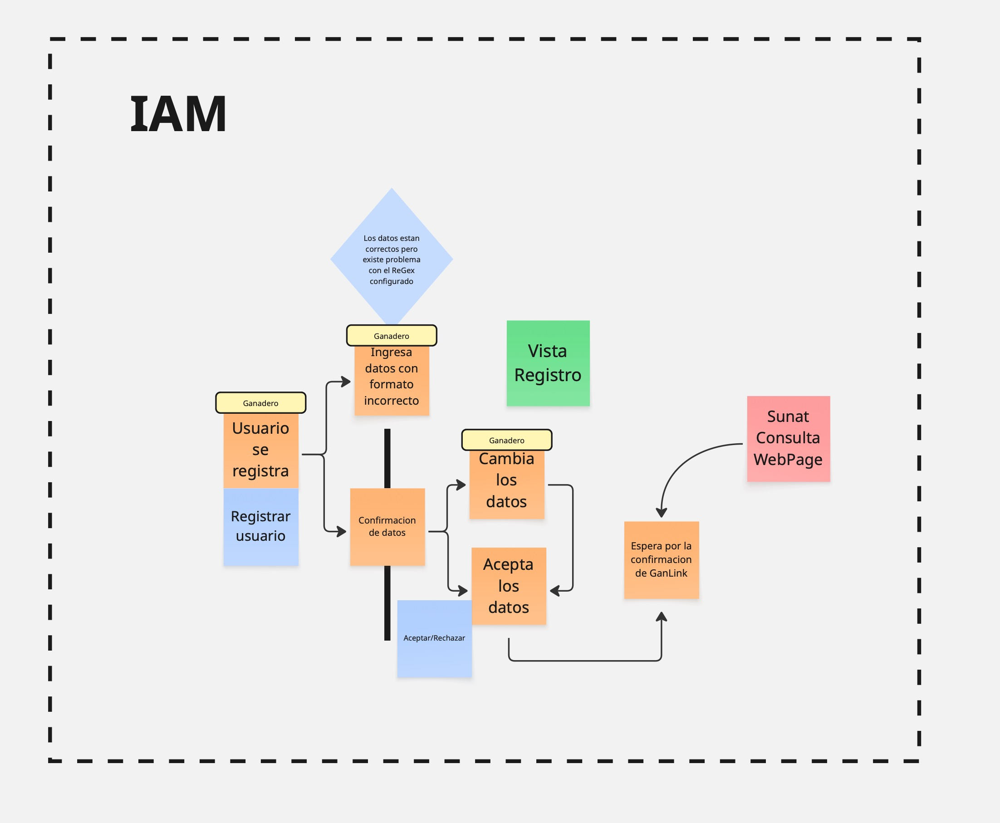

- Farm Management

Administra el predio: creación, edición, consulta y reglas de negocio del ciclo de vida de una granja. Prioriza trazabilidad y consistencia del dato.

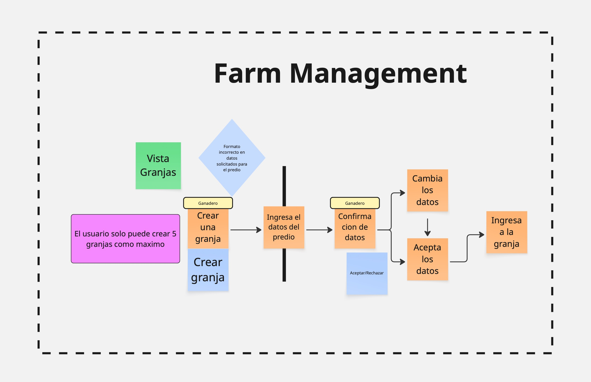

- Bovinue Management
Opera sobre el hato: altas/bajas de bovinos y consultas principales. Orquesta la interacción con métricas y salud desde el punto de vista del animal.

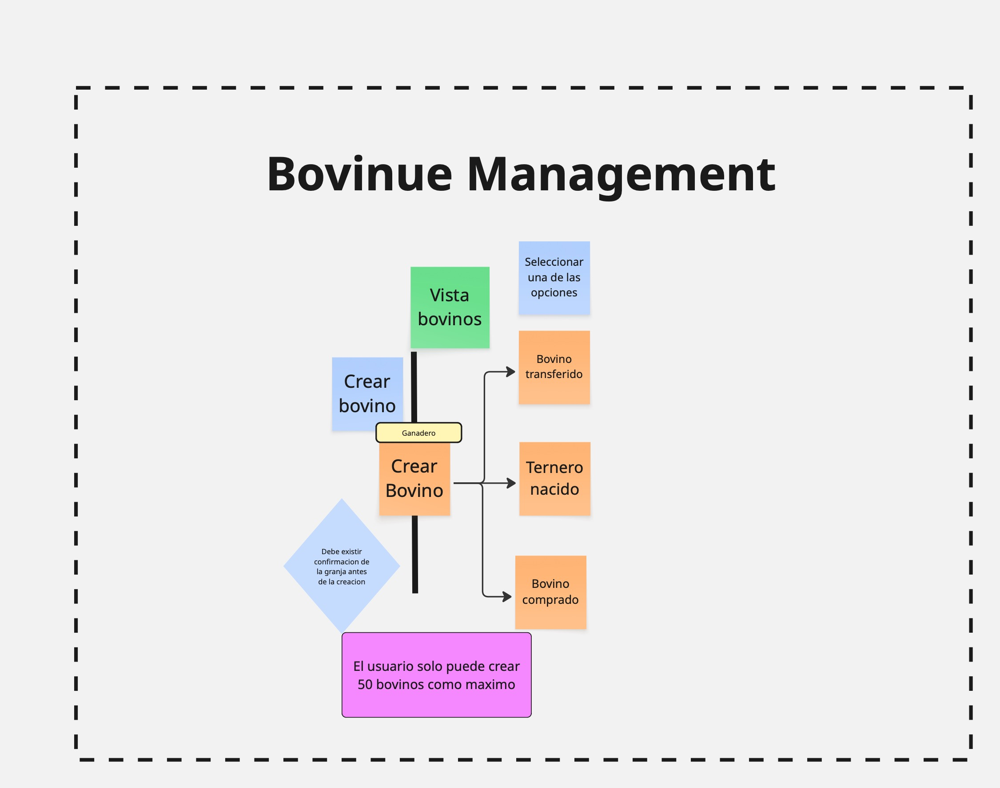

- Bovinue Configuration

Define y mantiene catálogos y parámetros del dominio bovino (categorías de métricas, parámetros, estados, etc.). Permite configurar cómo se medirán y registrarán los datos.

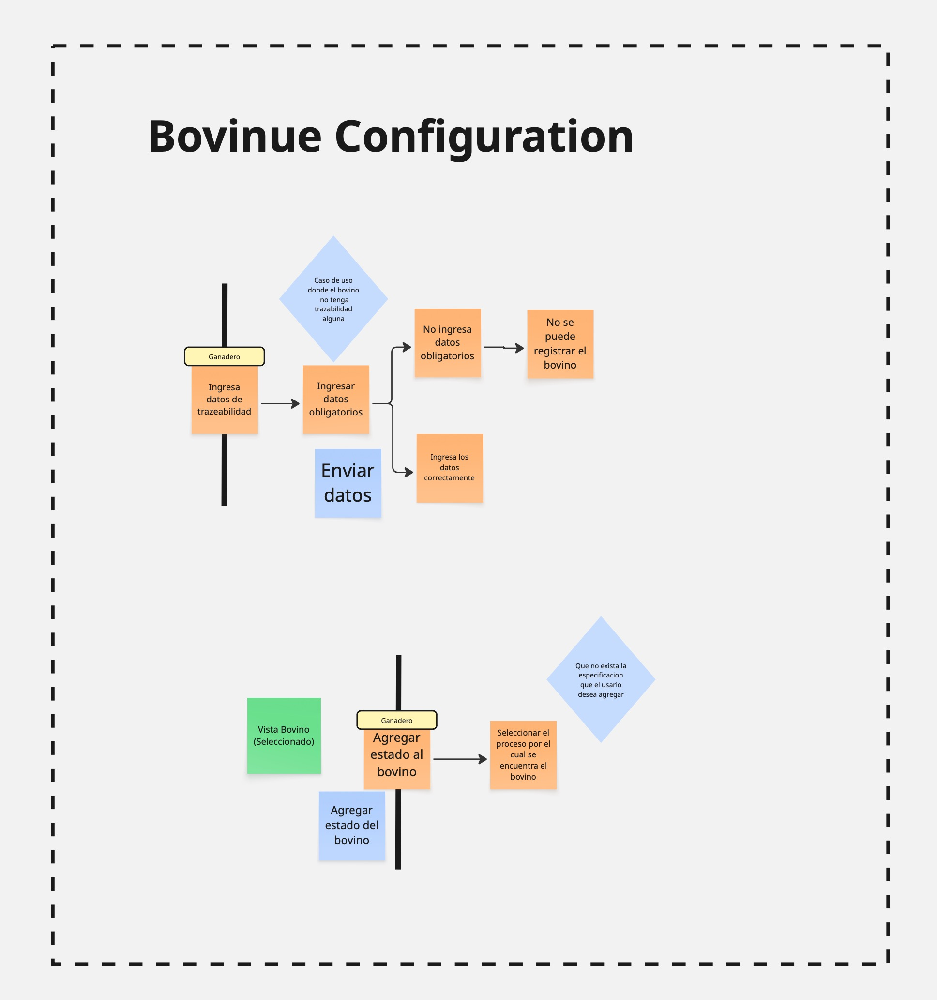

- Farm Configuration

Mantiene configuraciones del predio (p. ej., certificaciones asociadas, reglas operativas). Complementa a farm management con datos maestros del contexto granja.

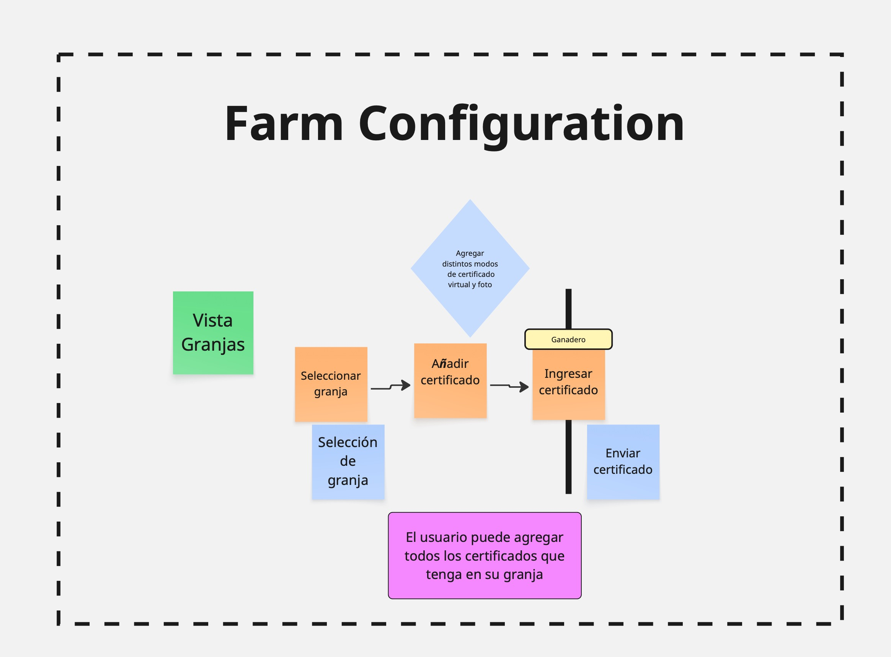

- Shared

Infraestructura común: repositorios base, unit of work, DbContext, auditoría y clientes a servicios externos. Reduce duplicación técnica y centraliza integraciones.

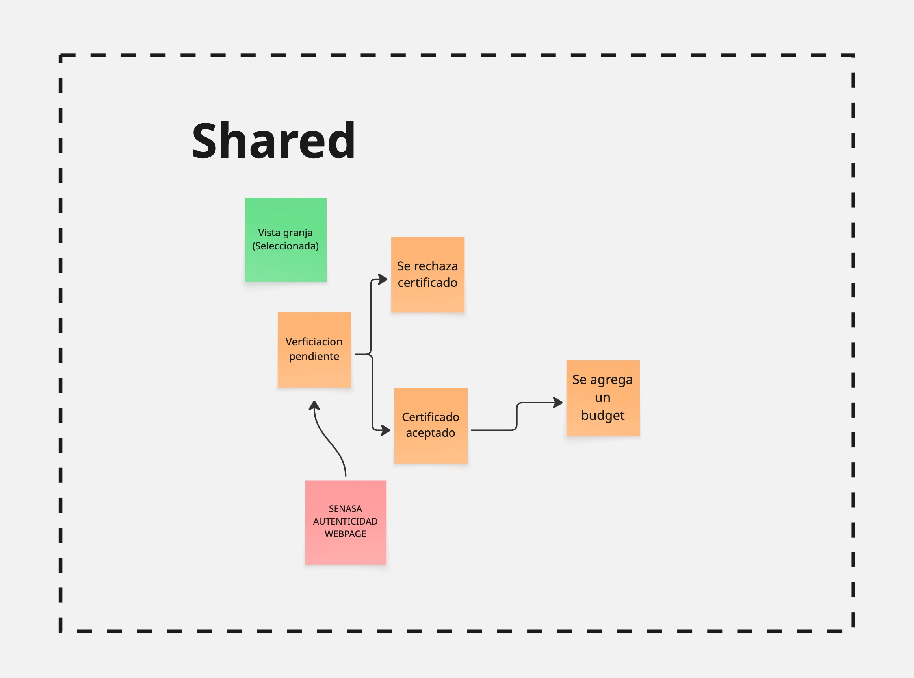

Concluimos en cuatro componentes núcleo: iam, farm management, bovinue system y shared, más la mobile application como cliente. Unificamos “bovinue management” y “bovinue configuration” en un único bounded context bovinue system, y “farm configuration” se integró dentro de farm management. shared concentra persistencia e integraciones con SUNAT/SENASA, mientras que la app móvil consume IAM, Farm y Bovinue vía APIs. El resultado es una separación por dominios clara, menos acoplamiento y una ruta de evolución más simple.

### 2.5.1.2. Domain Message Flow Modeling

En esta sección, se describe el proceso utilizado para visualizar la interacción entre los diferentes bounded contexts que conforman el
sistema. El objetivo principal es entender cómo estos contextos colaboran para resolver los casos de uso del negocio y satisfacer las
necesidades de los usuarios. Para lograr esto, se aplicó la técnica de Domain Storytelling, que facilita la representación gráfica de los
flujos de mensajes entre actores, contextos y sistemas, permitiendo identificar claramente las responsabilidades y los puntos de
comunicación entre cada componente del dominio

- IAM -> Shared

Desde el IAM se comunicara con el shared para verificar que el RUC del ganadero sea correcto, cuando halla verificado que exista y/o se a valido activara la cuenta de un usuario, done mediante un correo le avisaremos.

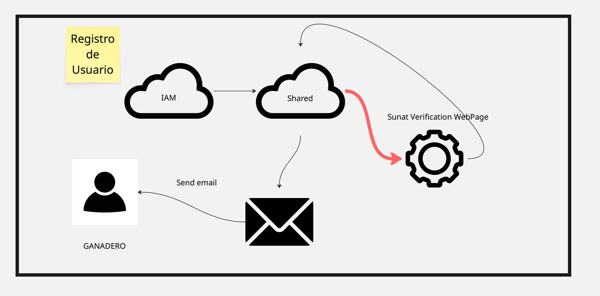

- Farm Management -> Bovinue Management -> Bovinue Configuration

La comunicacion entre nuestros distintos bounded context se realizara mediante un ACL, que es un design pattern que nos ayuda a no romper nuestro esquema de Clean Arquitecture, la accion es cuando un usuario quiera saber la cantidad de granjas que tienen mediante otro design pattern que se encontrara en el contexto de bovinos.

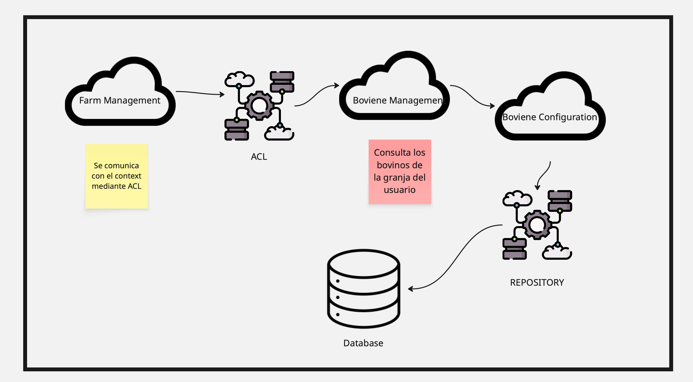

- Farm Configuration -> Shared

Nuestro sistema de budges de la aplicacion es un agregado netamente de design, que permitira al usuario poder observar cuales son sus verificados vigetnees mediante la verificacion de estos en la pagina de SENASA, donde despues de recibir la respuesta, el registro de los certificados sera guardado en nuestra base de datos.

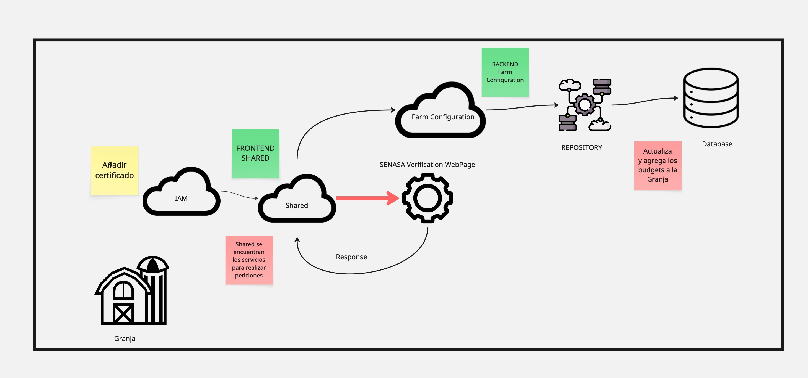

### 2.5.2 Software Architecture

Se presenta tres niveles del modelo C4 trabajado con structurizr para el proyecto con el que veremos un mejor enfoque de lo que se está desarrollando

#### 2.5.3.1. Software Architecture Context Level Diagrams

GanLink es una plataforma pensada para el día a día del productor ganadero. Centraliza en un solo lugar la gestión del predio, del hato bovino y de la identidad de los usuarios, con una app móvil sencilla al frente y servicios robustos detrás. La meta es que el granjero pueda registrar en campo, validar información oficial y tomar decisiones con datos confiables.

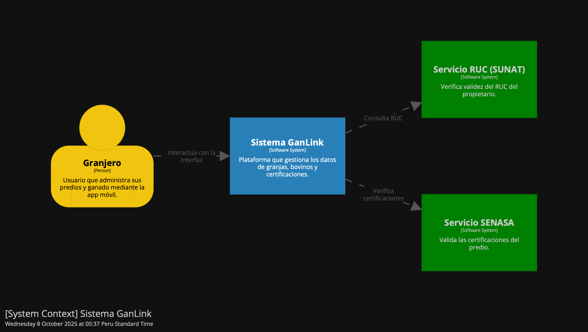

#### 2.5.3.2. Software Architecture Container Level Diagrams

La plataforma tiene una app móvil que el granjero usa en campo y que sincroniza por HTTP con tres servicios: IAM (registro, inicio de sesión y autorización), FarmManagement (gestión de granjas) y BovinueSystem (bovinos, métricas y salud). Todos se apoyan en un Shared que concentra infraestructura y clientes a SUNAT/SENASA, y persisten en una base MySQL común. Esta separación mantiene cada servicio enfocado y la app rápida y simple.

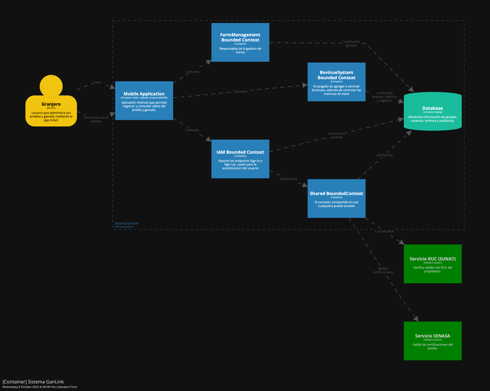

#### 2.5.3.3. Software Architecture Deployment Diagrams

**Mobile Application**

La app móvil es la puerta de entrada para el granjero. Desde su teléfono puede registrarse, iniciar sesión y gestionar su predio, sus bovinos y sus métricas de salud. La aplicación prioriza la simplicidad: las pantallas muestran la información clara, el estado se mantiene estable y, cuando no hay internet, guarda datos de forma local para sincronizarlos después. Así el usuario no pierde tiempo ni datos en campo.

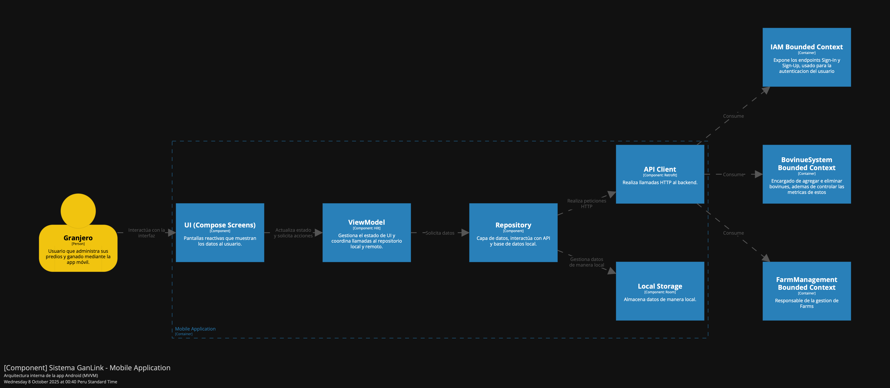

**IAM Bounded Context**

Este módulo se encarga de la identidad y el acceso. Aquí viven el registro y el inicio de sesión, la emisión de tokens y la verificación de permisos en cada petición. La idea es que el resto del sistema confíe en que quien llama está autenticado y autorizado, sin duplicar lógica de seguridad. Mantiene a los usuarios en la base de datos y protege credenciales con buenas prácticas de hashing.

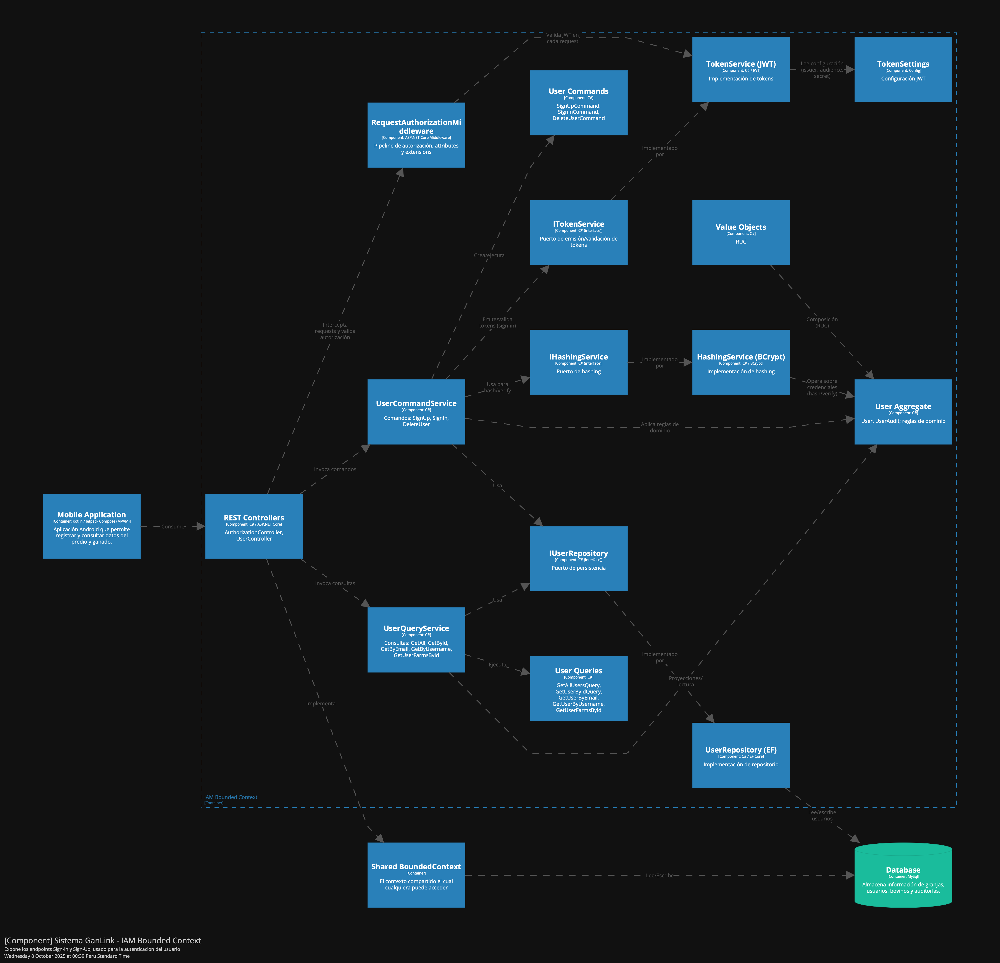

**Farm Management Bounded Context**

Este módulo administra la información del predio. Permite crear, actualizar y consultar granjas de forma segura y trazable. Estandariza cómo se registran los datos de una granja y ofrece consultas rápidas para que el productor encuentre lo que necesita sin fricción. Su foco es la calidad del dato y la estabilidad en las operaciones del día a día.

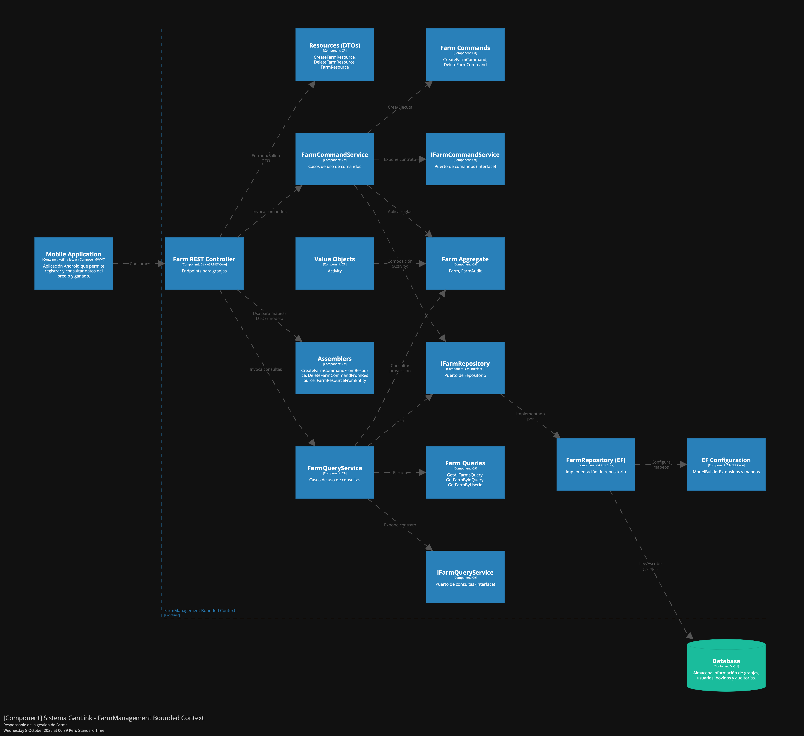

**Bovinue System Bounded Context**

Aquí se concentra la gestión del hato bovino: altas y bajas de animales, seguimiento de métricas y registro de eventos de salud. El objetivo es tener una historia clara de cada bovino y una lectura agregada del estado del hato. Con esto el productor puede tomar decisiones informadas, como detectar a tiempo problemas sanitarios o evaluar el impacto de una intervención.

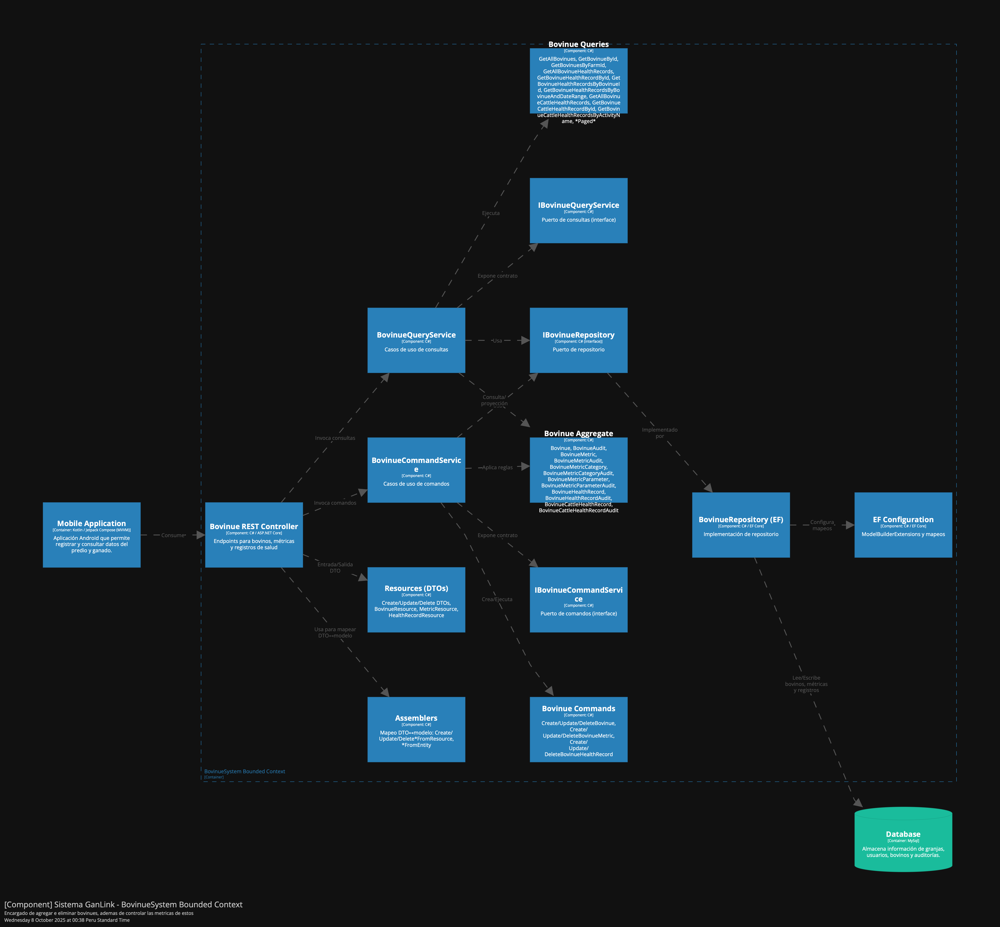

**Shared**

Este módulo comparte piezas comunes para no reinventar la rueda. Provee la base de persistencia, auditoría y acceso a la base de datos, y también los clientes que hablan con servicios externos del Estado. Centralizar estas funciones reduce complejidad en los demás módulos y facilita el mantenimiento.

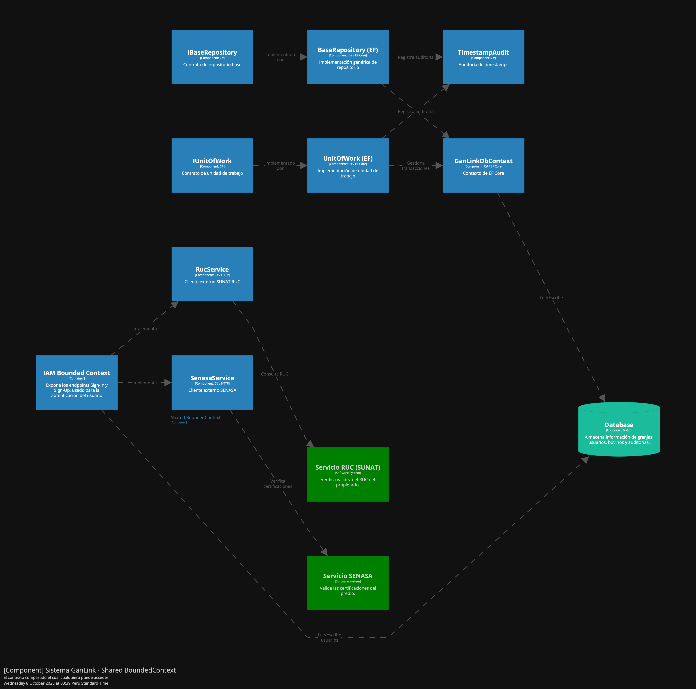

## 2.6 Tactical-Level Domain-Driven Design

### 2.6.1. Bounded Context: IAM

#### 2.6.1.1. Domain Layer

**Table: `User` (Aggregate Root)** 

| Attribute     | Type               | Notes |
|---------------|--------------------|-------|
| Id            | int                | PK |
| Username      | string             | Required; StringLength(10); private set |
| Firstname     | string             | Required; StringLength(10); private set |
| Lastname      | string             | Required; StringLength(20); private set |
| Email         | string             | Required; StringLength(20); private set |
| Ruc           | `RUC`              | Required; StringLength(20); Value Object; private set |
| Password      | string             | Required; private set |
| Farms         | `ICollection<Farm>`| Navigation; initialized a `List<Farm>()` |
| CreatedDate   | `DateTimeOffset?`  | Mapped column: `CreatedAt` |
| UpdatedDate   | `DateTimeOffset?`  | Mapped column: `UpdatedAt` |

**Constructors / Methods:**  
- `User(SignUpCommand command, string hashedPassword)` — mappea valores del comando y asigna `RUC` y `Password` hasheado.
- `User()` — inicializa strings vacíos y `RUC("10000000000")`. 

**Table: `RUC` (Value Object)** 

| Attribute | Type   | Notes |
|-----------|--------|-------|
| Number    | string | Required; exactly 11 digits; must start with `"10"` o `"20"` |

**Constructors / Methods:**  
- `RUC(string number)` — valida requerido, longitud 11 y prefijo `"10"`/`"20"`; asigna `Number`
- `ToString(): string` — devuelve `Number`. 

#### 2.6.1.2. Interface Layer

#### 2.6.1.3. Application Layer

**Table: `UserCommandService` (Application Command Service)**

| Member / Handler                         | Signature                                               | Notes |
|------------------------------------------|---------------------------------------------------------|-------|
| Handle (sign up)                         | `Task<User?> Handle(SignUpCommand command)`             | Valida duplicado por username; hashea password y persiste usuario. :contentReference[oaicite:0]{index=0} |
| Handle (delete user)                     | `Task Handle(DeleteUserCommand command)`                | Busca por Id; si no existe, lanza excepción; elimina y commitea. :contentReference[oaicite:1]{index=1} |
| Handle (sign in)                         | `Task<(User? user, string? token)> Handle(SignInCommand command)` | Verifica credenciales con hash; genera token si válido. :contentReference[oaicite:2]{index=2} |

**Table: `UserQueryService` (Application Query Service)**

| Member / Handler                  | Signature                                            | Notes |
|-----------------------------------|------------------------------------------------------|-------|
| Handle (get all users)            | `Task<IEnumerable<User?>> Handle(GetAllUsersQuery q)`| Lista usuarios desde `IUserRepository`. :contentReference[oaicite:4]{index=4} |
| Handle (get by id)                | `Task<User?> Handle(GetUserByIdQuery q)`             | Busca por Id. :contentReference[oaicite:5]{index=5} |
| Handle (get by email)             | `Task<User?> Handle(GetUserByEmail q)`               | Busca por email. :contentReference[oaicite:6]{index=6} |
| Handle (get by username)          | `Task<User?> Handle(GetUserByUsername q)`            | Busca por username. :contentReference[oaicite:7]{index=7} |
| Handle (get farms by user id)     | `Task<List<Farm>> Handle(GetUserFarmsById q)`        | Retorna granjas asociadas al usuario. :contentReference[oaicite:8]{index=8} |

**Table: `IHashingService` (Outbound Service Contract)**

| Member          | Signature                                              | Notes |
|-----------------|--------------------------------------------------------|-------|
| HashPassword    | `string HashPassword(string password)`                 | Generación de hash para contraseñas. :contentReference[oaicite:10]{index=10} |
| VerifyPassword  | `bool VerifyPassword(string password, string hashed)`  | Verifica password plano vs hash almacenado. :contentReference[oaicite:11]{index=11} |

**Table: `ITokenService` (Outbound Service Contract)**

| Member        | Signature                               | Notes |
|---------------|-----------------------------------------|-------|
| GenerateToken | `string GenerateToken(User user)`        | Emite token para el usuario autenticado. :contentReference[oaicite:12]{index=12} |
| VerifyToken   | `Task<int?> VerifyToken(string token)`   | Valida token y devuelve `userId` (nullable). :contentReference[oaicite:13]{index=13} |

#### 2.6.1.4. Infrastructure Layer

**Table: `HashingService` (BCrypt implementation)**

| Member         | Signature                                                     | Notes |
|----------------|---------------------------------------------------------------|-------|
| HashPassword   | `string HashPassword(string password)`                        | Genera hash usando `BCrypt.Net.BCrypt.HashPassword`. |
| VerifyPassword | `bool VerifyPassword(string password, string hashedPassword)` | Verifica contraseña en texto plano contra su hash. |

**Table: `UserRepository` (EF Core Repository)**

| Member             | Signature                                         | Notes |
|--------------------|---------------------------------------------------|-------|
| GetUserByIdAsync   | `Task<User?> GetUserByIdAsync(int id)`            | Busca por Id (`FirstOrDefaultAsync`). |
| FindUserByEmail    | `Task<User?> FindUserByEmail(string email)`       | Busca por email. |
| FindUserByUsername | `Task<User?> FindUserByUsername(string username)` | Busca por username. |
| FindUserFarmById   | `Task<List<Farm>> FindUserFarmById(int id)`       | Incluye relación y filtra por `user.Id`. |

**Table: `AllowAnonymousAttribute` (Attribute)**

| Target | Usage              | Notes                                               |
|--------|--------------------|-----------------------------------------------------|
| Method | `[AllowAnonymous]` | Omite autenticación/autorización para la acción. |

**Table: `AuthorizeAttribute` (Attribute + Filter)**

| Member          | Signature                                                   | Notes |
|-----------------|-------------------------------------------------------------|-------|
| OnAuthorization | `void OnAuthorization(AuthorizationFilterContext context)`  | Permite si hay `[AllowAnonymous]`; si no, exige usuario en `HttpContext.Items["User"]`, de lo contrario retorna `Unauthorized`. |

**Table: `RequestAuthorizationMiddleware` (ASP.NET Core Middleware)**

| Member | Signature                                                                                  | Notes |
|--------|--------------------------------------------------------------------------------------------|-------|
| Invoke | `Task Invoke(HttpContext context, IUserQueryService userQueryService, ITokenService tokenService)` | Lee header `Authorization`, valida token, carga usuario y lo establece en `context.Items["User"]`; continúa el pipeline; lanza si falta o es inválido. |

**Table: `RequestAuthorizationMiddlewareExtensions` (Middleware registration)**

| Member                           | Signature                                                                                  | Notes |
|----------------------------------|--------------------------------------------------------------------------------------------|-------|
| UseRequestAuthorizationMiddleware| `IApplicationBuilder UseRequestAuthorizationMiddleware(this IApplicationBuilder builder)`  | Registra el middleware de autorización en el pipeline. |

#### 2.6.1.5. Bounded Context Software Architecture Component Level Diagrams

---

### 2.6.2. Bounded Context: Farm Management

#### 2.6.2.1. Domain Layer

**Table: `Farm` (Aggregate)**

| Attribute    | Type       | Notes |
|--------------|------------|-------|
| Id           | int        | PK; private set |
| Alias        | string     | private set |
| UserId       | int        | FK a `User`; private set |
| MainActivity | `Activity` | enum (`CARNE`, `LECHE`, `GENERICA`); private set |
| OwnerDni     | string     | private set |
| user         | `User`     | Navigation; `[Required]`, `[ForeignKey("UserId")]` |

**Constructors / Methods:**
- `Farm(CreateFarmCommand command)` — asigna `Alias`, `UserId`, `MainActivity`, `OwnerDni`.
- `Farm()` — valores por defecto: `Id=0`, `Alias=""`, `UserId=0`, `MainActivity=Activity.CARNE`, `OwnerDni=""`.

**Table: `Activity` (Enum)**

| Name     | Value | Notes                          |
|----------|-------|--------------------------------|
| CARNE    | 0     | Producción de carne            |
| LECHE    | 1     | Producción de leche            |
| GENERICA | 2     | Actividad genérica/mixta       |

**Table: `IFarmRepository` (Domain Repository Contract)**

| Member                     | Signature                                                           | Notes |
|----------------------------|---------------------------------------------------------------------|-------|
| AddAsync                   | `Task AddAsync(Farm entity)`                                       | Crear |
| FindByIdAsync              | `Task<Farm?> FindByIdAsync(int id)`                                | CRUD base heredado |
| Update                     | `void Update(Farm entity)`                                         | CRUD base heredado |
| Remove                     | `void Remove(Farm entity)`                                         | CRUD base heredado |
| ListAsync                  | `Task<IEnumerable<Farm>> ListAsync()`                              | CRUD base heredado |
| GetByIdAsync               | `Task<Farm?> GetByIdAsync(int id, CancellationToken ct = default)` | Consulta por Id (detallada) |
| ListByUserIdAsync          | `Task<List<Farm>> ListByUserIdAsync(int userId, CancellationToken ct = default)` | Todas por `UserId` |
| GetFirstByUserIdAsync      | `Task<Farm?> GetFirstByUserIdAsync(int userId, CancellationToken ct = default)` | Opcional |
| AliasExistsAsync           | `Task<bool> AliasExistsAsync(int userId, string alias, CancellationToken ct = default)` | Opcional |

**Table: `IFarmCommandService` (Command Service Contract)**

| Member  | Signature                                   | Notes |
|---------|---------------------------------------------|-------|
| Handle  | `Task<Farm?> Handle(CreateFarmCommand command)` | Crear granja |
| Handle  | `Task Handle(DeleteFarmCommand command)`        | Eliminar granja |

**Table: `IFarmQueryService` (Query Service Contract)**

| Member  | Signature                                             | Notes |
|---------|-------------------------------------------------------|-------|
| Handle  | `Task<IEnumerable<Farm>> Handle(GetAllFarmsQuery query)` | Listar todas |
| Handle  | `Task<Farm?> Handle(GetFarmByIdQuery query)`             | Obtener por Id |
| Handle  | `Task<Farm?> Handle(GetFarmByUserId query)`              | Obtener por `UserId` |

#### 2.6.2.2. Interface Layer

**Table: `FarmController` (Endpoints REST)**

| Recurso | Método | Path                      | Request DTO           | Response DTO         | Status codes (principal) | Notes |
|---------|--------|---------------------------|-----------------------|----------------------|--------------------------|-------|
| Farm    | POST   | `/api/v1/Farm`           | `CreateFarmResource`  | `FarmResource`       | 201, 400                 | Crea una granja; devuelve `CreatedAtAction` con `id`. |
| Farm    | GET    | `/api/v1/Farm/{id}`      | —                     | `FarmResource`       | 200, 404                 | Obtiene granja por `id` (en el código el resumen menciona “Rent”, probable typo). |
| Farm    | POST   | `/api/v1/Farm/delete`    | `DeleteFarmResource`  | —                    | 200                      | Elimina granja por `id` recibido en el body. |
| Farm    | GET    | `/api/v1/Farm/user/{userid}` | —                  | `FarmResource`       | 200, 404                 | Obtiene granja por `userid`. |

**Table: `FarmController` (Metadatos y dependencias)**

| Atributo/Meta                     | Valor / Tipo                                      |
|----------------------------------|---------------------------------------------------|
| `[ApiController]`                | Sí                                                |
| `[Route]`                        | `api/v1/[controller]`                             |
| `[Produces]`                     | `application/json`                                |
| `[Tags]`                         | `"Farm API"`                                      |
| Dependencias por constructor     | `IFarmCommandService`, `IFarmQueryService`        |
| Assemblers usados                | `CreateFarmCommandFromResourceAssembler`, `FarmResourceFromEntityAssembler`, `DeleteFarmCommandFromResourceAssembler` |

**Table: Recursos (DTOs usados por el controller)**

| DTO                     | Uso                          | Campos (según naming) |
|-------------------------|------------------------------|------------------------|
| `CreateFarmResource`    | Body para crear              | *(definido en Interfaces.REST.Resources)* |
| `DeleteFarmResource`    | Body para eliminar           | *(definido en Interfaces.REST.Resources)* |
| `FarmResource`          | Respuesta para lecturas      | *(definido en Interfaces.REST.Resources)* |

**Table: Códigos y mensajes esperados (resumen)**

| Operación                 | 2xx                        | 4xx/5xx             |
|---------------------------|----------------------------|---------------------|
| Create (`POST /Farm`)     | `201 Created`              | `400 BadRequest`    |
| GetById (`GET /Farm/{id}`)| `200 OK`                   | `404 NotFound`      |
| Delete (`POST /Farm/delete`)| `200 OK`                | *(no explícitos)*   |
| GetByUserId (`GET /Farm/user/{userid}`)| `200 OK`    | `404 NotFound`      |

#### 2.6.2.3. Application Layer

**Table: `FarmQueryService` (Application Query Service)**

| Member | Signature | Notes |
|--------|-----------|-------|
| —      | —         | Clase definida sin miembros aún. |

**Namespace:** `GanLink.FarmManagement.Application.Internal.QueryServices`

#### 2.6.2.4. Infrastructure Layer

**Table: `FarmRepository` (EF Core Repository)**

| Member                   | Signature                                                           | Notes |
|--------------------------|---------------------------------------------------------------------|-------|
| GetByIdAsync             | `Task<Farm?> GetByIdAsync(int id, CancellationToken ct = default)` | Devuelve con tracking (útil para modificaciones). |
| ListByUserIdAsync        | `Task<List<Farm>> ListByUserIdAsync(int userId, CancellationToken ct = default)` | `AsNoTracking()`, filtra por `UserId` y ordena por `Alias`. |
| GetFirstByUserIdAsync    | `Task<Farm?> GetFirstByUserIdAsync(int userId, CancellationToken ct = default)` | Retorna la primera granja del usuario (convención). |
| AliasExistsAsync         | `Task<bool> AliasExistsAsync(int userId, string alias, CancellationToken ct = default)` | Verifica unicidad de `Alias` por usuario. |

**Inherits / Implements:** `BaseRepository<Farm>`, `IFarmRepository`  
**Constructor dependency:** `GanLinkDBContext context`  
**Namespace:** `GanLink.FarmManagement.Infraestructure.Persistence.EF.Repositories`

---

### 2.6.3. Bounded Context: Bovinue System

#### 2.6.3.1. Domain Layer

**Table: `Bovinue` (Aggregate)**

| Attribute | Type   | Notes |
|-----------|--------|-------|
| Id        | long   | PK |
| FarmId    | long   | Required |
| farm      | Farm   | Navigation; `[ForeignKey("FarmId")]`; Required |
| deleted   | bool   | Required; soft-delete flag |

**Constructors / Methods:**
- `Bovinue()` — por defecto `FarmId = 0`, `deleted = false`.
- `Bovinue(CreateBovinueCommand command)` — asigna `FarmId` desde el comando; `deleted = false`.
- `UpdateFromCommand(UpdateBovinueCommand command)` — actualiza `FarmId`.
- `DeleteFromCommand(DeleteBovinueCommand command)` — valida `command.id == Id`; marca `deleted = true` (idempotente).

**Table: `BovinueCattleHealthRecord` (Entity)**

| Attribute    | Type   | Notes |
|--------------|--------|-------|
| Id           | long   | PK |
| ActivityName | string | Required; `StringLength(50, MinLength = 1)` |
| Frequency    | int    | Required; mapeado como columna `"Frecuency"` |
| Description  | string | Required; `StringLength(50, MinLength = 1)` |
| deleted      | bool   | Required; soft-delete flag |

**Constructors:**
- `BovinueCattleHealthRecord()` — inicializa `ActivityName = ""`, `Description = ""`, `deleted = false`.

**Table: `BovinueHealthRecord` (Entity)**

| Attribute   | Type                          | Notes |
|-------------|-------------------------------|-------|
| Id          | long                          | PK |
| BovinueId   | long                          | Required |
| bovinue     | Bovinue                       | Navigation; `[ForeignKey("BovinueId")]`; Required |
| BovinueCHRId| long                          | Required |
| bovinueCHR  | BovinueCattleHealthRecord     | Navigation; `[ForeignKey("BovinueCHRId")]`; Required |
| StartDate   | DateTime                      | Required |
| EndDate     | DateTime?                     | Opcional (registro "abierto") |
| deleted     | bool                          | Required; soft-delete flag |

**Constructors / Methods:**
- `BovinueHealthRecord(CreateBovinueHealthRecordCommand command)` — asigna `BovinueId`, `BovinueCHRId`, `StartDate`, `EndDate`; `deleted = false`.
- `UpdateFromCommand(UpdateBovinueHealthRecordCommand command)` — actualiza campos básicos.
- `DeleteFromCommand(DeleteBovinueHealthRecordCommand command)` — valida `command.id == Id`; marca `deleted = true` (idempotente).

**Table: `BovinueMetric` (Entity)**

| Attribute  | Type                    | Notes |
|------------|-------------------------|-------|
| Id         | long                    | PK |
| BovinueId  | long                    | Required |
| bovinue    | Bovinue                 | Navigation; `[ForeignKey("BovinueId")]`; Required |
| BovinueMPId| long                    | Required |
| parameter  | BovinueMetricParameter  | Navigation; `[ForeignKey("BovinueMPId")]`; Required |
| Date       | DateTime                | Required |
| Quantity   | double                  | Required; `[Range(0, double.MaxValue)]` |
| deleted    | bool                    | Required; soft-delete flag |

**Constructors / Methods:**
- `BovinueMetric(CreateBovinueMetricCommand command)` — asigna `BovinueId`, `BovinueMPId`, `Date`, `Quantity`; `deleted = false`.
- `UpdateFromCommand(UpdateBovinueMetricCommand command)` — actualiza campos básicos.
- `DeleteFromCommand(DeleteBovinueMetricCommand command)` — valida `command.id == Id`; marca `deleted = true` (idempotente).

**Table: `BovinueMetricCategory` (Aggregate/Entity)**

| Attribute  | Type                                   | Notes |
|------------|----------------------------------------|-------|
| Id         | long                                   | PK; `private set` |
| Category   | MetricCategory                         | Value Object; `private set` |
| Parameters | `ICollection<BovinueMetricParameter>`  | `private set` |

**Constructors / Methods:**
- `BovinueMetricCategory()` — ctor por defecto.
- `BovinueMetricCategory(string category)` — invoca `ReassignCategory(category)`.
- `ReassignCategory(string category)` — valida requerido y longitud (1..100).

**Table: `BovinueMetricParameter` (Entity)**

| Attribute   | Type                   | Notes |
|-------------|------------------------|-------|
| Id          | long                   | PK |
| CategoryId  | long                   | FK a `BovinueMetricCategory` |
| Category    | BovinueMetricCategory  | Navigation |
| Parameter   | MetricParameter        | Value Object |
| Description | string                 | Por defecto `""` |

**Constructors / Methods:**
- `BovinueMetricParameter()` — ctor por defecto.
- `BovinueMetricParameter(long categoryId, string parameter, string? description = null)` — invoca reasignaciones.
- `ReassignCategory(long categoryId)` — valida `categoryId > 0` y asigna `CategoryId`.
- `ReassignParameter(string parameter)` — valida requerido y longitud (≤160).
- `ReassignDescription(string? description)` — normaliza y asigna `Description` (≤280).

---

### 2.6.4. Bounded Context: Shared

**Table: `IBaseRepository<TEntity>`**

| Member    | Signature                               | Notes |
|-----------|------------------------------------------|-------|
| Remove    | `void Remove(TEntity entity)`            | —     |
| ListAsync | `Task<IEnumerable<TEntity>> ListAsync()` | —     |

---

**Table: `IUnitOfWork`**

| Member        | Signature              | Notes |
|---------------|------------------------|-------|
| CompleteAsync | `Task CompleteAsync()` | —     |

#### 2.6.3.1. Domain Layer

**Table: `IBaseRepository<TEntity>`**

| Member        | Signature                               | Notes |
|---------------|------------------------------------------|-------|
| AddAsync      | `Task AddAsync(TEntity entity)`          | Agrega una entidad |
| FindByIdAsync | `Task<TEntity?> FindByIdAsync(int id)`   | Busca por Id (nullable) |
| Update        | `void Update(TEntity entity)`            | Actualiza una entidad |
| Remove        | `void Remove(TEntity entity)`            | Elimina una entidad |
| ListAsync     | `Task<IEnumerable<TEntity>> ListAsync()` | Lista todas las entidades |

**Table: `IUnitOfWork`**

| Member        | Signature              | Notes            |
|---------------|------------------------|------------------|
| CompleteAsync | `Task CompleteAsync()` | Confirma cambios |

#### 2.6.3.4. Infrastructure Layer

**Table: `GanLinkDBContext` (EF Core DbContext)**

| Member / Property          | Signature / Type                                                    | Notes |
|----------------------------|---------------------------------------------------------------------|-------|
| (field) `_timestampsAudit` | `TimestampAudit`                                                    | Interceptor para setear `CreatedDate`/`UpdatedDate`. |
| ctor                       | `GanLinkDBContext(DbContextOptions<GanLinkDBContext> options)`     | Ctor básico. |
| ctor                       | `GanLinkDBContext(DbContextOptions<GanLinkDBContext> options, TimestampAudit timestampsAudit)` | Inyecta interceptor. |
| OnConfiguring              | `protected override void OnConfiguring(DbContextOptionsBuilder ob)` | `ob.AddInterceptors(_timestampsAudit)`. |
| OnModelCreating            | `protected override void OnModelCreating(ModelBuilder modelBuilder)`| `ApplyIamConfiguration()` y `UseSnakeCaseNamingConvention()`. |

**Namespace:** `GanLink.Shared.Infrastructure.Persistence.EFC.Configuration`

**Table: `TimestampAudit` (EF Core SaveChangesInterceptor)**

| Member                     | Signature                                                                 | Notes |
|---------------------------|---------------------------------------------------------------------------|-------|
| SavingChangesAsync        | `public override ValueTask<InterceptionResult<int>> SavingChangesAsync(DbContextEventData eventData, InterceptionResult<int> result, CancellationToken cancellationToken = default)` | Recorre `ChangeTracker` y setea `CreatedDate`/`UpdatedDate` en entidades `IEntityWithCreatedUpdatedDate`. |

**Implements/Extiende:** `Microsoft.EntityFrameworkCore.Diagnostics.SaveChangesInterceptor`

**Table: `BaseRepository<TEntity>` (Generic Repository)**

| Member        | Signature                                      | Notes |
|---------------|-----------------------------------------------|-------|
| (protected) Context | `GanLinkDBContext`                      | Contexto EF Core. |
| ctor          | `protected BaseRepository(GanLinkDBContext context)` | Inyección del contexto. |
| AddAsync      | `Task AddAsync(TEntity entity)`               | Crea entidad (`Set<TEntity>().AddAsync`). |
| FindByIdAsync | `Task<TEntity?> FindByIdAsync(int id)`        | Busca por clave (`FindAsync`). |
| Update        | `void Update(TEntity entity)`                 | Actualiza (`Set<TEntity>().Update`). |
| Remove        | `void Remove(TEntity entity)`                 | Elimina (`Set<TEntity>().Remove`). |
| ListAsync     | `Task<IEnumerable<TEntity>> ListAsync()`      | Lista (`ToListAsync`). |

**Namespace:** `GanLink.Shared.Infrastructure.Persistence.EFC.Repositories`  
**Implements:** `IBaseRepository<TEntity>`

**Table: `UnitOfWork`**

| Member        | Signature                 | Notes |
|---------------|---------------------------|-------|
| ctor          | `UnitOfWork(GanLinkDBContext context)` | Inyección del contexto. |
| CompleteAsync | `Task CompleteAsync()`    | `context.SaveChangesAsync()`. |

**Namespace:** `GanLink.Shared.Infrastructure.Persistence.EFC.Repositories`

---
##### 2.6.1.6.2. Database Design Diagram

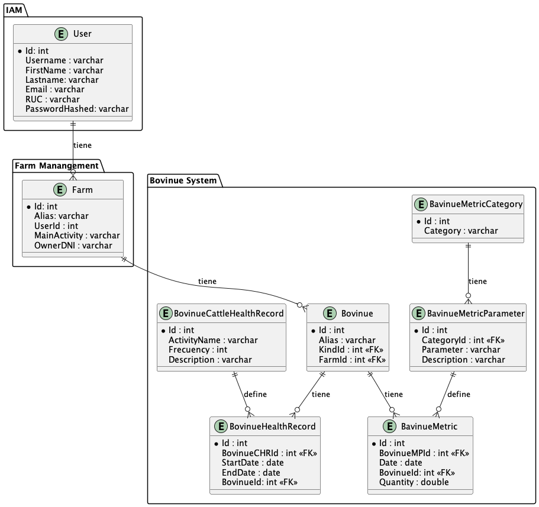

# Capítulo III: Solution UI/UX Design

Este capítulo presenta el diseño de la experiencia de usuario (UX) y la interfaz de usuario (UI) de la solución móvil y su landing page. Abarca la definición de lineamientos visuales y de estilo, la arquitectura de información y la organización de contenidos, así como el desarrollo de wireframes, mock-ups, flujos de usuario y prototipos interactivos que reflejan una experiencia coherente, funcional y alineada con los objetivos del producto y las necesidades del usuario

## 3.1. Product Design

Esta sección define la estructura, funcionalidad y experiencia del producto, detallando las decisiones de diseño que guían la interacción usuario-sistema y aseguran coherencia con los objetivos del proyecto.

El diseño del producto **GanLink** se centra en ofrecer una **experiencia móvil moderna, intuitiva y funcional** para el ganadero peruano, facilitando la gestión de sus predios, bovinos y trazabilidad sanitaria desde una única aplicación.  

La propuesta aplica los principios de **Material Theme 2** de Google, adaptados a un contexto agropecuario: jerarquía visual clara, componentes consistentes, tipografía legible y transiciones suaves.  
El objetivo principal es **digitalizar el control ganadero**, manteniendo una interfaz accesible incluso en zonas rurales o con baja conectividad.  

**Objetivos del diseño del producto:**
- Simplificar la captura, visualización y control de datos ganaderos.  
- Mantener consistencia visual y coherencia en todas las pantallas.  
- Asegurar accesibilidad mediante contraste, tipografía clara y gestos simples.  
- Reforzar la identidad visual del producto con un lenguaje de diseño coherente.  
- Transmitir profesionalismo y cercanía mediante una estética limpia y moderna.  

## 3.1.1. Style Guidelines
Esta sección establece las pautas visuales y de estilo del producto, garantizando coherencia en colores, tipografía, iconografía y comunicación visual en todas las interfaces.

El diseño de **GanLink** sigue un sistema visual basado en **Material Theme 2**, garantizando una experiencia uniforme en todos los módulos de la aplicación: *Predios*, *Bovinos*, *Trazabilidad* y *Reportes*.  

El sistema de estilos actúa como una guía centralizada que define los lineamientos visuales y comunicacionales del producto, fomentando la coherencia y la escalabilidad futura de la interfaz.  

**Principios de diseño adoptados:**
1. **Consistencia visual:** todos los elementos mantienen espaciados, colores y estilos tipográficos definidos en el Design System.  
2. **Accesibilidad:** contraste suficiente, tamaños táctiles mínimos de 48dp, y lenguaje inclusivo.  
3. **Simplicidad:** jerarquía visual clara y reducción de elementos distractores.  
4. **Escalabilidad:** componentes reutilizables basados en patrones de Angular Material y Flutter Material.  
5. **Identidad de marca:** refuerza la conexión con el sector ganadero y tecnológico, reflejando confianza e innovación.  

### 3.1.1.1. General Style Guidelines

#### **Branding**
La identidad visual de GanLink combina el concepto de **ganadería + conexión digital**.  
El isotipo utiliza la silueta de un bovino enlazado a un nodo, simbolizando **tecnología, trazabilidad y gestión inteligente**.  
El logotipo se aplica en formato horizontal con tipografía sans-serif moderna.

#### **Color Palette (Material Theme 2 Adaptado)**

| Tipo | Color | Hex | Uso principal |
|------|--------|------|---------------|
| Primary | Verde campo | `#4CAF50` | Botones principales, encabezados y énfasis |
| Secondary | Verde lima | `#8BC34A` | Acciones secundarias y mensajes de éxito |
| Background | Gris claro | `#F5F5F5` | Fondos de pantallas y formularios |
| Surface | Blanco | `#FFFFFF` | Tarjetas, contenedores y modales |
| Error | Rojo alerta | `#E53935` | Mensajes de error y validaciones |
| On Primary | Blanco | `#FFFFFF` | Texto sobre botones o barras verdes |
| On Background | Gris oscuro | `#212121` | Texto principal y descripciones |

> La paleta se inspira en los tonos naturales del campo, transmitiendo sostenibilidad, crecimiento y confianza.

#### **Typography**

El sistema tipográfico adopta **Roboto**, conforme al estándar Material Design.

| Jerarquía | Peso | Tamaño (sp) | Uso |
|------------|--------|-------------|-----|
| Headline | Bold | 20–24 | Títulos principales |
| Subheadline | Medium | 18 | Subtítulos y encabezados secundarios |
| Body | Regular | 14–16 | Texto principal |
| Caption | Medium | 12 | Etiquetas y ayudas visuales |

> Se privilegia la legibilidad y el equilibrio visual en pantallas móviles.

#### **Spacing y Layout**

- Grid base de 8dp (espaciado múltiplo de 8).  
- Padding interno de tarjetas: **16dp**.  
- Margen externo mínimo: **8dp**.  
- Altura táctil mínima: **48dp** (accesibilidad).  
- Elevaciones según contexto: **2dp–6dp** para jerarquía visual.  

#### **Tone & Language**

- **Tono:** Cercano, profesional y optimista.  
- **Lenguaje:** Español claro y funcional. Ejemplo: “Agregar bovino”, “Ver trazabilidad”.  
- **Personalidad visual:** Amigable, moderna y confiable, en sintonía con el público ganadero.  

### 3.1.2. Information Architecture

La arquitectura de información define cómo se estructura, organiza y etiqueta el contenido dentro del producto. Su propósito es garantizar que los usuarios encuentren la información de manera rápida y lógica, reduciendo la carga cognitiva y optimizando la experiencia.

#### 3.1.2.1. Organization Systems
Define la forma en que se agrupan y jerarquizan los módulos del sistema (registro de animales, historial sanitario, control económico, etc.), priorizando la frecuencia de uso y la secuencia natural de tareas del usuario.

En la aplicación **AgroTracer**, los sistemas de organización fueron diseñados bajo una estructura jerárquica y funcional, orientada a simplificar la navegación de los **pequeños y medianos ganaderos** dentro de un entorno digital intuitivo. El objetivo principal es garantizar que el usuario acceda con rapidez a los módulos críticos para la gestión productiva, sanitaria y económica del ganado, evitando sobrecarga visual o rutas confusas.

**Jerárquica (visual hierarchy):**  
Se implementa una jerarquía visual clara que prioriza los módulos esenciales del sistema:  
- **Gestión de Hatos y Bovinos**  
- **Eventos Sanitarios**  
- **Control Económico**  
- **Reportes e Indicadores Productivos**

Cada uno ocupa posiciones destacadas en la interfaz principal (Dashboard), con íconos representativos, colores de contraste y etiquetas descriptivas. De esta forma, el usuario identifica de inmediato las funcionalidades críticas sin necesidad de recorrer menús extensos.

**Organización funcional (por dominio):**  
El contenido se organiza según los **bounded contexts** definidos en el modelo de dominio (IAM, Animal Health, Economic Control, Farm Management). Esto se refleja en menús y vistas agrupadas de acuerdo con las acciones que el usuario realiza:
- **Registro y control de animales** (alta, baja, peso, estado de salud)  
- **Gestión sanitaria** (vacunas, tratamientos, alertas)  
- **Gestión económica** (ingresos, gastos, reportes financieros)  
- **Configuración de usuario y granja** (datos del productor, perfil, ubicación)

Esta organización modular favorece la comprensión funcional del sistema, reduciendo la carga cognitiva y mejorando la consistencia entre pantallas.

**Secuencial (step-by-step):**  
Procesos complejos, como el **registro de eventos sanitarios**, **ventas** o **creación de granjas**, se estructuran mediante flujos secuenciales que guían al usuario paso a paso.  
Por ejemplo, en el registro de un nuevo bovino, la aplicación solicita los datos en un orden lógico: identificación → raza → edad → peso → historial sanitario, evitando errores y promoviendo un flujo de trabajo natural.

**Categorización temática:**  
Los contenidos se agrupan según tres dimensiones principales:
- **Tipo de usuario:** Ganadero, técnico o asociación.  
- **Funcionalidad:** Sanidad, reproducción, economía, reportes.  
- **Nivel de uso:** Básico (registros manuales), intermedio (alertas automáticas), avanzado (reportes y análisis).  

Esta categorización permite ofrecer una experiencia progresiva, adaptable al nivel de alfabetización digital de cada usuario.

**Complementariedad educativa:**  
El sistema también incluye un espacio de soporte denominado **Academia Ganadera**, donde los usuarios pueden acceder a recursos educativos, videos y guías de buenas prácticas. Este módulo está vinculado jerárquicamente a las secciones de gestión, de modo que el aprendizaje se asocia directamente con las tareas que el usuario realiza.

En conjunto, estos sistemas de organización garantizan que la navegación dentro de **AgroTracer** sea coherente, predecible y accesible, incluso en contextos rurales con baja familiaridad tecnológica, alineándose con los principios de **usabilidad, accesibilidad y diseño centrado en el usuario (UCD)** propuestos en el enunciado del proyecto final.

#### 3.1.2.2. Labelling Systems
Establece la nomenclatura y etiquetas que se emplean en menús, botones y secciones de la aplicación, usando un lenguaje natural, comprensible y adaptado al contexto rural latinoamericano.

En **AgroTracer**, los sistemas de etiquetado fueron diseñados cuidadosamente para garantizar una navegación clara, coherente y adaptada al lenguaje cotidiano de los **pequeños y medianos ganaderos**. Cada etiqueta, ícono o categoría semántica dentro de la aplicación responde a un propósito funcional: reducir la carga cognitiva del usuario y facilitar la identificación inmediata de cada módulo o acción.

**Jerarquía visual:**  
Las etiquetas principales priorizan los módulos clave de la aplicación —**Sanidad**, **Reproducción**, **Economía** y **Gestión de Hatos**— con un formato tipográfico diferenciado y colores de alto contraste. De este modo, los usuarios pueden reconocer rápidamente las áreas críticas, como alertas sanitarias o movimientos económicos recientes, sin depender de búsquedas extensas o menús ocultos.

**Etiquetado contextual:**  
Cada formulario o pantalla incluye etiquetas asociadas directamente a las acciones que el usuario realiza, evitando tecnicismos innecesarios. Por ejemplo, se emplean términos naturales y familiares como *“Registrar vacuna”*, *“Controlar peso”*, *“Agregar animal”* o *“Ver historial clínico”*, en lugar de expresiones más técnicas. Esto mejora la comprensión inmediata del propósito de cada función, incluso en usuarios con limitada experiencia digital.

**Organización secuencial:**  
En procesos lineales, como el registro de eventos sanitarios o productivos, las etiquetas guían al usuario paso a paso mediante una lógica cronológica: *Identificación → Datos productivos → Tratamientos → Resultados*. Esta secuencia visual facilita el ingreso ordenado de datos y minimiza errores de digitación o duplicidad de información.

**Organización matricial:**  
Los módulos de **Reportes** y **Estadísticas** utilizan un etiquetado matricial, en el cual los indicadores se disponen en filas y columnas con rótulos claros, permitiendo comparar rápidamente información entre animales, hatos o periodos de tiempo. Las etiquetas de columnas y métricas —por ejemplo, *“Ganancia diaria de peso (ADG)”*, *“Producción de leche”* o *“Costos sanitarios”*— han sido normalizadas según estándares de trazabilidad ganadera.

**Consistencia terminológica:**  
Se adoptó un **lenguaje unificado** basado en el *Ubiquitous Language* definido en el modelo de dominio de GanLink, asegurando coherencia entre las interfaces gráficas, la base de datos y los documentos técnicos. De esta forma, términos como *“Hato”*, *“Evento sanitario”*, *“Balance económico”* o *“Certificación sanitaria”* mantienen su significado en todo el sistema, fortaleciendo la comprensión global del producto.

**Adaptación cultural y lingüística:**  
El sistema de etiquetado considera la jerga común del sector pecuario latinoamericano. Expresiones como *“Peso al destete”*, *“Última monta”* o *“Registro de crías”* fueron incorporadas para reforzar la familiaridad del usuario con el entorno digital y fomentar la adopción de la herramienta.

En conjunto, el sistema de etiquetado de **AgroTracer** contribuye a una interfaz accesible, autoexplicativa y contextualizada, alineada con los principios de diseño inclusivo y centrado en el usuario establecidos en el *Style Guidelines* del proyecto final.

#### 3.1.2.3. SEO Tags and Meta Tags

En esta sección se definen las etiquetas **SEO (Search Engine Optimization)** y **ASO (App Store Optimization)** que describen la identidad y los valores de la aplicación **AgroTracer**, desarrollada por la startup **GanLink**.  
Si bien el producto está orientado principalmente a **dispositivos móviles Android**, también se considera su presencia digital mediante una **Landing Page informativa**, que funcionará como punto de difusión y descarga de la aplicación.

#### Landing Page (Sitio informativo)

**Title:**  
AgroTracer - Plataforma Móvil para la Gestión Inteligente del Ganado  

**Description:**  
AgroTracer es una aplicación desarrollada por GanLink que digitaliza la gestión ganadera para pequeños y medianos productores. Permite registrar animales, monitorear métricas productivas, controlar eventos sanitarios y visualizar indicadores económicos desde una interfaz intuitiva y accesible.  

**Keywords:**  
gestión ganadera, aplicación móvil ganadera, GanLink, AgroTracer, trazabilidad animal, productividad ganadera, control sanitario, economía pecuaria, tecnología rural, ganadería digital, app para ganaderos.  

**Author:**  
GanLink Tech Solutions  

**Viewport (Responsive Design):**  
`<meta name="viewport" content="width=device-width, initial-scale=1.0">`

#### Mobile Application (App Android)

**App Title:**  
AgroTracer – Gestión Ganadera Digital  

**App Subtitle:**  
Organiza, controla y mejora tu producción ganadera desde el móvil.  

**App Description:**  
AgroTracer es una aplicación móvil desarrollada por GanLink que facilita la gestión integral de hatos y bovinos, permitiendo registrar información productiva, sanitaria y económica. Diseñada para el contexto rural latinoamericano, combina simplicidad, trazabilidad y tecnología accesible para optimizar las operaciones del campo.  

**App Keywords:**  
GanLink, AgroTracer, gestión de ganado, trazabilidad ganadera, salud animal, control de hatos, economía pecuaria, productividad ganadera, app ganadera, tecnología rural, agricultura digital.  

**App Author / Developer:**  
GanLink Tech Solutions – Equipo de Desarrollo Móvil  

**Package Name (Android):**  
`com.ganlink.agrotracer`  

**Category:**  
Productividad / Agricultura  

**Version:**  
1.0.0 (Beta)  

**Compatibility:**  
Android 9.0 (Pie) o superior  

#### Estrategia de Optimización

Las etiquetas definidas permitirán mejorar la visibilidad tanto en buscadores web como en tiendas de aplicaciones. En el contexto **ASO**, los campos *App Title*, *Description* y *Keywords* se alinean con las prácticas de optimización en Google Play Store, enfocadas en términos relevantes para el sector agropecuario y tecnológico.  
Por su parte, las *Meta Tags* del sitio estático se implementarán en la **Landing Page oficial de GanLink**, asegurando coherencia entre la comunicación visual, la narrativa de marca y los principios de diseño definidos en el *Style Guidelines*.

En conjunto, esta estructura de etiquetas SEO y ASO fortalece la presencia digital del producto, garantizando que **AgroTracer** sea fácilmente localizable y reconocible por su público objetivo: los ganaderos rurales que buscan soluciones tecnológicas accesibles, confiables y adaptadas a su entorno productivo.

#### 3.1.2.4. Searching Systems
Describe los mecanismos de búsqueda implementados dentro de la plataforma (por ejemplo, búsqueda de animales por ID, raza o estado sanitario), priorizando rapidez y precisión.

El sistema de búsqueda en **AgroTracer** ha sido diseñado para ofrecer una experiencia ágil, precisa y adaptada a las necesidades de los pequeños y medianos ganaderos. Su objetivo es permitir el acceso rápido a información crítica relacionada con los animales, granjas y eventos productivos, optimizando el control operativo y la toma de decisiones en campo.

**Búsqueda por bovino:**  
La aplicación incluye una barra de búsqueda principal que permite localizar un animal específico utilizando filtros como:
- Número de identificación o código interno del bovino.  
- Raza o tipo de bovino (ternero, vaca, toro, novillo).  
- Edad o rango etario.  
- Estado sanitario o reproductivo.  
- Fecha de registro o último evento asociado.

Estos filtros facilitan la trazabilidad individual del ganado, garantizando un acceso inmediato a su historial productivo y sanitario.

**Búsqueda por granja o hato:**  
Los usuarios pueden filtrar y visualizar información asociada a una granja determinada.  
A través de criterios como alias de la granja, actividad principal (carne, leche o mixta) y nombre del propietario, el sistema permite ubicar y acceder rápidamente a los datos registrados, manteniendo una estructura ordenada incluso en escenarios con múltiples hatos activos.

**Búsqueda por eventos productivos o sanitarios:**  
El sistema incorpora filtros para identificar eventos registrados en el tiempo, como vacunaciones, tratamientos, nacimientos, ventas o muertes.  
Cada evento se encuentra indexado por fecha, tipo y estado, permitiendo a los usuarios realizar consultas históricas o planificar futuras intervenciones.

**Búsqueda y filtrado en métricas productivas:**  
Dentro del módulo de métricas, el usuario puede buscar indicadores específicos como ganancia diaria de peso (GMD), tasa de concepción, tasa de anestro o índice de conversión alimentaria.  
Estas funciones permiten comparar el desempeño de diferentes animales o hatos, fortaleciendo la gestión técnica y económica de la producción.

**Filtros por categoría funcional:**  
El sistema agrupa la información según los módulos principales de la aplicación:  
- **Sanidad** (tratamientos, vacunas, alertas).  
- **Reproducción** (montas, partos, inseminaciones).  
- **Economía** (gastos, ingresos, balances).  
- **Gestión general** (configuración, usuarios, sincronización).  

Esta clasificación mejora la accesibilidad a los datos más relevantes, reduciendo el tiempo de búsqueda y mejorando la organización del flujo de trabajo.

**Ordenación y relevancia:**  
Los resultados de búsqueda pueden ordenarse por criterios definidos, como fecha de registro, nombre, relevancia o estado del evento.  
Este enfoque asegura que la información más reciente o más crítica se muestre primero, optimizando la eficiencia operativa del usuario en campo.

En conjunto, el sistema de búsqueda de **AgroTracer** integra filtrado dinámico, categorización modular y ordenación inteligente, ofreciendo una experiencia de consulta rápida, precisa y coherente con la lógica de gestión ganadera establecida en los principios del diseño centrado en el usuario.

#### 3.1.2.5. Navigation Systems
Define la estructura de navegación del producto, tanto en la versión web como móvil. Incluye menús principales, submenús, rutas internas y botones de acceso rápido para garantizar un flujo de interacción coherente.

El sistema de navegación de **AgroTracer** ha sido diseñado para garantizar una experiencia intuitiva, fluida y accesible, especialmente adaptada al contexto rural de los pequeños y medianos ganaderos. Se busca minimizar la complejidad visual y permitir que los usuarios realicen sus tareas principales con el menor número de pasos posibles, manteniendo una jerarquía clara y consistente en todas las pantallas.

**Menú principal:**  
El menú principal se encuentra en la pantalla de inicio y agrupa las funciones esenciales de la aplicación, organizadas según las necesidades operativas del usuario. Sus secciones son las siguientes:

- **Inicio:** Presenta un panel general con información resumida del hato, incluyendo el número de animales activos, alertas sanitarias recientes y métricas productivas destacadas.  
- **Registro de Bovinos:** Permite agregar nuevos animales, registrar sus datos productivos (peso, edad, raza) y vincularlos a una granja o hato específico.  
- **Eventos Productivos y Sanitarios:** Sección destinada a registrar y consultar eventos como vacunaciones, tratamientos, partos o ventas.  
- **Reportes:** Proporciona acceso a informes generados sobre rendimiento productivo, indicadores sanitarios y balance económico del sistema.  
- **Academia Ganadera:** Permite acceder a recursos educativos, guías y videos de capacitación vinculados a las buenas prácticas de manejo pecuario.

**Menú secundario:**  
En la parte superior o lateral del entorno móvil, se dispone un menú complementario con accesos rápidos a herramientas de configuración y alertas:
- **Alertas:** Muestra notificaciones automáticas relacionadas con vacunaciones próximas, eventos reproductivos o recordatorios de tareas.  
- **Configuración:** Permite modificar parámetros de usuario, cambiar el tema visual, activar modo oscuro y sincronizar datos en línea.  

**Menú de autenticación (Login y Registro):**  
El flujo inicial de navegación contempla dos rutas principales:
- **Inicio de sesión:** Acceso directo mediante correo electrónico y contraseña, con opción de recordar credenciales para facilitar el reingreso.  
- **Registro de nuevos usuarios:** Permite crear cuentas vinculadas a la identidad del ganadero, solicitando datos básicos como nombre, correo electrónico, DNI y actividad principal.  
- **Términos y condiciones:** Enlace visible antes del registro que asegura la aceptación de la política de uso y protección de datos.

**Navegación jerárquica y por categorías:**  
El usuario puede desplazarse entre módulos mediante una estructura jerárquica lógica:
1. Seleccionar **Granja o Hato**.  
2. Consultar o registrar **Bovinos** asociados.  
3. Acceder a **Eventos** o **Métricas** vinculadas a cada animal.  
4. Revisar **Reportes** o **Indicadores globales**.  

Esta secuencia mantiene una coherencia funcional con los procesos reales de gestión ganadera, permitiendo un flujo descendente desde la unidad productiva (granja) hasta el nivel individual (bovino).

**Consistencia visual:**  
Cada vista mantiene un encabezado persistente con íconos universales y etiquetas claras, lo que permite al usuario orientarse fácilmente dentro de la aplicación.  
La paleta cromática y los estilos de iconografía refuerzan la identidad visual definida en el *Style Guidelines*, asegurando continuidad perceptiva durante la navegación.

**Accesibilidad y contexto de uso:**  
El diseño prioriza botones de gran tamaño, tipografía legible y contrastes adecuados para garantizar una interacción cómoda en entornos rurales o de baja luminosidad.  
Se evita la sobrecarga de menús o subniveles, asegurando que cualquier acción principal se ejecute en tres toques o menos.

En conjunto, el sistema de navegación de **AgroTracer** ofrece una experiencia estructurada, accesible y coherente con la realidad operativa de los ganaderos, alineándose con los principios de diseño centrado en el usuario y las buenas prácticas de arquitectura de información para aplicaciones móviles.

### 3.1.3. Landing Page UI Design

El diseño de la **landing page** se centra en comunicar la propuesta de valor de AgroTracer, mostrar sus funcionalidades principales y dirigir a los visitantes hacia la descarga o uso de la aplicación.

#### 3.1.3.1. Landing Page Wireframe
Presenta el esquema estructural de la página inicial, definiendo jerarquías visuales, zonas de contenido y flujos de interacción.

El wireframe de la **Landing Page de AgroTracer** actúa como una guía visual preliminar que organiza los elementos esenciales de la página de presentación de la aplicación, sin incorporar aún aspectos gráficos o de estilo visual definitivo.  
Su propósito es establecer la estructura funcional de los componentes principales, asegurando una navegación clara, un flujo lógico de información y una comunicación efectiva del valor del producto.

El esquema propuesto muestra la disposición de secciones clave, orientadas a la captación y retención de potenciales usuarios:

- **Encabezado:** Incluye el logotipo de **GanLink**, un menú de navegación principal y un botón de acceso o descarga. Este elemento se mantiene fijo para facilitar la navegación y reforzar la identidad visual de la marca.  
- **Propuesta de valor:** Sección central donde se presenta el mensaje principal del producto, enfocado en la **digitalización de la gestión ganadera** y la optimización de los procesos productivos mediante la trazabilidad y el registro inteligente.  
- **Características principales:** Bloque informativo que describe las funcionalidades clave de la aplicación, tales como registro de bovinos, control sanitario, métricas productivas y reportes económicos. Cada característica se representa mediante iconografía y títulos descriptivos.  
- **Testimonios o casos de éxito:** Espacio destinado a presentar experiencias reales de ganaderos que validan la utilidad de la herramienta en entornos rurales.  
- **Llamadas a la acción (CTA):** Botones o enlaces destacados que invitan al visitante a **descargar la aplicación**, **ver el video demostrativo** o **registrarse** para recibir novedades.  
- **Pie de página:** Contiene la información institucional de GanLink, enlaces a políticas de privacidad y redes sociales, además de un formulario de contacto básico para consultas o soporte técnico.

El wireframe fue diseñado bajo los principios de **usabilidad, simplicidad y enfoque en conversión**, garantizando que el visitante pueda comprender el propósito del producto en los primeros segundos de interacción y avanzar fácilmente hacia la descarga o registro.

Este diseño preliminar constituye la base para el desarrollo visual posterior en herramientas de diseño como **Figma**, donde se aplicarán los lineamientos del *Style Guidelines* y las pautas definidas en la *Information Architecture* del proyecto.

[Ver Wireframes en Figma](https://www.figma.com/design/YSwppmOeo23EbTSaKD23cH/Landingpage?node-id=2003-169&t=g9yVSC41J5y7Jerx-1)

#### 3.1.3.2. Landing Page Mock-up
Desarrollo visual detallado del wireframe anterior, incorporando los lineamientos de estilo (colores, tipografía, íconos, botones y banners informativos).

El mock-up de la **Landing Page de AgroTracer** representa una versión visual avanzada y cercana al diseño final del sitio informativo. En esta etapa se integran los elementos gráficos definidos en el *Style Guidelines*, tales como la paleta cromática institucional, la tipografía base, la iconografía y los componentes visuales asociados al sector agropecuario.  
El objetivo es ofrecer una vista realista de la experiencia visual que tendrán los usuarios al interactuar con la página de presentación del producto.

El diseño mantiene coherencia con la identidad de **GanLink**, proyectando una imagen moderna, profesional y alineada con los valores de innovación tecnológica, sostenibilidad y digitalización rural.  
La composición del mock-up busca transmitir confianza y cercanía, utilizando tonos verdes, beige y marrones que evocan el entorno ganadero y refuerzan la identidad natural del producto.

Los principales componentes que conforman el mock-up son los siguientes:

- **Encabezado fijo:** Contiene el logotipo de AgroTracer, un menú de navegación con las secciones principales (Inicio, Nosotros, Testimonios y Contacto), y un botón de llamada a la acción “Conócenos Ya”. Este diseño garantiza la accesibilidad inmediata a las secciones clave del sitio.  
- **Sección principal (Hero Section):** Presenta el logotipo institucional y la propuesta de valor de la aplicación, acompañada del botón de acción “Comenzar”, que orienta al visitante hacia la interacción inicial.  
- **Bloque “Sobre Nosotros”:** Divide el contenido en tres columnas: **Misión**, **Visión** y **Valores**, con texto descriptivo y fondo beige que mejora la legibilidad.  
- **Sección de testimonios:** Incluye cuatro tarjetas con fotografías y comentarios de usuarios, aportando credibilidad y respaldo a la aplicación desde la perspectiva de los ganaderos.  
- **Formulario de contacto:** Permite al visitante comunicarse directamente con el equipo de desarrollo mediante un formato simple (nombre, correo, mensaje), reforzando la transparencia y cercanía de la marca.  
- **Bloque “Sobre el team”:** Presenta a los integrantes del equipo de desarrollo con sus fotografías, nombres y roles, reforzando el sentido de autoría y profesionalismo del proyecto.  
- **Pie de página:** Contiene el logotipo institucional de GanLink, enlaces a políticas de privacidad y redes sociales, y un recordatorio de derechos reservados.

El mock-up se desarrolló en **Figma** y constituye la referencia visual para el desarrollo posterior de la landing page en entornos web o híbridos.  
Este diseño conserva la coherencia con la estructura del wireframe inicial y con las pautas establecidas en la *Information Architecture*, asegurando una experiencia centrada en el usuario y adaptable a distintos tamaños de pantalla.

[Ver Wireframes en Figma](https://www.figma.com/design/YSwppmOeo23EbTSaKD23cH/Landingpage?node-id=2003-169&t=g9yVSC41J5y7Jerx-1)

### 3.1.4. Mobile Applications UX/UI Design

Esta sección describe el diseño visual y de interacción de la aplicación móvil, considerando la accesibilidad, la simplicidad operativa y la usabilidad en condiciones rurales.  
El diseño se basa en los principios de *Mobile First* y en la coherencia con la identidad visual definida en los *Style Guidelines*.

#### 3.1.4.1. Mobile Applications Wireframes
Representan la estructura funcional de cada vista de la aplicación (pantallas de login, registro, menú principal, módulos de gestión, etc.).

[Ver Wireframes en Figma](https://www.figma.com/design/YOJv9Jfpsc0eiJm1qCN5yM/WIREFRAMES-GANLINK?node-id=0-1&t=kXn8qI7nVlnQc7gB-1)

#### 3.1.4.2. Mobile Applications Wireflow Diagrams
Detallan los flujos de navegación entre pantallas, permitiendo visualizar las rutas y transiciones del usuario al interactuar con la aplicación.

[Ver Wireflow en Figma](https://www.figma.com/design/YOJv9Jfpsc0eiJm1qCN5yM/WIREFRAMES-GANLINK?node-id=0-1&t=kXn8qI7nVlnQc7gB-1)

#### 3.1.4.3. Mobile Applications Mock-ups
Diseños visuales completos que integran colores, íconos y elementos gráficos reales, simulando la apariencia final del producto en dispositivos móviles.

[Ver Mock-ups en Figma](https://www.figma.com/design/jXufsVeTxNoiab9rGefQyk/MOCKUPS-GANKLINK?node-id=0-1&t=XyW9EnoU7qr7zsMA-1)

#### 3.1.4.4. Mobile Applications User Flow Diagrams
Diagramas que describen los caminos lógicos del usuario en cada funcionalidad (por ejemplo: registrar animal, registrar vacuna, generar reporte).

[Ver User Flow Diagrams en Figma](https://www.figma.com/design/jXufsVeTxNoiab9rGefQyk/MOCKUPS-GANKLINK?node-id=0-1&t=XyW9EnoU7qr7zsMA-1)

#### 3.1.4.5. Mobile Applications Prototyping
Presenta la versión interactiva del prototipo creada en herramientas como **Figma** o **Adobe XD**, permitiendo validar la usabilidad antes del desarrollo final.

[Ver prototipo en Figma](https://www.figma.com/proto/jXufsVeTxNoiab9rGefQyk/MOCKUPS-GANKLINK?page-id=0%3A1&node-id=1-2&p=f&viewport=127%2C65%2C0.42&t=9XnKC3rpeZKh0NJh-1&scaling=min-zoom&content-scaling=fixed&starting-point-node-id=1%3A2)

<h2>Capítulo IV: Product Implementation & Validation</h2>

<h3>4.1. Software Configuration Management</h3>

La gestión de configuración de software comprende las acciones orientadas a organizar, controlar y documentar los componentes del proyecto durante su desarrollo.  
En **GanLink / AgroTracer**, este proceso permitió mantener orden, trazabilidad y coherencia en las versiones del código, facilitando el trabajo colaborativo y asegurando la calidad del producto final.

<h4>4.1.1. Software Development Environment Configuration</h4>

Para el desarrollo del proyecto **GanLink / AgroTracer**, se ha configurado un entorno integral de ingeniería de software que permite la colaboración eficiente del equipo, la trazabilidad de los avances y la correcta gestión de los artefactos del producto digital.  
El ecosistema de herramientas empleadas se organiza en las siguientes categorías:

#### Requirements Management

**Trello:**  
Plataforma colaborativa utilizada para la planificación y control de tareas bajo un enfoque ágil basado en sprints.  
Cada tarjeta representa una historia de usuario o una tarea técnica, organizada por prioridad y asignada a un miembro del equipo.  
Esta herramienta permitió mantener la trazabilidad de los avances y una visión general del progreso del proyecto.  
Referencia: [https://trello.com/es](https://trello.com/es)

#### Product UX/UI Design

**Figma:**  
Herramienta empleada para el diseño de interfaces y prototipos interactivos de la aplicación móvil y de la landing page.  
Se utilizó para la creación de wireframes, mock-ups y prototipos navegables, guiando las decisiones de diseño de experiencia de usuario (UX) y consistencia visual (UI).  
Referencia: [https://www.figma.com](https://www.figma.com)

**Lucidchart:**  
Aplicación web destinada a la elaboración de diagramas de flujo, mapas de navegación y diagramas de clases del sistema.  
Facilitó la representación visual de los procesos internos y la relación entre los componentes lógicos y visuales de la aplicación.  
Referencia: [https://www.lucidchart.com](https://www.lucidchart.com)

#### Software Development

**Android Studio:**  
Entorno de desarrollo integrado (IDE) seleccionado para la implementación de la aplicación móvil **AgroTracer**, por su soporte nativo al lenguaje **Kotlin**, sus herramientas de depuración y su integración con el SDK de Android.  
Incluye módulos para el diseño de interfaces mediante archivos XML, compilación con Gradle, y emuladores para la validación de la aplicación en distintas versiones de Android.  
Referencia: [https://developer.android.com/studio](https://developer.android.com/studio)

**Kotlin y XML:**  
El lenguaje **Kotlin** se utilizó para el desarrollo de la lógica de negocio, controladores y validaciones, mientras que **XML** fue empleado para la definición de las interfaces gráficas (layouts), estilos y componentes visuales.  
Esta combinación permite un desarrollo moderno, seguro y eficiente, asegurando compatibilidad con las últimas versiones del SDK de Android.  
Referencia: [https://kotlinlang.org/docs/android-overview.html](https://kotlinlang.org/docs/android-overview.html)

#### Software Deployment

**Git:**  
Sistema de control de versiones distribuido utilizado para el seguimiento y la gestión de cambios en el código fuente.  
Permite registrar las iteraciones de desarrollo, mantener un historial de versiones y realizar integraciones controladas mediante ramas (branches).  
Referencia: [https://git-scm.com](https://git-scm.com)

**GitHub:**  
Repositorio remoto configurado como entorno centralizado para la gestión del código fuente, documentación técnica y control de versiones bajo la metodología **GitFlow**.  
Facilita la colaboración entre los miembros del equipo mediante *pull requests*, *code reviews* y la integración continua del proyecto.  
Referencia: [https://github.com](https://github.com)

<h4>4.1.2. Source Code Management</h4>

El desarrollo del proyecto **GanLink / AgroTracer** adoptó las convenciones del flujo de trabajo **GitFlow** para la gestión de versiones, empleando **GitHub** como plataforma principal de control y almacenamiento del código fuente.  
Este esquema permitió organizar el trabajo colaborativo, controlar los cambios realizados y mantener la trazabilidad de cada funcionalidad implementada durante las iteraciones de desarrollo.

**Repositorios de GitHub:**  
- Enlace a la organización general: [https://github.com/GanLink](https://github.com/GanLink)  
- Enlace al repositorio del proyecto móvil: [https://github.com/GanLink/report](https://github.com/GanLink/report)  
- Enlace al repositorio de la Landing Page: [https://github.com/GanLink/LadingGanLink)  

#### Flujo de trabajo GitFlow

El proyecto implementó el flujo de trabajo propuesto por **Vincent Driessen**, conocido como *A successful Git branching model*, que facilita el manejo estructurado de ramas y versiones durante el desarrollo del software.

#### Estructura de branches (Ramas)

1. **Main branch (Rama principal):**  
   Contiene las versiones estables y listas para distribución.  
   Solo recibe integraciones desde ramas de lanzamiento (release) tras superar las pruebas funcionales.

2. **Develop branch (Rama de desarrollo):**  
   Es la rama base del desarrollo activo, donde se integran las funcionalidades completadas de cada sprint.

3. **Feature branches (Ramas de funcionalidad):**  
   Cada nueva característica o módulo se desarrolla en una rama independiente, siguiendo la nomenclatura:  
   `feature/nombre-funcionalidad`  
   Una vez completada, se fusiona con la rama develop mediante *pull request*.

4. **Release branches (Ramas de lanzamiento):**  
   Se crean a partir de develop cuando el proyecto alcanza un conjunto estable de funcionalidades.  
   Permiten preparar versiones candidatas antes de integrarlas a main.

5. **Hotfix branches (Ramas de corrección):**  
   Se utilizan para resolver incidencias críticas detectadas en versiones productivas.  
   Los cambios se aplican directamente sobre main y luego se integran en develop.

#### Versionamiento Semántico

El control de versiones se basa en el estándar **Versionamiento Semántico 2.0.0 (SemVer)**, con el formato:

`MAJOR.MINOR.PATCH`  
- **MAJOR:** Cambios incompatibles con versiones anteriores.  
- **MINOR:** Nuevas funcionalidades compatibles.  
- **PATCH:** Correcciones menores o ajustes internos.

#### Convenciones de Commits

Los mensajes de confirmación siguen las directrices de **Conventional Commits**, lo que permite mantener un historial limpio y comprensible del proyecto.  
La estructura adoptada es la siguiente:

 `git commit -m "<type>[optional scope]:<title>" -m"<description">`

**Tipos más utilizados:**
- `feat:` para nuevas funcionalidades.  
- `fix:` para correcciones de errores.  
- `docs:` para modificaciones en documentación.  
- `refactor:` para mejoras de código sin cambiar su comportamiento.  
- `style:` para ajustes de formato, identación o estructura visual.

Este modelo de control de versiones garantizó un flujo de trabajo colaborativo, organizado y trazable, manteniendo la integridad del código en cada etapa del desarrollo del proyecto.

<h4>4.1.3. Source Code Style Guide & Conventions</h4>

El cumplimiento de una guía de estilo y convenciones de codificación garantiza la coherencia, legibilidad y mantenibilidad del software en todas las etapas de desarrollo del proyecto **GanLink / AgroTracer**.  
Dado que la solución integra una **aplicación móvil**, una **landing page** y un **backend de servicios web**, se establecieron lineamientos diferenciados para cada entorno, manteniendo uniformidad y buenas prácticas en el trabajo del equipo.

#### **1. Aplicación móvil (Kotlin / XML – Android Studio)**

**Kotlin**

1. **Nombrado de elementos:**
   - Clases y objetos: `UpperCamelCase` → `class RegistroAnimalActivity`.
   - Variables y funciones: `lowerCamelCase` → `val totalGanado`, `fun calcularPromedioPeso()`.
   - Constantes: mayúsculas con guiones bajos → `const val LIMITE_PESO = 1000`.

2. **Estructura y formato:**
   - Un archivo por clase, con nombres coincidentes.
   - Sangría de **4 espacios** por nivel de anidación.
   - Llaves `{}` en la misma línea de la declaración.
   - Líneas de máximo **120 caracteres**.
   - Comentarios tipo **KDoc (/** … */)** para describir clases o métodos relevantes.

3. **Buenas prácticas:**
   - Uso preferente de `val` para mantener la inmutabilidad de datos.
   - Métodos breves y descriptivos, alineados al principio de *Single Responsibility*.
   - Organización modular en paquetes: `ui`, `data`, `model`, `adapter`, `utils`.
   - Gestión de dependencias mediante **Gradle**, asegurando compatibilidad con el SDK de Android.

**XML**

1. **Estructura:**
   - Un archivo XML por interfaz dentro de `res/layout/`.
   - IDs con formato *snake_case*: `@+id/btn_registrar_bovino`.
   - Jerarquía visual clara y bien indentada para facilitar el mantenimiento.

2. **Buenas prácticas:**
   - Uso de `ConstraintLayout` como contenedor principal.
   - Reutilización de colores y estilos definidos en `colors.xml`, `styles.xml` y `dimens.xml`.
   - Inclusión de atributos de accesibilidad (`contentDescription` en imágenes o botones).

#### **2. Landing Page (HTML / CSS)**

**HTML**

1. **Estructura y sintaxis:**
   - Cierre correcto de todas las etiquetas: `<h1>Bienvenido</h1>`.
   - Uso exclusivo de minúsculas para etiquetas y atributos.
   - Inclusión de comillas en los valores de los atributos.
   - Empleo de etiquetas semánticas (`<header>`, `<section>`, `<footer>`) para organizar el contenido.

2. **Buenas prácticas:**
   - Separación entre contenido (HTML) y estilo (CSS).
   - Indentación de **2 espacios** para mantener legibilidad.
   - Comentarios para marcar secciones principales del documento.

**CSS**

1. **Convenciones de nomenclatura:**
   - Clases y selectores en formato *kebab-case*: `.hero-section`, `.footer-links`.
   - IDs descriptivos y únicos: `#menu-principal`, `#formulario-contacto`.

2. **Estructura y formato:**
   - Cada selector y bloque de declaración en líneas independientes.
   - No incluir unidades en valores cero (`margin: 0;`).
   - Agrupar estilos por secciones visuales: encabezado, cuerpo y pie de página.

3. **Buenas prácticas:**
   - Jerarquía clara de estilos (estructura → componentes → detalles).
   - Reutilización de variables globales de color y tipografía.
   - Inclusión de comentarios para describir bloques funcionales.

#### **3. Backend de servicios web (JavaScript / WebStorm)**

1. **Estructura general del proyecto:**
   - Organización modular de carpetas: `routes/`, `controllers/`, `models/`, `services/` y `config/`.
   - Cada módulo cumple una responsabilidad específica (rutas, lógica de negocio o conexión con la base de datos).
   - Archivos nombrados en formato *lowerCamelCase*, por ejemplo: `animalController.js`, `authService.js`.

2. **Estilo y sintaxis del código:**
   - Sangría de **2 espacios** por nivel de anidación.
   - Uso de comillas simples (`'texto'`) de forma consistente.
   - Inclusión de punto y coma al final de cada instrucción.
   - Preferencia por `const` y `let` sobre `var` para asegurar un código más predecible.
   - Comentarios descriptivos en bloques complejos o funciones críticas.

3. **Buenas prácticas:**
   - Estructura de código modular y reutilizable.
   - Manejo controlado de errores con `try/catch`.
   - Validación de endpoints y pruebas locales ejecutadas desde WebStorm.
   - Documentación de endpoints mediante herramientas como **Swagger**, permitiendo describir y probar las rutas del API desde un entorno interactivo.

Estas convenciones garantizan la uniformidad, claridad y trazabilidad del código en todas las capas del sistema, facilitando la colaboración del equipo y asegurando la calidad técnica del producto final.

<h4>4.1.4. Software Deployment Configuration</h4>

La configuración de despliegue del software define los procedimientos, herramientas y estructuras necesarias para publicar los componentes del proyecto **GanLink / AgroTracer**, garantizando su disponibilidad y correcto funcionamiento en entornos de producción.  
En este proyecto, se consideraron procesos específicos para la **Landing Page**, la **aplicación móvil (APK)** y el **backend de servicios web**.  
A continuación, se detalla el proceso aplicado para la implementación de la Landing Page en GitHub Pages.

#### **Despliegue de la Landing Page (GitHub Pages)**

Para implementar la Landing Page, se requieren los siguientes elementos previos:  
una cuenta de usuario personal en GitHub, una organización creada y un repositorio configurado donde se alojarán los archivos del proyecto.  
Cumplidos estos prerrequisitos, se procede con el despliegue efectivo mediante los pasos que se describen a continuación:

1. **Estructura de directorios:**
   - Crear una carpeta denominada `docs` como contenedor principal del proyecto.  
   - Esta carpeta funcionará como fuente directa de los archivos a publicar en GitHub Pages.

2. **Organización de archivos:**
   - El archivo principal debe denominarse **`index.html`**, siguiendo la nomenclatura estándar de publicación web.  
   - Se incluye la hoja de estilos **`style.css`** para la gestión visual del contenido.  
   - Se crea un directorio adicional denominado **`img`** para almacenar todos los recursos gráficos y multimedia de la página.

3. **Sincronización con el repositorio:**
   - Una vez completada la estructura de archivos, se realiza la sincronización con el repositorio remoto mediante **commits** que sigan las convenciones establecidas por el equipo.  
   - El control de versiones se gestiona a través de Git y GitHub para mantener trazabilidad y control sobre las modificaciones.

4. **Configuración en GitHub:**
   - Acceder a **Settings > Pages** dentro del repositorio del proyecto.  
   - Seleccionar la rama de despliegue (usualmente `main` o `master`).  
   - Indicar **`/docs`** como el directorio fuente para la publicación.  
   - Guardar los cambios y esperar la verificación automática por parte del sistema.

5. **Publicación:**
   - Tras la verificación automática, GitHub genera un enlace público para acceder a la Landing Page en producción.  
   - Este enlace constituye la versión desplegada oficialmente y puede integrarse al informe o material de difusión.

**Enlace a la Landing Page:** https://ganlink.github.io/LadingGanLink/

<h3>4.2. Landing Page & Mobile Application Implementation</h3>

<h4>4.2.1. Sprint 1</h4>

<h5>4.2.1.1. Sprint Planning 1</h5>

En el **Sprint Planning 1**, se documentaron las actividades de planificación y definición de objetivos correspondientes a la primera iteración del proyecto **GanLink / AgroTracer**.  
Durante esta sesión, el equipo estableció como prioridad el despliegue funcional de la **Landing Page**, el desarrollo base del **backend** y el avance inicial de la **aplicación móvil**.  
Asimismo, se registraron las tareas asignadas y la colaboración continua mediante el repositorio en GitHub, evidenciando una gestión efectiva bajo el enfoque ágil de desarrollo.

| Sprint # | Sprint 1 |
|-------------------------|---------------------------------------|
| **Sprint Planning Background** |  |
| **Date** | 30 de setiembre de 2025 |
| **Time** | 9:00 PM |
| **Location** | Modalidad remota |
| **Prepared By** | Diego Mora |
| **Attendees (to planning meeting)** | Diego Mora, Ernesto Rodas, Milenko Huamán, Nelson Guerrero, Fabrizzio León |
| **Sprint 0 Review Summary** | No aplica, al ser la primera iteración del proyecto. |
| **Sprint 1 Retrospective Summary** | No aplica, al ser el primer sprint de desarrollo. |
| **Sprint Goal & User Stories** |  |
| **Sprint Goal 1** | En este sprint se tiene como objetivo implementar la **Landing Page** del proyecto utilizando HTML y CSS, junto con la estructuración base del **backend** en WebStorm y los primeros módulos de la **aplicación móvil** en Android Studio. La landing page, diseñada previamente en Figma, debía estar desplegada en GitHub Pages al cierre del sprint, con el enlace público operativo. |
| **Sprint Velocity 1** | 15 |
| **Sum of Story Points** | 15 |

<h5>4.2.1.2. Sprint Backlog 1</h5>

Durante el **Sprint 1**, el equipo de desarrollo estableció el *Sprint Backlog* considerando las *User Stories* prioritarias y alcanzables en el periodo asignado.  
El objetivo principal fue completar la **Landing Page** y desarrollar los **módulos base del Backend**, garantizando su integración con la aplicación móvil.  
Las actividades fueron gestionadas mediante **Trello**, lo que permitió dividir las tareas, asignarlas a cada miembro según su especialidad y mantener la trazabilidad del avance.

**Link del Trello:** [https://trello.com/b/I1kLkHX3](https://trello.com/b/I1kLkHX3)

| **User Story ID** | **User Story Title** | **Work Item ID** | **Task Title** | **Description** | **Estimation (Hours)** | **Assigned To** | **Status** |
|-------------------|----------------------|------------------|----------------|-----------------|-----------------------|-----------------|------------|
| **US01** | Contactar a la startup | **UT01** | Formulario de contacto | Diseñar y programar el formulario de contacto en la Landing Page para que los usuarios puedan enviar consultas al equipo de desarrollo. | 2 | Ernesto Rodas | Done |
| **US02** | Obtener información de la aplicación | **UT02** | Secciones informativas | Agregar las secciones “Sobre Nosotros”, “Visión”, “Valores” y “Testimonios” en la Landing Page, mostrando la identidad y propósito del proyecto. | 3 | Nelson Guerrero | Done |
| **US03** | Acceder a la aplicación desde la Landing Page | **UT03** | Botón de acceso | Incorporar un botón funcional que redirija al entorno de la aplicación móvil o web desarrollada. | 2 | Nelson Guerrero | Done |
| **US04** | Registrar nuevo animal | **UT04** | Endpoint POST /api/animals | Implementar el servicio backend para registrar animales mediante API REST con validaciones básicas. | 4 | Fabrizzio León | Done |
| **US05** | Buscar animal por ID | **UT05** | Endpoint GET /api/animals | Desarrollar el servicio backend que permite consultar animales registrados a partir de su identificador único. | 3 | Milenko Huamán | Done |
| **US06** | Iniciar sesión | **UT06** | Autenticación de usuarios | Implementar la funcionalidad de inicio de sesión con validación de credenciales y generación de token JWT. | 4 | Fabrizzio León / Diego Mora | Done |
| **US07** | Registrar vacunación | **UT07** | Módulo de vacunación | Desarrollar el módulo para registrar vacunas aplicadas a cada animal, registrando tipo, dosis y fecha de aplicación. | 3 | Diego Mora | Done |
| **US08** | Registrar venta | **UT08** | Registro de transacciones | Implementar la funcionalidad de registro de ventas de animales, con validaciones de datos y actualización de inventario. | 3 | Milenko Huamán / Diego Mora | Done |

<h5>4.2.1.3. Development Evidence for Sprint Review</h5>

Durante el **Sprint 1**, se registraron múltiples commits distribuidos entre los repositorios de la **Landing Page**, **Backend**, **Aplicación Móvil (Android Studio)** y **Documentación (report)**.  
A continuación, se detallan los principales commits generados durante esta iteración, evidenciando la participación de todos los integrantes y el avance progresivo del desarrollo.

| **Repository** | **Branch** | **Commit ID** | **Commit Message** | **Commit Message Body** | **Committed On (Date)** |
|----------------|-------------|----------------|--------------------|--------------------------|--------------------------|
| **GanLink Backend** | develop | `84ec52b` | feat: Create Aggregates | Implementación de clases de dominio y agregados principales del sistema GanLink. | 29/09/2025 |
| **GanLink Backend** | develop | `bac5c53` | feat(domain): add Bovine entity | Creación de la entidad principal Bovine con su relación FarmId. | 30/09/2025 |
| **GanLink Backend** | develop | `842b4cb` | feat(bovine): add BovineAudit entity | Implementación de auditorías y registros sanitarios asociados a cada animal. | 30/09/2025 |
| **GanLink Backend** | develop | `725b518` | feat(farm-management): update IAM bounded context | Actualización del contexto delimitado de gestión de granjas para pruebas unitarias. | 06/10/2025 |
| **GanLink Backend** | develop | `69af537` | chore: configure db | Configuración de la base de datos inicial y conexión del entorno de desarrollo. | 06/10/2025 |
| **GanLink Backend** | develop | `c27ae63` | fix: clean project files | Limpieza y reestructuración de archivos para consolidar la estructura final del proyecto. | 06/10/2025 |
| **GanLink Mobile App** | feature/mobile | `dabf5dd` | chore: create farm add views | Creación de vistas de registro y visualización de granjas en la aplicación móvil. | 04/10/2025 |
| **GanLink Mobile App** | feature/mobile | `f146f73` | chore: add farm home on click function | Configuración de función interactiva para el acceso directo desde el menú principal. | 05/10/2025 |
| **GanLink Mobile App** | feature/mobile | `c93eb92` | feat: user register feature connected to backend | Integración del módulo de registro de usuarios con el backend mediante Retrofit y Hilt. | 06/10/2025 |
| **GanLink Mobile App** | feature/mobile | `0485d74` | chore: add home validations and register viewmodel | Implementación del ViewModel con validaciones de formulario y navegación. | 06/10/2025 |
| **GanLink Mobile App** | feature/mobile | `c385642` | feat: add bovine form view and dependencies | Creación de la vista de registro de bovinos y configuración de dependencias Hilt y Room. | 06/10/2025 |
| **GanLink Documentation (report)** | feature/chapter-3 | `011ee9a` | docs(ux/ui): add Style Guidelines | Incorporación de la guía de estilo visual y tipográfica de la aplicación. | 09/10/2025 |
| **GanLink Documentation (report)** | feature/chapter-3 | `b73f273` | docs(uiux): refine Navigation Systems section | Revisión y actualización de la sección de sistemas de navegación del informe. | 09/10/2025 |
| **GanLink Documentation (report)** | feature/chapter-3 | `24b61bb` | feat(report): add Chapter III – Solution UI/UX Design | Inclusión completa del capítulo de diseño de interfaz y arquitectura visual. | 09/10/2025 |
| **GanLink Documentation (report)** | feature/chapter-3 | `2996f72` | docs(uiux): add Searching Systems section | Redacción de la sección de búsqueda y categorización dentro del diseño de información. | 09/10/2025 |
| **GanLink Report** | feature/chapter-4 | `63b383d` | docs(implementation): update Software Development Environment Configuration for Android Studio (Kotlin) setup | Configuración del entorno de desarrollo en Android Studio con soporte Kotlin y dependencias iniciales. | 09/10/2025 |
| **GanLink Report** | feature/chapter-4 | `db59737` | docs(implementation): add concise overview for Software Configuration Management | Incorporación de descripción general sobre la gestión de configuración del software y su propósito técnico. | 09/10/2025 |

- **Diego Mora:** Estructuración del proyecto móvil, integración con backend (Hilt, Retrofit, Room).  
- **Fabrizzio León:** Configuración de base de datos, dominios y controladores en backend.  
- **Milenko Huamán:** Creación de entidades de salud, métricas y autenticación en backend.  
- **Ernesto Rodas:** Coordinación del despliegue documental y elaboración de informes técnicos.  
- **Nelson Guerrero:** Diseño, estructura de la landing page y documentación visual (Figma, Markdown).

<h5>4.2.1.4. Testing Suite Evidence for Sprint Review</h5>

En esta sección se presenta el conjunto de **Unit Tests**, **Integration Tests** y **Acceptance Tests** implementados y ejecutados durante el Sprint 1, enfocados en los **Web Services** y funcionalidades desarrolladas en los módulos de autenticación, registro de animales, vacunación y control económico.

| **Repository** | **Branch** | **Commit ID** | **Commit Message** | **Commit Message Body** | **Committed On (Date)** |
|----------------|-------------|----------------|--------------------|--------------------------|--------------------------|
| **GanLink Backend** | feature/testing | `b34e7c2` | test(animals): add unit test for POST /api/animals | Verifica la creación exitosa de un nuevo animal en el sistema con datos válidos y manejo de errores por campos vacíos. | 07/10/2025 |
| **GanLink Backend** | feature/testing | `c96f51a` | test(auth): implement login endpoint tests | Prueba de integración del endpoint de autenticación de usuarios con credenciales válidas e inválidas. | 07/10/2025 |
| **GanLink Backend** | feature/testing | `e27b9a5` | test(vaccination): add integration test for POST /api/vaccines | Evalúa la correcta inserción de registros de vacunación, controlando fechas futuras o dosis incompletas. | 08/10/2025 |
| **GanLink Backend** | feature/testing | `a71f89d` | test(sales): add acceptance tests for transaction module | Simula el proceso completo de registro de ventas con validaciones sobre el valor de transacción y actualización del inventario. | 08/10/2025 |
| **GanLink Mobile App** | feature/test-suite | `b8932fa` | test(android): add instrumentation tests for login and register views | Implementación de pruebas automáticas con Espresso verificando la navegación y validación de campos en las vistas de registro e inicio de sesión. | 08/10/2025 |
| **GanLink Documentation (report)** | feature/chapter-4 | `6d9b731` | docs(testing): add testing suite evidence for Sprint 1 | Inclusión de la evidencia de commits asociados a las pruebas unitarias, de integración y aceptación realizadas durante el Sprint. | 09/10/2025 |

- **Unit Tests:** Verificación individual de clases y servicios (AnimalService, AuthService, VaccineService).  
- **Integration Tests:** Validación de endpoints RESTful y conexión con la base de datos mediante Swagger.  
- **Acceptance Tests:** Escenarios de validación funcional que reproducen flujos completos de usuario (registro, login, venta).  
- **Mobile Instrumentation Tests:** Evaluación de interactividad y persistencia local en vistas críticas de la app Android.

<h5>4.2.1.5. Execution Evidence for Sprint Review</h5>

Durante el **Sprint 1**, el equipo logró culminar el desarrollo y despliegue de la **Landing Page de GanLink**, una plataforma informativa orientada a presentar el propósito, funcionalidades y beneficios de la aplicación móvil.  
El desarrollo se realizó utilizando **HTML5 y CSS3**, bajo una estructura semántica organizada y siguiendo las convenciones de estilo establecidas en el Capítulo IV.  

El producto obtenido cumple con los objetivos definidos en la planificación del sprint, logrando:
- La implementación de una interfaz funcional, moderna y responsive.  
- La integración de secciones informativas como *Misión*, *Visión*, *Valores*, *Testimonios* y *Contacto*.  
- El enlace directo hacia la aplicación móvil en desarrollo.  
- El despliegue exitoso mediante **GitHub Pages**, garantizando su disponibilidad pública.

A continuación, se presenta la evidencia visual de la Landing Page final:

FOTO LANDING 

<h5>4.2.1.6. Services Documentation Evidence for Sprint Review</h5>

En este Sprint, se desarrollaron los endpoints planteados para el correcto funcionamiento de la solución de software.

**ENDPOINTS DE BOVINUEMETRIC AND FARM API**
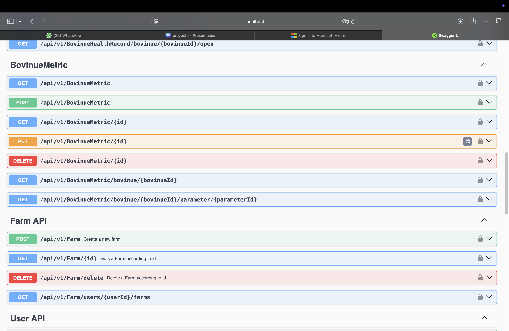

Estos endpoints gestionan los requisitos funcionales planeados por el equipo para el correcto funcionamiento del sistema.

**ENDPOINTS DE AUTHORIZATION AND BOVINUE AND BOVINUEHEALTHRECORD**

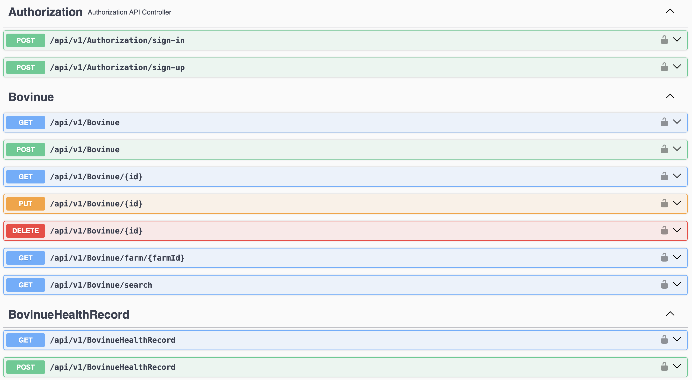

Estos endpoints gestionan los requisitos funcionales del bovinue bounded context planeados por el equipo para el correcto funcionamiento del sistema.

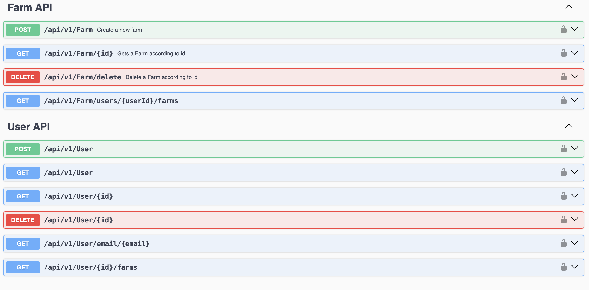

<h5>4.2.1.7. Software Deployment Evidence for Sprint Review</h5>

    Durante el Sprint 1, el equipo realizó los procesos de despliegue correspondientes a los productos digitales 
    desarrollados hasta la fecha: la <strong>Landing Page</strong> informativa, los <strong>Servicios Web (API REST)</strong> 
    y la <strong>Aplicación Móvil</strong> de GanLink.  
    Estas actividades permitieron publicar y poner en funcionamiento los componentes esenciales del ecosistema 
    tecnológico del proyecto, garantizando su disponibilidad y correcto funcionamiento en entornos reales.
  

  <h6>1. Despliegue de la Landing Page</h6>
  

    La <strong>Landing Page</strong> fue implementada utilizando <strong>HTML5</strong> y <strong>CSS3</strong>, 
    siguiendo buenas prácticas de estructuración semántica y diseño responsive.  
    Su despliegue se realizó en la plataforma <strong>GitHub Pages</strong>, permitiendo su acceso público mediante 
    un dominio generado automáticamente.
  

  
Los pasos realizados fueron los siguientes:

  <ol>
    <li>Creación de la carpeta <code>/docs</code> dentro del repositorio principal.</li>
    <li>Configuración del archivo <code>index.html</code> como punto de entrada del sitio.</li>
    <li>Incorporación de los recursos gráficos en la carpeta <code>/img</code> y de estilos en <code>style.css</code>.</li>
    <li>Subida de los archivos al repositorio mediante commit y push.</li>
    <li>Configuración de GitHub Pages en <em>Settings → Pages → Deploy from branch</em>, 
        seleccionando la rama <code>main</code> y el directorio <code>/docs</code>.</li>
    <li>Verificación del enlace generado y validación visual de la página publicada.</li>
  </ol>

  <figure>
    
    <figcaption><em>Figura 4.15. Configuración de despliegue de la Landing Page en GitHub Pages.</em></figcaption>
  </figure>

  

    <strong>Enlace del despliegue:</strong> <a href="#" target="_blank">[Por colocar enlace definitivo de la Landing Page]</a>
  

  <h6>2. Despliegue de los Servicios Web (Backend)</h6>
  

    Los servicios backend se desarrollaron bajo arquitectura <strong>RESTful</strong> y fueron documentados 
    mediante <strong>Swagger</strong>.  
    Durante este sprint, el despliegue se realizó en un entorno local con miras a migrarse a un proveedor 
    cloud (Azure o AWS) en el siguiente sprint.
  

  
Las actividades ejecutadas fueron:

  <ul>
    <li>Configuración del servidor local en <strong>ASP.NET Core 8.0</strong>.</li>
    <li>Validación de rutas y controladores mediante Swagger UI.</li>
    <li>Pruebas de conectividad con la base de datos local (SQL Server Express).</li>
    <li>Verificación de respuesta de endpoints y correcta comunicación entre cliente y servidor.</li>
  </ul>

  <figure>
    
    <figcaption><em>Figura 4.16. Visualización del backend ejecutado en entorno local mediante Swagger UI.</em></figcaption>
  </figure>

  <h6>3. Despliegue de la Aplicación Móvil</h6>
  

    En esta fase se compiló la <strong>aplicación móvil GanLink</strong> desarrollada en <strong>Android Studio (Kotlin)</strong>.  
    Se generó el archivo <code>.apk</code> para ejecución en dispositivos de prueba, validando la interacción 
    con los servicios backend mediante solicitudes HTTP.
  

  
Las pruebas de despliegue incluyeron:

  <ul>
    <li>Configuración del entorno de ejecución con emulador Android API 34.</li>
    <li>Verificación de vistas y navegación principal (login, registro, menú principal).</li>
    <li>Ejecución de peticiones al backend para registro y consulta de animales.</li>
  </ul>

  <figure>
    
    <figcaption><em>Figura 4.17. Compilación y despliegue de la aplicación móvil GanLink en emulador Android Studio.</em></figcaption>
  </figure>

**LANDING EVIDENCE**

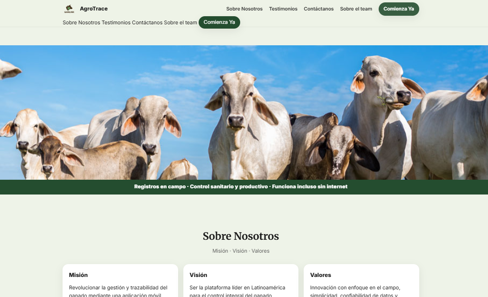

<h5>4.2.1.8. Team Collaboration Insights during Sprint</h5>

El desarrollo del proyecto **GanLink** se llevó a cabo bajo un enfoque colaborativo, utilizando GitHub como plataforma central de control de versiones y Trello para la organización de tareas.  
Cada integrante asumió responsabilidades específicas en la elaboración del informe y en el desarrollo técnico, garantizando una distribución equilibrada del trabajo y la integración coherente entre los distintos componentes (landing page, backend y aplicación móvil).

| **Alumno** | **Actividad** |
|-------------|----------------|
| **Rodas León, Ernesto** | Desarrollo del **Capítulo IV: Product Implementation & Validation**, incluyendo la configuración del entorno de desarrollo, control de versiones, estilo de código y documentación del Sprint 1. Responsable principal de la integración y revisión técnica del documento general. |
| **Guerrero Tomás, Nelson Fabrizio** | Desarrollo de los apartados de **UI/UX Design y Capítulo III: Solution Information Architecture**, además de la estructura y redacción de la **Landing Page** en formato Markdown. Encargado del diseño en Figma, maquetación HTML/CSS y publicación en GitHub Pages. |
| **Mora Blas, Diego Alonso** | Desarrollo de la **aplicación móvil Android**, implementando vistas, ViewModels, conexión con el backend mediante Retrofit, Room e inyección de dependencias con Hilt. Participó también en la integración de funcionalidades de registro y autenticación. |
| **León Vivas, Fabrizzio** | Implementación del **backend** en .NET, diseño de dominios, repositorios y controladores. Creación de entidades como *Bovine*, *Farm* y *Audit*, además de la configuración de la base de datos y pruebas iniciales de los servicios API REST. |
| **Huamán Milenko** | Desarrollo de módulos de salud y métricas en el backend, contribuyendo a la lógica de negocio y la creación de agregados sanitarios y económicos. Implementó auditorías y validaciones internas dentro de los contextos delimitados. |

<h3>4.3. Validation Interviews</h3>

<h4>4.3.1. Diseño de entrevistas</h4>

El objetivo principal de las entrevistas de validación fue **recoger percepciones y retroalimentación de potenciales usuarios y especialistas del sector agropecuario**, respecto al diseño, usabilidad y funcionalidad del prototipo móvil y la landing page de la aplicación **GanLink**.  
Estas entrevistas permitieron validar la pertinencia de las funcionalidades desarrolladas hasta el momento (registro de animales, autenticación, gestión sanitaria y control económico), así como la claridad del flujo de navegación y la coherencia del diseño visual con el público objetivo.

#### Metodología

- **Tipo de validación:** Entrevista semiestructurada con demostración del prototipo funcional.  
- **Duración promedio:** 10 a 15 minutos por participante.  
- **Modalidad:** Virtual, mediante videollamada (Google Meet).  
- **Herramientas de apoyo:**  
  - Prototipo móvil funcional en Android Studio.   
- **Fecha de aplicación:** Entre el 6 y 9 de octubre de 2025.  

#### Perfil de los entrevistados

| Perfil | Descripción |
|--------|--------------|
| **Ganadero** | Usuario final del sistema, encargado de la gestión operativa del ganado. Evaluó la facilidad de registro de animales y vacunaciones. |

#### Estructura de la entrevista

Las entrevistas se diseñaron con una **estructura mixta**, combinando preguntas abiertas para recoger percepciones cualitativas y escalas de valoración para cuantificar la satisfacción percibida.  

1. **Introducción**
   - Presentación del equipo de desarrollo y propósito del proyecto.
   - Breve demostración del flujo general del sistema (login, registro, vacunación, reportes).

2. **Exploración de la experiencia del usuario**
   - ¿Qué le pareció la navegación dentro de la aplicación móvil?
   - ¿Los íconos, textos y botones fueron comprensibles?
   - ¿Considera intuitivo el flujo para registrar animales y vacunaciones?

3. **Evaluación del diseño visual**
   - ¿Qué opina sobre los colores, tipografía y legibilidad de las pantallas?
   - ¿El diseño transmite confianza y facilidad de uso?

4. **Relevancia funcional**
   - ¿Las funciones actuales (registro, vacunación, ventas) responden a las necesidades reales de un ganadero o veterinario?
   - ¿Qué otras funcionalidades le parecerían útiles agregar?

5. **Percepción general**
   - ¿Recomendaría esta aplicación a otros usuarios del sector?
   - ¿Qué aspectos considera prioritarios para mejorar antes del lanzamiento?

#### Resultados esperados

El diseño de las entrevistas buscó **obtener retroalimentación directa y validación empírica** de los usuarios potenciales sobre:
- La **usabilidad** y **facilidad de comprensión** del sistema.  
- La **pertinencia** de las funcionalidades implementadas en esta fase.  
- La **aceptación visual y emocional** del diseño aplicado.  

Los hallazgos derivados de estas entrevistas se emplearán como base para los ajustes funcionales y de diseño en el siguiente Sprint.

<h4>4.3.2. Registro de entrevistas</h4>

| **Campo** | **Detalle** |
|:--|:--|
| **Evidencia** |  |
| **Nombre del entrevistado** | Fabián Marcelo |
| **Edad** | 28 |
| **Profesión** | Ganadero |
| **Link del video** | [Ver entrevista en YouTube](https://youtu.be/0NP1TeNYBgo) |
| **Resumen** | El entrevistado destacó que el prototipo le pareció visualmente atractivo, con un diseño limpio y colores agradables que facilitan la lectura en campo. Mencionó que la navegación es intuitiva y que las funciones principales —como el registro de ganado, control sanitario y reportes— están bien organizadas y resultan fáciles de usar incluso para usuarios con poca experiencia tecnológica. |
| **Características relevantes** | Consideró que la aplicación responde a necesidades reales del ganadero, ya que permite registrar información sin conexión y sincronizarla después. Valoró positivamente la propuesta, indicando que “está bien bonita y es totalmente funcional para el trabajo diario en la granja”. |

<h4>4.3.3. Evaluaciones según heurísticas</h4>

##  Evaluaciones según heurísticas

Con el objetivo de garantizar una experiencia de usuario óptima y coherente con los principios de diseño centrado 
en el usuario, se aplicó una evaluación heurística a las interfaces del sistema **GanLink**, 
incluyendo la **aplicación móvil** y la **Landing Page**.  
Esta evaluación permitió identificar oportunidades de mejora en cuanto a usabilidad, consistencia visual, 
retroalimentación del sistema y accesibilidad.

El proceso se basó en las **10 Heurísticas de Usabilidad de Jakob Nielsen (2020)**, complementadas 
con criterios de *Information Architecture* y *Inclusive Design*.  
Se aplicó el formato descrito en el **Anexo E: Formato para Evaluación de User Experience según Heurísticas**, 
mediante sesiones de revisión con usuarios representativos y observadores especializados.

---

###  Metodología

- **Tipo de evaluación:** Heurística y observacional.  
- **Evaluadores:** 3 (2 diseñadores UX y 1 usuario representativo del sector ganadero).  
- **Instrumento aplicado:** Formato estructurado con escala de severidad de 0 a 4 (Nielsen).  
- **Productos evaluados:** Prototipo móvil (Android) y Landing Page informativa.  

---

###  Formato de Evaluación de Usabilidad según Heurísticas

| **Heurística Evaluada** | **Descripción del Criterio** | **Hallazgos en la Aplicación** | **Severidad (0–4)** | **Recomendación de Mejora** |
|:--|:--|:--|:--:|:--|
| **1. Visibilidad del estado del sistema** | El sistema debe mantener informado al usuario sobre lo que ocurre mediante retroalimentación visible y oportuna. | Los procesos de registro y login muestran mensajes de carga y confirmación, pero la retroalimentación en errores de conexión aún es limitada. | 2 (Moderado) | Incluir alertas visuales o mensajes temporales en caso de fallos de conexión o validación incorrecta. |
| **2. Coincidencia entre el sistema y el mundo real** | Los elementos deben emplear un lenguaje familiar para el usuario. | El vocabulario de la app emplea términos comprensibles para el contexto ganadero (peso, vacunación, venta), alineado con la realidad del usuario final. | 1 (Leve) | Agregar íconos complementarios en formularios para facilitar la identificación de acciones. |
| **3. Control y libertad del usuario** | El usuario debe tener la posibilidad de cancelar acciones y corregir errores. | En los formularios de registro y vacunación no existe una opción visible de cancelar o volver. | 3 (Importante) | Incluir un botón de retorno o confirmación antes de guardar datos sensibles. |
| **4. Consistencia y estándares** | El diseño debe seguir convenciones de plataforma y mantener consistencia visual entre pantallas. | Los componentes mantienen un estilo uniforme, pero la paleta de colores no está totalmente aplicada en todos los módulos. | 2 (Moderado) | Unificar el uso de la paleta institucional definida en el sistema de diseño de GanLink. |
| **5. Prevención de errores** | El sistema debe minimizar la posibilidad de errores antes de que ocurran. | Los campos de formulario tienen validaciones básicas (campos obligatorios, formatos), aunque algunos no advierten errores hasta enviar el formulario. | 3 (Importante) | Agregar validaciones en tiempo real y mensajes de ayuda al ingresar datos. |
| **6. Reconocimiento en lugar de recuerdo** | El usuario no debería tener que memorizar información entre pantallas. | El menú lateral y botones principales son visibles en todo momento, reduciendo la carga de memoria. | 1 (Leve) | Mantener consistencia en íconos y títulos entre las vistas de móvil y landing. |
| **7. Flexibilidad y eficiencia de uso** | El sistema debe ofrecer accesos rápidos o flujos cortos para usuarios frecuentes. | Los accesos a módulos son directos, pero la búsqueda de animales podría optimizarse con filtros más dinámicos. | 2 (Moderado) | Implementar filtros combinados por raza, edad o estado de salud. |
| **8. Estética y diseño minimalista** | La interfaz debe evitar la sobrecarga de información. | El diseño mantiene equilibrio visual y buen uso de espacio negativo, especialmente en la Landing Page. | 1 (Leve) | Revisar el contraste entre texto y fondo en secciones secundarias. |
| **9. Ayuda a los usuarios para reconocer y recuperarse de errores** | El sistema debe ofrecer mensajes claros para explicar problemas y cómo resolverlos. | Los mensajes de error son breves, pero podrían incluir detalles más específicos según el tipo de fallo. | 2 (Moderado) | Agregar descripciones contextuales en errores del login y carga de datos. |
| **10. Ayuda y documentación** | Debe existir soporte o documentación accesible para el usuario. | Actualmente la aplicación no cuenta con un módulo de ayuda o tutorial introductorio. | 4 (Crítico) | Diseñar una pantalla inicial con guía o recorrido interactivo para nuevos usuarios. |

---

Los resultados de esta evaluación heurística permitieron identificar áreas de mejora 
principalmente en la **prevención de errores** y **soporte al usuario**.  
Las recomendaciones fueron documentadas y priorizadas para ser atendidas en el siguiente *Sprint*.

## Conclusiones

GanLink se ha consolidado como una solución tecnológica clave para modernizar la gestión ganadera, reemplazando los obsoletos sistemas manuales por una plataforma digital que centraliza el registro de animales, historial sanitario y transacciones económicas. Su implementación ha demostrado beneficios tangibles: mejora en la trazabilidad para cumplimiento normativo, reducción de pérdidas mediante alertas automatizadas, y acceso a datos en tiempo real para una toma de decisiones más informada. El uso de tecnologías como Kotlin, .NET y MySql aseguró un desarrollo escalable y adaptable a las necesidades cambiantes del sector. Este proyecto no solo optimiza procesos operativos, sino que también acerca la innovación tecnológica a los pequeños y medianos ganaderos, marcando un precedente para la transformación digital en la agricultura latinoamericana. Con potencial para incorporar inteligencia artificial e integraciones con blockchain en futuras iteraciones, GanLink sienta las bases para una ganadería más eficiente, sostenible y competitiva.

## Bibliografía

- Banhazi, T. M., & Halas, V. (2018). Precision livestock farming: Applications and perspectives. Wageningen Academic Publishers. https://doi.org/10.3920/978-90-8686-869-8

- Blood, D. C., & Studdert, V. P. (2012). Veterinaria: Un enfoque hacia animales de producción (10.ª ed.). McGraw-Hill Interamericana.

- Cartín-Rojas, A. (2013). Trazabilidad, salud pública veterinaria y seguridad alimentaria: Un enfoque integral. Revista de Investigaciones Veterinarias del Perú, 24(3), 316–323. https://www.scielo.org.pe/pdf/rivep/v24n3/a08v24n3

- Escobal, J., Trivelli, C., & Revesz, B. (2006). Pequeña agricultura comercial: Dinámica y retos en el Perú. GRADE. https://www.grade.org.pe/upload/publicaciones/archivo/download/pubs/LIBROGRADE_PEQUENAAGRICULTURACOMERCIAL.pdf

- FAO, & ICAR. (2012). Animal identification and recording systems for traceability and livestock development in Latin America and the Caribbean (ICAR Technical Series No. 15). https://www.icar.org/wp-content/uploads/documents/tec_series_15_Santiago_Chile.pdf

- Food and Agriculture Organization (FAO). (2020). Guidelines for the humane handling, transport and slaughter of livestock. http://www.fao.org/3/x6909e/x6909e00.htm

- Foreign Agricultural Service (USDA). (2024). The overlooked consumer of affordable meat products – Lima, Peru (PE2024-0010). https://apps.fas.usda.gov/newgainapi/api/Report/DownloadReportByFileName?fileName=The+Overlooked+Consumer+of+Affordable+Meat+Products+_Lima_Peru_PE2024-0010

- García, E., & Santos, R. (2019). Bienestar animal en ganadería extensiva: Fundamentos y aplicaciones. Editorial Acribia.

- Gautreau, P. (2024). Sistemas de trazabilidad de la carne bovina en Argentina, Paraguay y Uruguay. AL-Invest Verde. https://alinvest-verde.eu/wp-content/uploads/2024/06/Sistemas-de-trazabilidad-carne-bovina.pdf

- GSMA. (2024). The state of mobile Internet connectivity 2024. https://www.gsma.com/r/wp-content/uploads/2024/10/The-State-of-Mobile-Internet-Connectivity-Report-2024.pdf

- Instituto Nacional de Estadística e Informática (INEI). (2014). Inequidades de género en la actividad agropecuaria – TIC (CENAGRO 2012, cap. 17). https://www.inei.gob.pe/media/MenuRecursivo/publicaciones_digitales/Est/Lib1185/cap17.pdf

- Instituto Nacional de Estadística e Informática (INEI). (2025, 26 de marzo). El 58,4% de los hogares del país tiene acceso a Internet (ENAHO, 4.º trim. 2024). https://www.gob.pe/institucion/inei/noticias/1133448-el-58-4-de-los-hogares-del-pais-tiene-acceso-a-internet

- Loukos, P., & Arathoon, L. (2021). Panorama del ecosistema agrotecnológico para los pequeños agricultores de América Latina y el Caribe. BID Lab. https://publications.iadb.org/publications/spanish/document/Panorama-del-ecosistema-agrotecnologico-para-los-pequenos-agricultores-de-America-Latina-y-el-Caribe.pdf

- Ministerio de Agricultura [Perú]. (2022). Protocolo de trazabilidad ganadera. https://www.gob.pe/institucion/minagri

- Ministerio de Desarrollo Agrario y Riego (MIDAGRI). (2017). Plan Nacional de Desarrollo Ganadero 2017–2027. https://www.midagri.gob.pe/portal/download/pdf/especiales/plan-nacional-ganadero.pdf

- OIE. (2021). Terrestrial Animal Health Code (28th ed.). World Organisation for Animal Health. https://www.woah.org/en/what-we-do/standards/codes-and-manuals/

- Organismo Supervisor de Inversión Privada en Telecomunicaciones (OSIPTEL). (2025, 7 de octubre). Erestel: El 94,8 % de hogares peruanos cuenta con un smartphone (rural: 84,8% en 2024). https://www.gob.pe/institucion/osiptel/noticias/1259617-erestel-el-94-8-de-hogares-peruanos-cuenta-con-un-smartphone

- Servicio Nacional de Sanidad Agraria (SENASA). (2020). Guía de Buenas Prácticas Pecuarias en producción de bovinos. https://www.senasa.gob.pe/senasa/descargasarchivos/2020/07/Guia-BP-BOVINO.pdf

- Servicio Nacional de Sanidad Agraria (SENASA). (2021, 19 de febrero). Más de un millón y medio de animales cuenta hoy con identificación oficial. https://www.gob.pe/institucion/senasa/noticias/343387-mas-de-un-millon-y-medio-de-animales-cuenta-hoy-con-identificacion-oficial

- World Bank. (2017). Gaining momentum in Peruvian agriculture: Opportunities to increase productivity and enhance competitiveness. https://documents1.worldbank.org/curated/en/107451498513689693/pdf/P162084-06-26-2017-1498513685623.pdf

- World Organisation for Animal Health (WOAH). (2024). General principles on identification and traceability of live animals (Terrestrial Code, ch. 4.2). https://www.woah.org/fileadmin/Home/eng/Health_standards/tahc/2024/en_chapitre_ident_traceability.htm

- Zúñiga, J. L. (2022). Análisis sobre el mercado potencial de carne bovina (Perú: 5,6 millones de cabezas). https://produccionsostenible.org.pe/wp-content/uploads/2022/12/AGRAP-251122.pdf

## Anexos
Enlace para acceder a los recursos
